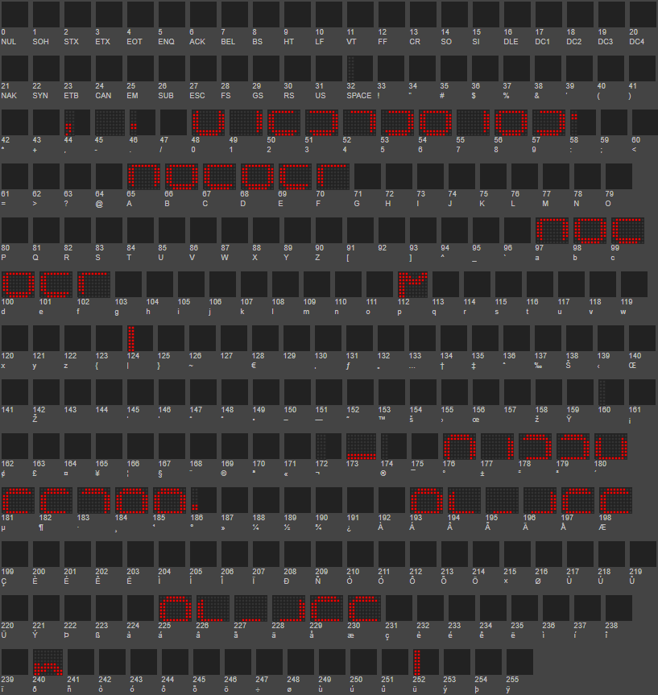

.. include:: ../Plugin/_plugin_substitutions_p10x.repl
.. _P104-Font-Numeric7Segment_page:

|P104-Font-Numeric7Segment_typename|
======================================================

Double height hexadecimal and 'p' characters only, lower part in the normal ASCII index, upper part in the high ASCII index (+128).

