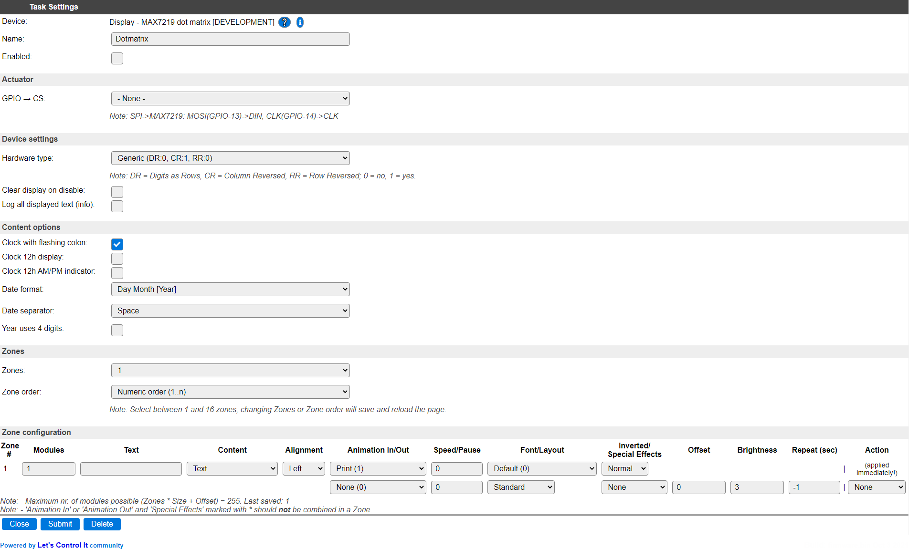
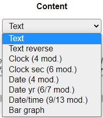
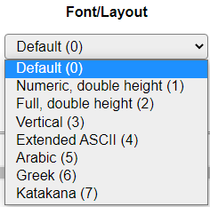

.. include:: ../Plugin/_plugin_substitutions_p10x.repl
.. _P104_page:

|P104_typename|
==================================================

|P104_shortinfo|

Plugin details
--------------

Type: |P104_type|

Name: |P104_name|

Status: |P104_status|

GitHub: |P104_github|_

Maintainer: |P104_maintainer|

Used libraries: |P104_usedlibraries|

Datasheet: |P104_datasheet|

Description
-----------

The MAX7219 LED controllers are versatile in the fact that they can control either a set of 7-segment displays (see :ref:`P073_Page`) or, a matrix of up to 64 LEDs and that's where this plugin comes in. *(Technically, the MAX7221 chip is also supported by the MD_Parola/MD_MAX72XX libraries, but as I didn't find any boards using that chip, I can't officially say it is supported.)*

This plugin is designed to configure and control a daisy-chained series of up to 255 modules of 8x8 dotmatrix displays, that can be be bought from several suppliers, in several predefined physical configurations (1, 2, 4, 8, 2x2, 2x4 and 2x8 modules).

The usual logical order of these modules is from right to left, and bottom to top (for the double-height modules), in zig-zag order:

(Image sourced from Parola A-Z blog articles)

This specific hardware setup can be somewhat confusing when initially setting up this plugin, so a setting **Zone order** has been added to arrange the zones in the same order as the hardware, if it is placed as shown in the image above.

Zones
~~~~~~

A Zone is a set of modules, electrically adjecent to each other, that can be configured to display a sinlge type of content. A zone consists of at least 1 and max. 255 modules.

There is at least 1 zone, up to 8 zones can be configured on an ESP8266, and up to 16 zones on an ESP32. This limitation for ESP8266 is related to the amount of memory used by the libraries and the plugin.

For each zone there are several settings that can be configured, explained in detail below.

Power consumption
~~~~~~~~~~~~~~~~~~

By the physical design of these modules, using LED's for display, the power consumption is dependent on the number of leds that are activated and the brightness that is set for the zone. On a display consisting of 4 modules, all leds activated and at max. brightness, nearly 1.5A current was measured at 5V, so it requires an adequate power supply, preferably separate from the power supply used to power the ESP.

Also, when using several modules sequentially, separate wiring should be added for VCC and GND to each group of modules, to avoid burning out the pcb traces of the module where the power is connected. When using 4 or 8 module displays, it is advised to use separate wiring for power to each module, and only connect the GND and signal connections DOUT/CLK/CS/GND to DIN/CLK/CS/GND of the next module, but **never** the VCC pins.

Module voltage
~~~~~~~~~~~~~~

The MAX72xx controllers can work with 3.3V (3V3) (max. 6V), but these dot matrix devices are often used at 5V. As the ESP units are only 3.3V compatible on the GPIO pins, a level converter should be added when connecting the ESP to the display on 5V.

Signal wiring
~~~~~~~~~~~~~~

.. note:: If the display modules use a VCC higher than 3.3V, f.e. 5V, a level converter for 3V3 to 5V should be used when connecting the display to the ESP, as the ESP might be damaged, or the logic levels don't match the requirements of the display (high level = 3.5V @ VCC 5V), and won't work properly.

.. code-block:: text

   ESP        Level converter   5V    MAX72xx 1   5V   MAX72xx 2  5V    MAX72xx n
   ----       ---------------   |     ----------  |    ----------  |    ----------
   3V3   -->  LV           HV <-+->   VCC         +->  VCC         +->  VCC ...
   GND   ---  GND ------- GND   ---   GND - GND   ---  GND - GND   ---  GND ...
   MOSI  -->  LV1 ------> HV1   -->   DIN - DOUT  -->  DIN - DOUT  -->  DIN ...
   CS    -->  LV2 ------> HV2   -->   CS  - CS    -->  CS  - CS    -->  CS  ...
   CLK   -->  LV3 ------> HV3   -->   CLK - CLK   -->  CLK - CLK   -->  CLK ...

The SPI ``CLK`` and ``MOSI`` GPIO pins from the ESP can be determined on the Hardware page, where they are documented, SPI must be enabled for this plugin to work. For convenience the pins are also shown as a note on the Task settings page. These pins can/should be shared with other SPI devices connected to the ESP. The ``MISO`` signal isn't used for this, output-only, type of device.

The ``CS`` pin is configured in the Task settings page for the device. This pin is *not* shared with other devices.

Device configuration
--------------------

After adding the plugin to the Devices page, the configuration is shown: (Name was already set by me before the screenshot was made)

Task settings
~~~~~~~~~~~~~~

* **Name** The name of the task. This should be unique for all devices that are configured. (Initially empty)

* **Enabled** For the device to work it has to be enabled. When checked, the device will be started as soon as the ESP starts. If desired, the device can also be enabled from f.e. a rule by using the ``TaskEnable,<tasknr>`` or ``TaskEnable,<taskname>`` command, or disabled using the corresponding ``TaskDisable,<tasknr>|<taskname>`` commands.

Actuator
~~~~~~~~

* **GPIO -> CS** Select the GPIO pin that's wired to the ``CS`` input on the first MAX72xx module.

Device settings
~~~~~~~~~~~~~~~~

* **Hardware type** Selects the type of hardware.

The list of available types is:

Not all possible hardware types are commercially available, these have been named 'Other'. For each type the available Max72xx settings are added to the description.

Legend: DR = Digits as Rows, CR = Column Reversed, RR = Row Reversed; 0 = no, 1 = yes.

All modules I ordered from Aliexpress so far work with the ``FC16`` hardware type. If that doesn't work, f.e. because the text is displayed reversed per module, or vertically instead of horizontally, then another hardware type should be tried.

If multiple modules are to be connected daisy-chained, they all need to be of the same hardware type, as the Parola library that is used doesn't support different hardware types per zone. When multiple hardware types are to be used, then a separate Task (Devices tab) can be created matching those settings, and a separate GPIO pin should be configured for the ``CS`` pin.

* **Clear display on disable** When enabled, the display will be cleared when the task is disabled.

* **Log all displayed text (info)** When enabled, all content that is displayed, also when the Repeat option is used, are logged at Info level. The content will only be visible in the log if that is at Info level, or a more detailed level, configurable on the Tools/Advanced page.

Content options
~~~~~~~~~~~~~~~~

The content options are global to all zones.

* **Clock with flashing colon** When enabled, the Clock content options will show a flashing colon between the Hour and Minute digits (1 second on, 1 second off). Enabled by default.

* **Clock 12h display** When enabled, the Clock content options will use 12 hour display, instead of 24 hour.

* **Clock 12h AM/PM display** When enabled, with also **Clock 12h display** enabled, will suffix the Clock content with ``a`` for AM and ``p`` for PM time.

* **Date format** Select the type of display for all Date and Date/time content types.

Available options:

* **Date separator** Select the separator to use for Date content types.

Available options:

* **Year uses 4 digits** When enabled, the Date yr and Date/time content types use a 4 digit year display instead of 2 digits.

*(NB: On some challenged bin-size builds these Content options can be unavailable, then default settings will be used.)*

Zones
~~~~~~

* **Zones** Select the number of zones you want to configure. Adding or deleting a zone can also be done using the Actions column (when available). The maximum number of zones depends on the type of ESP used, on ESP8266 between 1 and 8 zones can be configured, and on ESP32, up to 16 zones can be set. When changing the number of zones, the page will be reloaded to reflect the new configuration.

* **Zone order** As described above, the logical ordering of the modules is from bottom right to top left. For a more intuitive display of the zones, they can be shown from high to low instead of in numeric, low to high, order. The Actions column does take this setting into account when Add above or Add below is selected. When changing the Zone order, the page will be reloaded to show the zones in the new order.

Available choices:

Zone configuration
~~~~~~~~~~~~~~~~~~

For each Zone there are a number of settings that can be configured.

* **Modules** The number of modules that are in this zone. The maximum that can be set here is 255.

* **Text** If a pre-defined text should be displayed for the zone, it can be set here. The usual variables and functions, as shown on the Tools/System Variables page can be used, as well as the ``[Task#<variable>]`` and ``[Var#<n>]``, ``[Int#<n>]`` and ``%v<n>%`` variables. The system variables that produce special characters, like ``{D}`` etc., actually generate Unicode characters, and that is not supported by the, ASCII based, fonts used. To use any special characters look them up in the font tables, below, to have the desired characters displayed. This field is also used by the Bar graph content type for any predefined bar graph display. Maximum length of this field is 100 characters. If longer contents needs to be set, it can be set from the rules using the ``DotMatrix,<zone>,txt,"<text content>"`` command. (``txt`` and ``settxt`` subcommands).

* **Content** Select the type of content shown in the zone.

This are the available options:

Between round braces the expected number of modules, required to display the complete content, is added.

* *Text* A plain text, or with variables (as described above) will be displayed. The number of modules isn't estimated.
* *Text reverse* Like *Text*, but the result will be reversed before displaying it. Makes the Vertical font more usable.
* *Clock* Shows the current time according to the **Content options** settings.
* *Clock sec* Shows the current time, including seconds and according to the **Content options** settings.
* *Date* Show the date in a day and month format, formatted as configured in the **Content options** settings.
* *Date yr* Show the date in a day, month and year format, formatted as configured in the **Content options** settings.
* *Date/time* Show the date and time (no seconds), formatted as configured in the **Content options** settings.
* *Bar graph* Show from 1 to 8 bar graphs, using a graph string per bar graph. The bar graph always uses the entire zone.

Content types can not be combined in a single zone.

Content type: Bar graph: See below in the Commands section for a full description of the graph string options.

* **Alignment** The alignment of the content, except Bar graph, selected for the zone.

Available options:

* **Animation In** The animation that is used to put the content into the zone. Default is Print, that just puts the content according to the alignment, in the zone. Animation option None is not available for **Animation In**, as the zone would not display anything.

* **Animation Out** The animation used to 'remove' the content from the zone. If set to None (the default), the content will stay in the zone until it is changed, or updated when the **Repeat (sec)** option is used.

Available options:

The exact effect of each animation can best be seen by experimenting with them.

Some animations are marked with an asterisk ``*`` as a warning that they should not be combined with a **Special Effects** setting that is *also* marked with an asterisk. The result is undefined, and may result in a distorted display.

* **Speed** The speed setting is used to control the speed factor of the animation in the zone in milliseconds. It is used for both the In and Out animations. When set to 0, the delay between each animation step is ~25 msec.

* **Pause** The delay after completing the **Animation In** before starting the **Animation Out**, in milliseconds. If no Out animation is set, this still adds to the time of completing the animation (before a next Repeat would be started).

* **Font** The font used to display the content. A few special fonts are available, allowing special characters to be displayed, and also a double-height font can be used to create a larger display where two similar zones are physically mounted above each other (as shown in the image in the Description section). When using a double-height font, also the **Layout** option should be set accordingly, and the **Content** setting should be the same, as well as any text. Bar graphs do not use a font, so when set for a zone, the **Font** and **Layout** settings are ignored.

Available options:

All available fonts have been taken from the example code of the used Parola library.

The Arabic, Greek and Katakana fonts have all their characters in the 'high-ascii' range (> 128 ascii values), so they can (and should) **not** be used to 'translate' normal text to Arabic, Greek or Katakana.

On 'bin-size-challenged' builds the *Full, double height* font is replaced by the *Numeric, double height* font, to limit the bin-size a bit more. This font can display only numeric (actually hexadecimal, 0..9 and A..F) and date/time content.

Font overview:
^^^^^^^^^^^^^^

* :ref:`P104-Font-Default_page`
* :ref:`P104-Font-Numeric7Segment_page`
* :ref:`P104-Font-DoubleHeight_page`
* :ref:`P104-Font-Vertical_page`
* :ref:`P104-Font-ExtASCII_page`
* :ref:`P104-Font-Arabic_page`
* :ref:`P104-Font-Greek_page`
* :ref:`P104-Font-Katakana_page`

.. spacer

* **Layout** Determines wether the standard layout should be used, or the Upper/Lower part of a double-height font.

Available options:

* *Standard* For normal display, should be used for all fonts except the double-height fonts.
* *Double, upper* Only for use with a double height font. Shows the upper half of a double height font.
* *Double, lower* Only for use with a double height font. Shows the lower half of a double height font.

.. spacer

* **Inverted** With the Inverted option the text or bargraph on the display is either light on a dark background (Normal) or black on a light background (Inverted).

.. warning::

   When using the Inverted option, the displays in the zone use **much** more power, so selecting the correct power supply is very important!

Available options:

.. image:: P104_ZoneInvertedOptions.png
   :alt: Zone inverted options

* *Normal* Light content on dark background
* *Inverted* Dark content on light background

.. spacer

* **Special Effects** These effects can be used to turn a display 'upside down', in left/right 'mirror-image' or both.

Available options:

.. image:: P104_ZoneSpecialEffectsOptions.png
   :alt: Zone special effects options

* *None* Normal display.
* *Flip up/down* Mirrors the content of each module on the horizontal axis.
* *Flip left/right* Mirrors the content of each module on the vertical axis.
* *Flip u/d & l/r* Mirrors the content of each module on both the horizontal and vertical axis.

.. spacer

* **Offset** The offset can be used to skip a number of modules before a zone, f.e. when displaying a smaller zone on a larger set of displays, or when a module has a defect. A value between 0 and 254 kan be used here.

.. spacer

* **Brightness** Sets the brightness of the display, and thus highly influences the power required by a zone. Valid values are from 0 to 15, where 0 is very dimmed, and 15 is *very* bright (though that might differ per unit).

Measurements have been done to determine the current per pixel, when used at 5V:

+----------+--------+---------+------------------------------------------+
|Brightness| Current          |                                          |
+----------+--------+---------+------------------------------------------+
|Level     | 1 LED  | 256 LEDS| Remark                                   |
+==========+========+=========+==========================================+
|1         | 0.8 mA | 270 mA  | really soft light, but still very usable |
+----------+--------+---------+------------------------------------------+
|3         | 1.8 mA | 530 mA  | nice during the evening                  |
+----------+--------+---------+------------------------------------------+
|7         | 3.6 mA | 995 mA  | usable brightness in normal daylight     |
+----------+--------+---------+------------------------------------------+
|15        | 5.5 mA | 1485 mA | a 'blinding light' brightness            |
+----------+--------+---------+------------------------------------------+

(Other brightness levels can be interpolated)

* **Repeat (sec)** Allows to repeat the current content of a zone to be redisplayed, using the animations as configured. Value is in seconds accuracy. The default value -1 indicates that repeat is disabled for the zone.

This will also repeat any content (usually *Text* or *Bar graph*) that is set using the corresponding commands (see below), or refresh a *Bar graph* on a regular interval. The initially set content is re-evaluated before it's displayed.

* **Action** These actions are related to changing the configuration of zones, not related to the display or content of a zones.

Available actions:

**The selected Action is executed immediately!**

* *None* No action.
* *New above* Add a new Zone above the current zone.
* *New below* Add a new Zone below the current zone.
* *Delete* Remove the current zone from the list. **This can not be undone!**

Above and Below are relative to the current Zone order, so if **Zone order** is in *Numeric order*, selecting *New above* will shift all Zones 1 position down, and insert a new Zone above it, and if **Zone order** is in *Display order*, then action *New above* will insert a new Zone 2 shifting any other zones 1 number up, and leave Zone 1 as is.

The *New* options are only available if the maximum nr. of zones isn't reached yet.

Commands
--------

.. include:: P104_commands.repl

Change log
----------

.. versionchanged:: 2.0
  ...

  |added| 2020-06-13 Initial version for ESPEasy.
