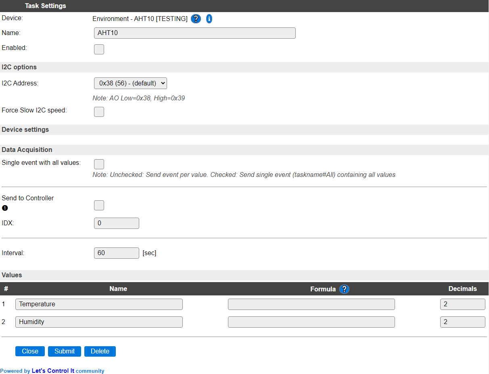

.. include:: ../Plugin/_plugin_substitutions_p10x.repl
.. _P105_page:

|P105_typename|
==================================================

|P105_shortinfo|

Plugin details
--------------

Type: |P105_type|

Name: |P105_name|

Status: |P105_status|

GitHub: |P105_github|_

Maintainer: |P105_maintainer|

Used libraries: |P105_usedlibraries|

Datasheet: |P105_datasheet| |P105_datasheet2| |P105_datasheet3|

Description
-----------

The AHT10/AHT20/AHT21 sensors provide Temperature and Humidity measurements (factory calibrated), via an I2C bus connection.

.. warning::

  * The **AHT10** device does sometimes not 'play nice' when there are also other I2C devices on the same bus (many complaints can be found on the internet). NB: This may be hardware-, vendor-, or chip-revision-specific.

Because of this peculiarity, other sensors may be more appropriate, like the AHT20/AHT21 also supported by this plugin, or :ref:`P028_page`, :ref:`P106_page`, :ref:`P014_page`, :ref:`P034_page`, :ref:`P051_page`, :ref:`P068_page` or :ref:`P072_page`.

This plugin tries to avoid such situations (I2C bus lock) by (soft) resetting the sensor if it doesn't respond for some time.

Settings
--------

**Name**: The name for this task, should be unique.

**Enabled**: Allows to enable/disable the device.

I2C Options 
^^^^^^^^^^^^

The available settings here depend on the build used. At least the **Force Slow I2C speed** option is available, but selections for the I2C Multiplexer can also be shown. For details see the :ref:`Hardware_page`

**I2C Address**: The address the device is using. The AHT10 sensor allows to select a secondary address by pulling the AO (sometimes marked as A0) pin to high (3.3V) to select the secondary address. That address should then be selected here too. The AHT20/AHT21 sensors only support a single I2C address, so it will be forced to the default address.

Device Settings
^^^^^^^^^^^^^^^^

If the plugin is configured for **Sensor model** AHT10 and other devices configured in a task use the I2C bus, a warning is displayed (see example below) that combining them with this device may cause issues on the I2C bus, resulting in all I2C devices no longer working as intended. This may occur immediately, or only after some time, like 10 minutes or an hour.

**Sensor model** Selection of the connected type of hardware. (AHT2x sensors have a slightly different intialization.)

Available options:

**AHT10** This sensor model should better be avoided, as it doesn't always work with other devices on the same I2C bus. Also, the AHT15 can be used, but that has similar issues.

**AHT20** An more modern version of the sensor.

**AHT20** An more modern version of the sensor, very similar to the AHT20, in a more compact chip package.

Data Acquisition
^^^^^^^^^^^^^^^^

This group of settings, **Single event with all values**, **Send to Controller** and **Interval** settings are standard available configuration items. Send to Controller is only visible when one or more Controllers are configured.

**Interval** By default, Interval will be set to 60 sec. It is the frequency used to read sensor values and send these to any Controllers configured for this device.

Values
^^^^^^

The names for the values are initially set to a default name, but can be changed if desired. Also, a formula can be entered to re-calculate the value before display/sending to a controller, and the number of decimals can be changed, for Temperature, usually 1 decimal is enough to be displayed (value will be rounded).

Change log
----------

.. versionchanged:: 2.0
  ...

  |added| 2021-08-01 Moved from ESPEasy PluginPlayground to the main repository.
