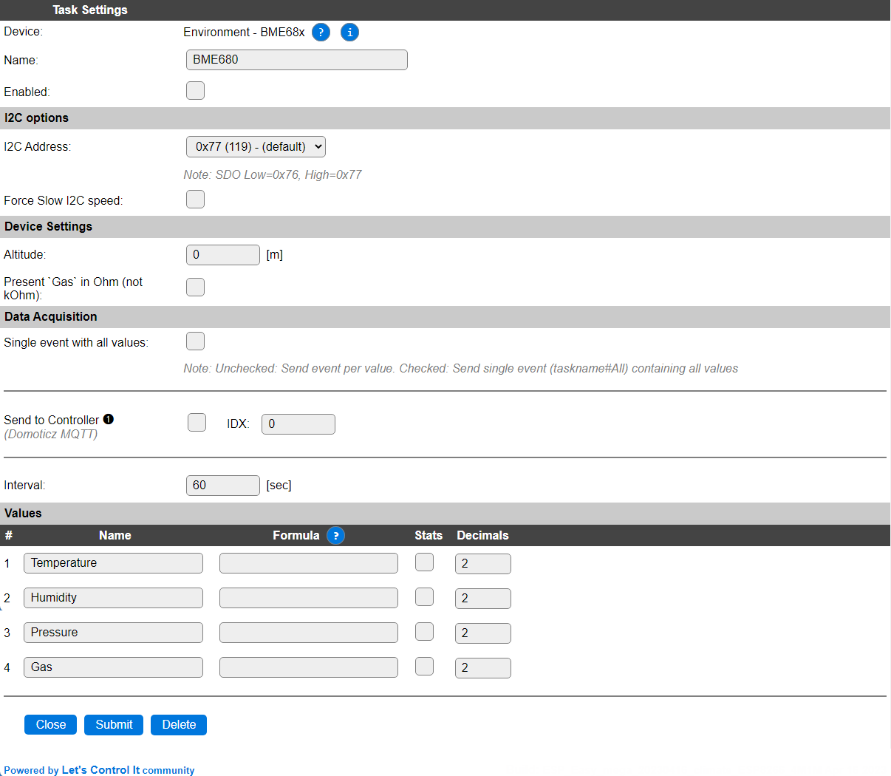

.. include:: ../Plugin/_plugin_substitutions_p10x.repl
.. _P106_page:

|P106_typename|
==================================================

|P106_shortinfo|

Plugin details
--------------

Type: |P106_type|

Name: |P106_name|

Status: |P106_status|

GitHub: |P106_github|_

Maintainer: |P106_maintainer|

Used libraries: |P106_usedlibraries|

Description
-----------

Plugin to use the Bosch BME680 and BME688 Temperature, Humidity, Barometric pressure and MOX Gas resistance values.

.. warning:: For the BME688 sensor the AI features are not supported, only the BME680 features, as it is fully backward compatible.

Specifications:
 * Temperature (-40C to +85C)
 * Relative humidity (0-100 %RH)
 * Barometric pressure (300-1100 hPa)
 * Gas resistance (can be used to determine IAQ, Index of Air Quality)

configuration
-------------

* **Name**: Required by ESPEasy, must be unique among the list of available devices/tasks.

* **Enabled**: The device can be disabled or enabled. When not enabled the device should not use any resources.

I2C options
^^^^^^^^^^^

* **I2C Address**: The device supports 2 addresses, that can be configured using the ``SDO`` pin: (not all boards have that pin available, but could use soldering-pads to configure the address)

The available I2C settings here depend on the build used. At least the **Force Slow I2C speed** option is available, but selections for the I2C Multiplexer can also be shown. For details see the :ref:`Hardware_page`

Device Settings
^^^^^^^^^^^^^^^

* **Altitude** When not at sea-level, the plugin can apply an altitude compensation on the **Pressure** value.

* **Present `Gas` in Ohm (not kOhm)**: Normally the Gas resistance value, received from the MOX Gas sensor, is divided to be presented as kOhm, but with this setting checked, the native Ohm value is shown.

Data Acquisition
^^^^^^^^^^^^^^^^

This group of settings, **Single event with all values** and **Send to Controller** settings are standard available configuration items. Send to Controller is only visible when one or more Controllers are configured.

* **Interval** By default, Interval will be set to 60 sec. The data will be collected and optionally sent to any configured controllers using this interval.

Values
^^^^^^

The plugin provides the ``Temperature``, ``Humidity``, ``Pressure`` and ``Gas`` values. A formula can be set to recalculate. The number of decimals can be set as desired.

Per Value is a **Stats** checkbox available, that when checked, gathers the data and presents recent data in a graph, as described here: :ref:`Task Value Statistics:  <Task Value Statistics>`

.. Events
.. ~~~~~~

.. .. include:: P106_events.repl

Change log
----------

.. versionchanged:: 2.0

|changed| 2023-04-16 Renamed to BME68x, make ``Gas`` output scale configurable.  ...

|added| 2020-04-25
