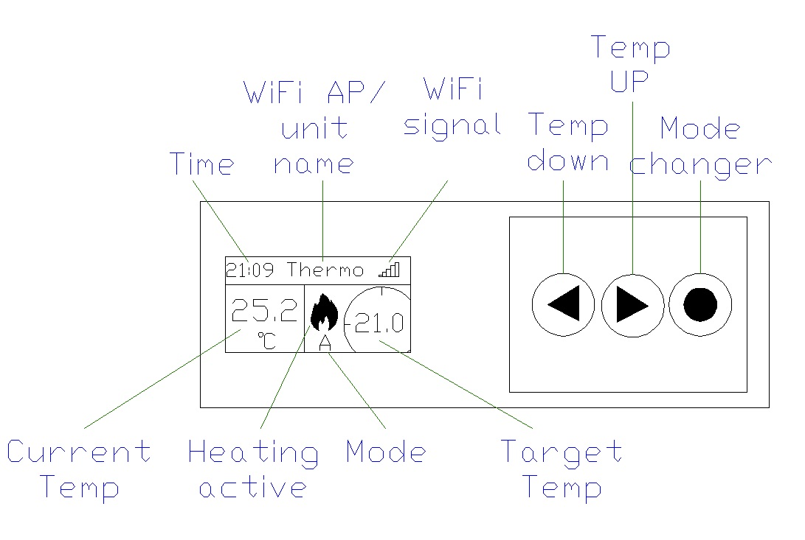
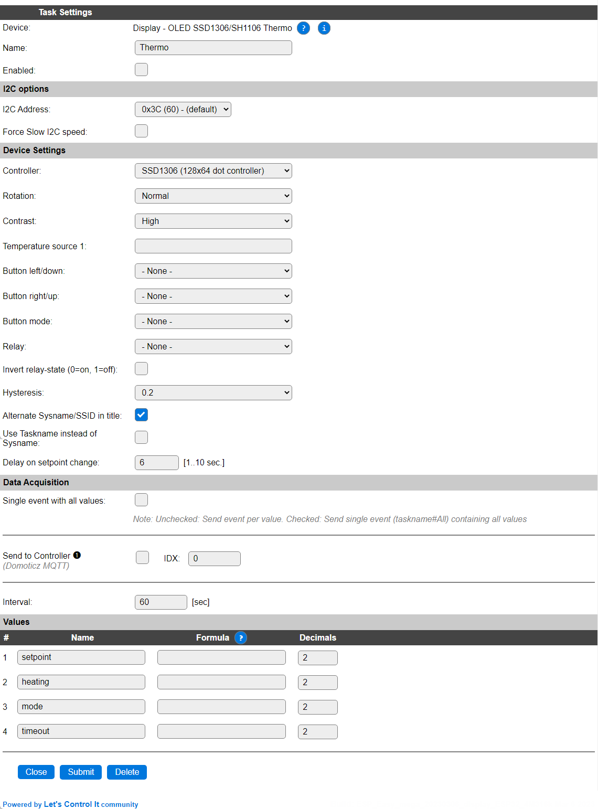
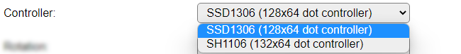
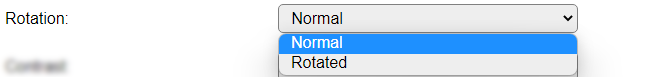
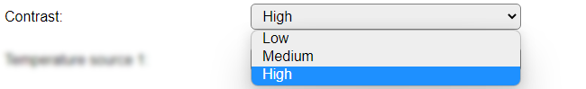
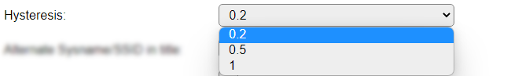

.. include:: ../Plugin/_plugin_substitutions_p10x.repl
.. _P109_page:

|P109_typename|
==================================================

|P109_shortinfo|

Plugin details
--------------

Type: |P109_type|

Name: |P109_name|

Status: |P109_status|

GitHub: |P109_github|_

Maintainer: |P109_maintainer|

Used libraries: |P109_usedlibraries|

Description
-----------

This plugin is a thermostat control for an on/off heating system.

Display and Button layout explanation:

Configuration
-------------

Task settings
~~~~~~~~~~~~~

* **Name**: The name of the task. This should be unique for all devices that are configured. (Initially empty)

* **Enabled**: For the device to work it has to be enabled. When checked, the device will be started as soon as the ESP starts. If desired, the device can also be enabled from f.e. a rule by using the ``TaskEnable,<tasknr>`` or ``TaskEnable,<taskname>`` command, or disabled using the corresponding ``TaskDisable,<tasknr>|<taskname>`` commands.

I2C Options 
^^^^^^^^^^^^

The available settings here depend on the build used. At least the **Force Slow I2C speed** option is available, but selections for the I2C Multiplexer can also be shown. For details see the :ref:`Hardware_page`

**I2C Address**: The address the device is using. Some boards offer a solderable address selector that is to be used to select the address. The available addresses are ``0x3C`` and ``0x3D``.

Device Settings
^^^^^^^^^^^^^^^

* **Controller**: Select the used controller, only the ``SSD1306`` and ``SH1106`` are supported. This plugin **requires** a 128x64 or 132x64 pixel display.

* **Rotation**: Depending on the way the display is mounted, it may be needed to rotate the content of the screen 180 degrees. That can be selected here.

* **Contrast**: The brightness of the screen can be controlled by adjusting the contrast. For normal use, and to avoid the displayed content to burn-in on the display, Medium or Low should best be selected.

* **Temperature source 1**: This is the temperature source for the thermostat. A ``[task#value]`` name should be typed in here for a temperature task that reflects the temperature to be maintained by the thermostat.

* **Button left/down**: Select the GPIO pin that is used to connect the button to lower the setpoint temperature. When Manual mode is active, this button will decrease the Timeout value by 5 minutes. Maximum timeout value is 90 minutes.

* **Button right/up**: Select the GPIO pin that is used to connect the button to raise the setpoint temperature. When Manual mode is active, this button will increase the Timeout value by 5 minutes. Maximum timeout value is 90 minutes.

* **Button mode**: Select the GPIO pin that is used to connect the button to select the thermostat mode. When pressing the button the mode will rotate through the available modes. Available modes:

  * **0**: Off

  * **1**: Automatic, the default mode at startup.

  * **2**: Manual. When switched to manual, a timeout of 5 minutes is set, after which the mode is switched back to automatic. The user selected timeout duration in minutes can be set using the ``thermo,mode,m,<timeout>`` command. Also, the timeout can be changed using the up and down buttons to increase or decrease the timeout in 5 minute steps.

* **Relay**: Select the GPIO pin that will turn the relay on and off that controls the heat-source. Default: 1 = on, 0 = off, unless **Invert relay** is checked.

* **Invert relay-state (0=on, 1=off)**: Invert the working of the **Relay** pin, 0 = on, 1 = off.

* **Hysteresis**: Select the temperature difference for switching the relay between on and off state, 0.2, 0.5 or 1 degree.

* **Alternate Sysname/SSID in title**: When enabled, the title will be interchanged between the Sysname (Name of the unit, set on the Config tab), and the WiFi SSID the unit is connected to. When disabled, the Sysname (or Taskname, see next option) will be shown only.

* **Use Taskname instead of Sysname**: When checked, the taskname will be used instead of the Sysname, to allow switching between tasks with different configuration, f.e. for having Day and Night configurations with different setpoints. The display then shows the active taskname.

* **Delay on setpoint change**: Configure the delay in seconds before the relay state will be changed after the setpoint is changed. Range: 1..10 seconds. This is to avoid flipping the heating on/off rapidly when changing the setpoint value.

Data Acquisition
^^^^^^^^^^^^^^^^

This group of settings, **Single event with all values**, **Send to Controller** and **Interval** settings are standard available configuration items. Send to Controller is only visible when one or more Controllers are configured.

Values
^^^^^^

There are 4 values available for this plugin, that reflect the current status while the task is active.

``Setpoint`` shows the currently used setpoint temperature.

``Heating`` shows either 1 or 0 for heating On or Off.

``Mode`` shows the mode, 0 = off, 1 = automatic, 2 = manual.

``Timeout`` shows the remaining timeout while in Manual mode. When not in Manual mode, the value is undefined.

Commands
~~~~~~~~

.. include:: P109_commands.repl

.. Events
.. ~~~~~~

.. .. include:: P109_events.repl

Change log
----------

.. versionchanged:: 2.0
  ...

  |changed| 2022-10: Behavior change, change relay state only after a configurable delay, only save settings when changed and after a delay of 30 seconds

  |added| 2020-04-25
