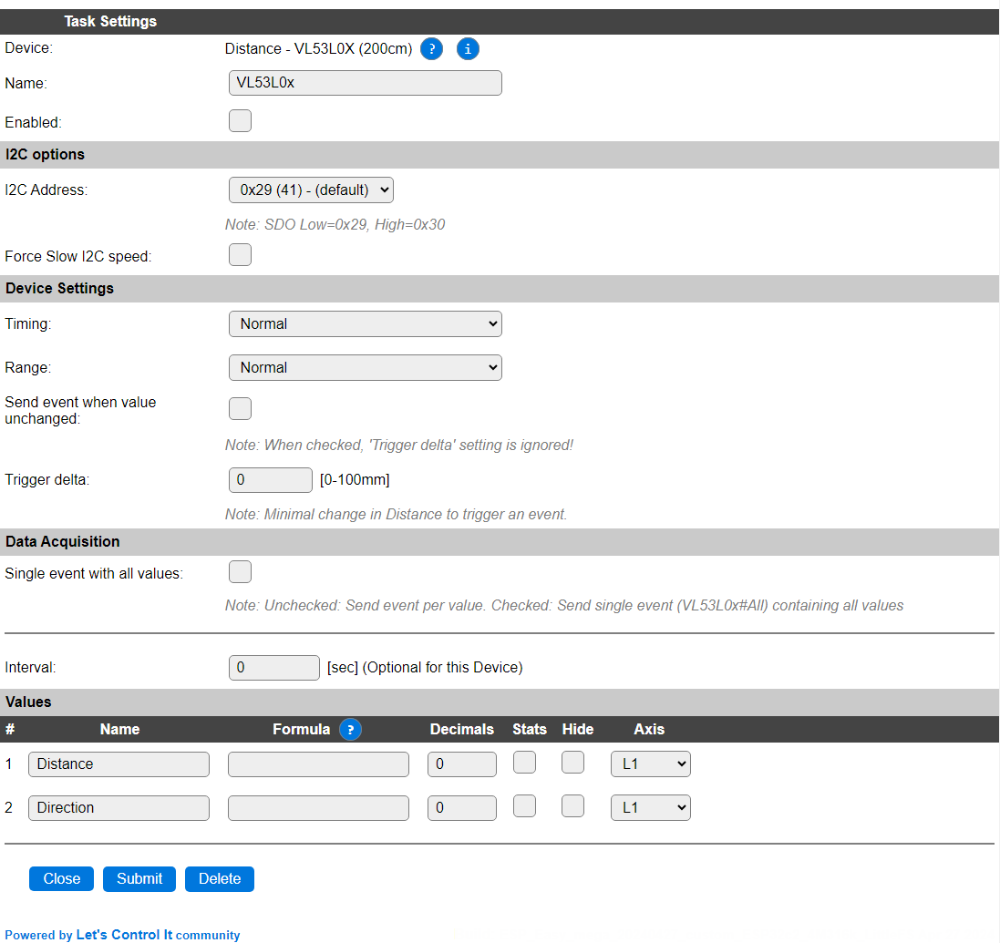
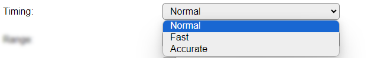
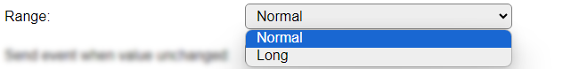

.. include:: ../Plugin/_plugin_substitutions_p11x.repl
.. _P110_page:

|P110_typename|
==================================================

|P110_shortinfo|

Plugin details
--------------

Type: |P110_type|

Name: |P110_name|

Status: |P110_status|

GitHub: |P110_github|_

Maintainer: |P110_maintainer|

Used libraries: |P110_usedlibraries|

Description
-----------

This I2C sensor with 2 ranges offers distance measurement based on a Laser Time-of-Flight sensor. Output result is in millimeters.

Configuration
--------------

**Name** A unique name should be entered here.

**Enabled** The device can be disabled or enabled. When not enabled the device should not use any resources.

I2C Options 
^^^^^^^^^^^^

The available settings here depend on the build used. At least the **Force Slow I2C speed** option is available, but selections for the I2C Multiplexer can also be shown. For details see the :ref:`Hardware_page`

**I2C Address**: The address the device is using. Some boards holding this chip offer an extra connection SDO that can be used to select the address, other boards just allow to select the secondary address and keep that active until the next power-cycle of the sensor.

Device Settings
^^^^^^^^^^^^^^^^

**Timing**: The timing setting of the sensor determines the accuracy of the measurement. There are 3 options available:

*Normal* The default value (80 msec.)

*Fast* A faster but less accurate measurement (20 msec.) Can be used with a high speed read interval (1-5 sec).

*Accurate* A slower but far more accurate measurement (320 msec.) For use with a longer read interval setting (30-60 sec).

**Range**: the measuring ranges:

*Normal* For measurements in the 0 to 800 millimeter range.

*Long* For measurements in the 0 to 2000 millimeter range (but somewhat less accurate).

The Data Acquisition, Send to Controller and Interval settings are standard available configuration items. Send to Controller only when one or more Controllers are configured.

Values
^^^^^^

There is only 1 value available for this sensor, with the default name ``Distance``. A formula can be set to recalculate, f.e. to centimeters using ``%value%/10``. The number of decimals is by default set to 2, but for use with millimeters distance it can be set to 0, as no decimals are provided from the measurement.

.. Events
.. ~~~~~~

.. .. include:: P110_events.repl

Change log
----------

.. versionchanged:: 2.0
  ...

  |added| 2021-02-06 Moved to main repository Plugin 110 from PluginPlayground Plugin 133

  |added| 2021-02-06 Refactoring to allow multiple instances of the plugin (when using an I2C multiplexer)
