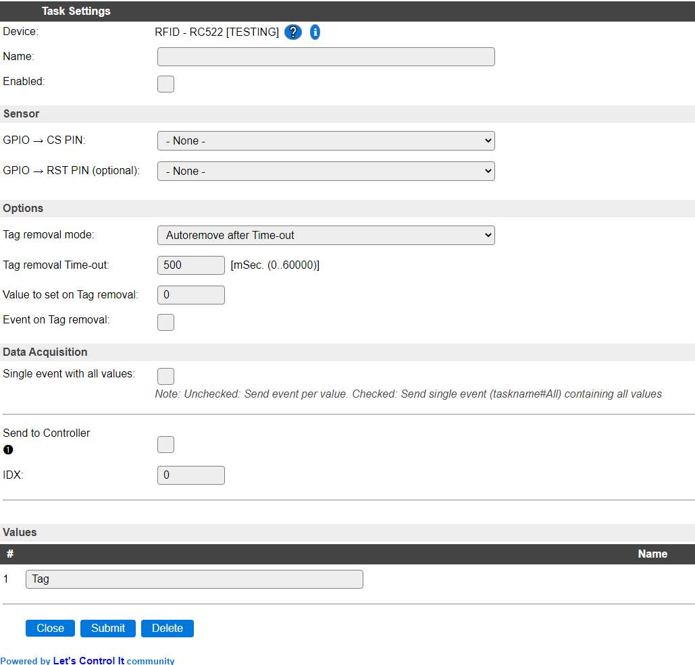

.. include:: ../Plugin/_plugin_substitutions_p11x.repl
.. _P111_page:

|P111_typename|
==================================================

|P111_shortinfo|

Plugin details
--------------

Type: |P111_type|

Name: |P111_name|

Status: |P111_status|

GitHub: |P111_github|_

Maintainer: |P111_maintainer|

Used libraries: |P111_usedlibraries|

Description
-----------

This SPI device reads the tag ID from Mifare tags, cards and stickers using the NXP MFRC522 NFC chip.

The value is placed in the Tag variable, and can be read from rules and sent to controllers.

Settings
--------

**Name**: The name for this task, should be unique.

**Enabled**: Allows to enable/disable the device.

This device is connected via SPI, so the SPI interface should be enabled on the Hardware tab. There, also the common SPI pin numbers are shown. CS and other optional pin configurations are to be set in the device cconfiguration.

The MFRC522 needs at least the CS pin configured, the RST (Reset) pin is optional.

**CS Pin**: The Chip Select signal, often labeled SDA on the board.

**RST Pin**: Optional pin that is pulled low when communication with the device fails a few times. Usually labeled RST on the board.

**Tag removal mode** After scanning a tag, it can be automatically removed (reset). There are 2 removal modes, 'None' and 'Autoremove after Time-out' (default).

**Tag removal Time-out** (Default 500 mSec) The timeout in milli seconds (range 0 - 60000) after which the last Tag will be automatically removed, if the Time-out option is selected.

**Value to set on Tag removal** (Default 0) Set a value to the Tag when the previous tag is removed. (Range 0 to 2147483647 as larger values are difficult to store in settings.)

**Event on Tag removal** (Disabled by default) When enabled sends the removed Tag value as an event and to all enabled controllers.

Supported hardware
------------------

MFRC522 based NFC RFID reader connected via SPI.

|P111_usedby|

.. Commands available
.. ^^^^^^^^^^^^^^^^^^

.. .. include:: P111_commands.repl

.. Events
.. ~~~~~~

.. .. include:: P111_events.repl

Change log
----------

.. versionadded:: 2.0
  ...

  |added|
  2021-02-07: Moved from PluginPlayground to main repository.
  
  Added options for tag reset and event on tag reset.

