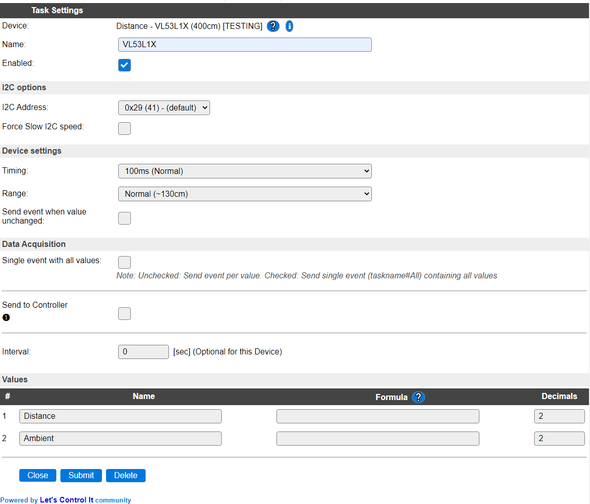
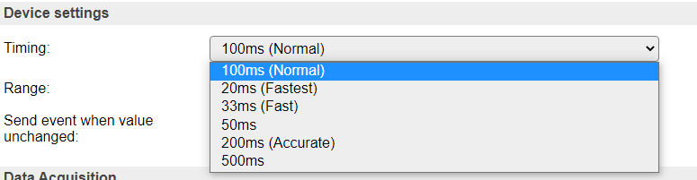
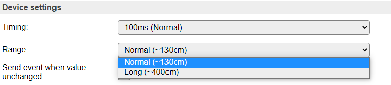

.. include:: ../Plugin/_plugin_substitutions_p11x.repl
.. _P113_page:

|P113_typename|
==================================================

|P113_shortinfo|

Plugin details
--------------

Type: |P113_type|

Name: |P113_name|

Status: |P113_status|

GitHub: |P113_github|_

Maintainer: |P113_maintainer|

Used libraries: |P113_usedlibraries|

Description
-----------

This I2C sensor with 2 ranges offers distance measurement based on a Laser Time-of-Flight sensor. Output result for Distance is in millimeters.

The VL53L1X sensor can measure either 0 - 130cm (Normal range) or 0 - 400cm (Long range), where the closely related VL53L0X can measure up to 200cm. The API's for these sensors are not compatible, so different libraries are used.

Configuration
--------------

**Name** A unique name should be entered here.

**Enabled** The device can be disabled or enabled. When not enabled the device should not use any resources.

I2C Options 
^^^^^^^^^^^^

The available settings here depend on the build used. At least the **Force Slow I2C speed** option is available, but selections for the I2C Multiplexer can also be shown. For details see the :ref:`Hardware_page`

**I2C Address**: The address the device is using. The chip allows to select the secondary address and keep that active until the next power-cycle of the sensor.

Device Settings
^^^^^^^^^^^^^^^^

**Timing**: The timing setting of the sensor determines the accuracy of the measurement. There are 6 options available:

*100 ms (Normal)* The default value, using an integration time of 100 msec.

*20ms (Fastest)* The fastest but least accurate measurement. Should only be used for Normal range (see below).

*33ms (Fast)* A fast but not very accurate measurement.

*50ms* A somewhat more accurate measurement.

*200ms Accurate* A slower but far more accurate measurement. For use with a longer read interval setting (30-60 sec).

*500ms* The longest integration time available. For use with long read interval settings.

**Range**: the measuring ranges:

*Normal (~130cm)* For measurements in the 0 to 1300 millimeter (130cm) range.

*Long (~400cm)* For measurements in the 0 to 4000 millimeter (400cm) range (but somewhat less accurate).

**Send event when value unchanged** To avoid many of the same events when the measurement is stable, this option is off by default. When enabled, every measurement will cause an event, and send the data to any enabled Controller.

**Trigger delta** To avoid triggering many events with only a small difference in distance the 'Trigger delta' option is available. This can be set to only trigger an event when the new distance is at least the delta less or more than the previous measurement.

NB: This setting is ignored if 'Send event when value unchanged' is checked!

The Data Acquisition, Send to Controller and Interval settings are standard available configuration items. Send to Controller only when one or more Controllers are configured.

**Interval** By default, Interval will be set to 60 sec. Setting this to 1 or 2 seconds, usually offers a reasonable response time.

Values
^^^^^^

The measured distance is available in ``Distance``. A formula can be set to recalculate, f.e. to centimeters using ``%value%/10``. The number of decimals is by default set to 2, but for use with millimeters distance it can be set to 0, as no decimals are provided from the measurement.

The Ambient lighting condition during measurement is available in ``Ambient``. The unit is kcps (Photons per second, recalculated to kilo count per second)

.. Events
.. ~~~~~~

.. .. include:: P113_events.repl

Change log
----------

.. versionchanged:: 2.0

  |added| 2021-04-05 Added to main repository as Plugin 113 Distance - VL53L1X (400cm), based on a copy of Plugin 110 Distance - VL53L0X (200cm)
