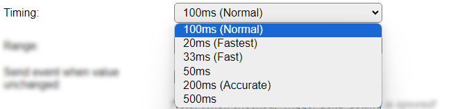

.. include:: ../Plugin/_plugin_substitutions_p11x.repl
.. _P113_page:

|P113_typename|
==================================================

|P113_shortinfo|

Plugin details
--------------

Type: |P113_type|

Name: |P113_name|

Status: |P113_status|

GitHub: |P113_github|_

Maintainer: |P113_maintainer|

Used libraries: |P113_usedlibraries|

Description
-----------

This I2C sensor with 2 ranges offers distance measurement based on a Laser Time-of-Flight sensor. Output result for Distance is in millimeters.

The VL53L1X sensor can measure either 0 - 130cm (Normal range) or 0 - 400cm (Long range), where the closely related VL53L0X can measure up to 200cm. The API's for these sensors are not compatible, so different libraries are used.

The VL53L1X sensor allows for the Region of Interest (ROI) to be configured, resulting in a smaller Field of View (FoV).

Configuration
--------------

.. image:: P113_DeviceConfiguration.png

* **Name** A unique name should be entered here.

* **Enabled** The device can be disabled or enabled. When not enabled the device should not use any resources.

I2C Options 
^^^^^^^^^^^^

The available settings here depend on the build used. At least the **Force Slow I2C speed** option is available, but selections for the I2C Multiplexer can also be shown. For details see the :ref:`Hardware_page`

* **I2C Address**: The address the device is using. Because of an issue with changing the I2C address of the sensor, this list is limited to 1 item, and the address isn't changed/set.

Device Settings
^^^^^^^^^^^^^^^^

* **Timing**: The timing setting of the sensor determines the accuracy of the measurement. There are 6 options available:

*100 ms (Normal)* The default value, using an integration time of 100 msec.

*20ms (Fastest)* The fastest but least accurate measurement. Should only be used for Normal range (see below).

*33ms (Fast)* A fast but not very accurate measurement.

*50ms* A somewhat more accurate measurement.

*200ms Accurate* A slower but far more accurate measurement. For use with a longer read interval setting (30-60 sec).

*500ms* The longest integration time available. For use with long read interval settings.

* **Range**: the measuring ranges:

*Normal (~130cm)* For measurements in the 0 to 1300 millimeter (130cm) range.

*Long (~400cm)* For measurements in the 0 to 4000 millimeter (400cm) range (but somewhat less accurate).

* **Send event when value unchanged** To avoid many of the same events when the measurement is stable, this option is off by default. When enabled, every measurement will cause an event, and send the data to any enabled Controller.

* **Trigger delta** To avoid triggering many events with only a small difference in distance the 'Trigger delta' option is available. This can be set to only trigger an event when the new distance is at least the delta less or more than the previous measurement.

NB: This setting is ignored if 'Send event when value unchanged' is checked!

Region Of Interest (ROI)
^^^^^^^^^^^^^^^^^^^^^^^^

For reducing the Field of View (FoV) angle of the sensor from 27 degrees to a more narrow angle, the number of actually used SPADs (Single Photon Avalance Diode) can be configured, to limit the FoV angle to as low as 15 degrees. See the **Field of View considerations** section, below.

To divert the Optical Center of the selected, rectangle, group of SPADs from the physical center of the sensor, the desired position can be selected from a table, shown below. If the ``x`` or ``y`` ROI settings are set \> 10, the Optical Center index is fixed to index 199, the physical center, by the low-level driver, to ensure that the configured number of SPADs can be used.

* **ROI 'x' SPADs**: Select the number of SPADs in ``x`` direction. Default and max. value is 16, lowest value is 4.

* **ROI 'y' SPADs**: Select the number of SPADs in ``y`` direction. Default and max. value is 16, lowest value is 4.

* **Optical Center index for ROI**: Select the Optical Center index for the ROI area configured. See the **Optical Center index matrix** section below for the available index values

Data Acquisition
^^^^^^^^^^^^^^^^

The Data Acquisition, Send to Controller and Interval settings are standard available configuration items. Send to Controller only when one or more Controllers are configured.

* **Interval** By default, Interval will be set to 60 sec. Setting this to 1 or 2 seconds, usually offers a reasonable response time.

Values
^^^^^^

The measured distance is available in ``Distance``. A formula can be set to recalculate, f.e. to centimeters using ``%value%/10``. The number of decimals can be set to 0, when using millimeters, as no decimals are provided from the measurement.

The Ambient lighting condition during measurement is available in ``Ambient``. The unit is kcps (Photons per second, recalculated to kilo count per second)

Value ``Direction`` holds the direction relative to the *previous* distance value: ``-1`` = smaller distance, ``0`` = unchanged distance, ``1`` = greater distance.

.. Events
.. ~~~~~~

.. .. include:: P113_events.repl

|

Field of View considerations
----------------------------

An aproximation of the FoV for a few ROI configurations:

.. csv-table:: 
  :header: "ROI zone size (SPADs)", "Diagonal Field of View"
  :width: 40%
  :widths: 20, 20
  :align: left

  "16 x 16", "27° (full FoV)"
  "8 x 8", "20°"
  "4 x 4", "15° (smallest)"

When using a smaller number of SPADs, the sensitivity, and thus the max. distance range, of the sensor will be reduced. When reducing the number of SPADs to the minimum of 4 x 4, the max. usable distance is ca. 1.7 meter.

The actual Field of View can be seen as a cone, similar to this image:

The light-colored cone in the center of the pink cone is a projection of the theoretical FoV when 4 x 4 SPADs are configured for the ROI. The max. distance available is reduced, as described above.

|

Optical Center index matrix
---------------------------

The **Optical Center index for ROI** can be selected from this table, where the index selected will be used as the center-point for the specified square of SPADs. When either of the x or y values are \> 10, the default index of 199 will be used.

.. csv-table::
    :header: "Row/Col", "1", "2", "3", "4", "5", "6", "7", "8", "9", "10", "11", "12", "13", "14", "15", "16", "Remark"
    :widths: 6, 5, 5, 5, 5, 5, 5, 5, 5, 5, 5, 5, 5, 5, 5, 5, 5, 14

	"A", "128","136","144","152","160","168","176","184",  "192","200","208","216","224","232","240","248",""
	"B", "129","137","145","153","161","169","177","185",  "193","201","209","217","225","233","241","249",""
	"C", "130","138","146","154","162","170","178","186",  "194","202","210","218","226","234","242","250",""
	"D", "131","139","147","155","163","171","179","187",  "195","203","211","219","227","235","243","251",""
	"E", "132","140","148","156","164","172","180","188",  "196","204","212","220","228","236","244","252",""
	"F", "133","141","149","157","165","173","181","189",  "197","205","213","221","229","237","245","253",""
	"G", "134","142","150","158","166","174","182","190",  "198","206","214","222","230","238","246","254",""
	"H", "135","143","151","159","167","175","183","191",  "**199**","207","215","223","231","239","247","255",""
	
	"I", "127","119","111","103", "95", "87", "79", "71",   "63", "55", "47", "39", "31", "23", "15", "7", ""
	"J", "126","118","110","102", "94", "86", "78", "70",   "62", "54", "46", "38", "30", "22", "14", "6", ""
	"K", "125","117","109","101", "93", "85", "77", "69",   "61", "53", "45", "37", "29", "21", "13", "5", ""
	"L", "124","116","108","100", "92", "84", "76", "68",   "60", "52", "44", "36", "28", "20", "12", "4", ""
	"M", "123","115","107", "99", "91", "83", "75", "67",   "59", "51", "43", "35", "27", "19", "11", "3", ""
	"N", "122","114","106", "98", "90", "82", "74", "66",   "58", "50", "42", "34", "26", "18", "10", "2", ""
	"O", "121","113","105", "97", "89", "81", "73", "65",   "57", "49", "41", "33", "25", "17",  "9", "1", ""
	"P", "120","112","104", "96", "88", "80", "72", "64",   "56", "48", "40", "32", "24", "16",  "8", "0", "Pin 1 of chip"

An example of a reduced ROI, with a displaced Optical Center is shown in this image:

.. image:: P113_OpticalCenter_ex1.png

The shown Optical Center index for this 6 x 10 SPADs selection would be 223.

|

Change log
----------

.. versionchanged:: 2.0
  ...

  |added| 2024-07-30 Add configuration and description for ROI and FoV.

  |added| 2024-04-27 Add value ``Direction``.

  |added| 2021-04-05 Added to main repository as Plugin 113 Distance - VL53L1X (400cm), based on a copy of Plugin 110 Distance - VL53L0X (200cm)
