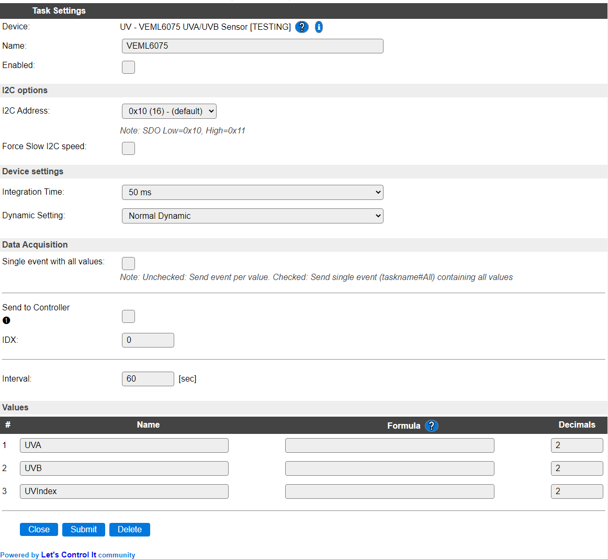
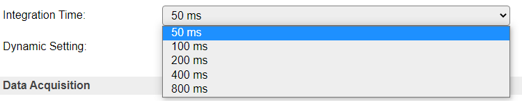
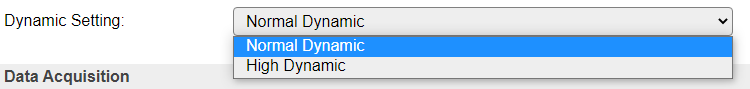

.. include:: ../Plugin/_plugin_substitutions_p11x.repl
.. _P114_page:

|P114_typename|
==================================================

|P114_shortinfo|

Plugin details
--------------

Type: |P114_type|

Name: |P114_name|

Status: |P114_status|

GitHub: |P114_github|_

Maintainer: |P114_maintainer|

Used libraries: |P114_usedlibraries|

Description
-----------

This I2C sensor with 2 resolutions (normal/high dynamic) offers UVA (365 +/-10 nm) and UVB (330 +/-10 nm) measurement and a calculated UVIndex value. Output result for UV is in irradiance, watt per square metre. The maximum value that can me measured is 65535, as the chip provides 16 bit values.

NB: If the unit is over-exposed, possibly the measurement could exceed the maximum returned value of 65535, and the calculated UVIndex value will *not* be correct.

NB2: When measuring outside UV exposure, the sensor should also be outside, as f.e. window glass filters out most UV radiance, and measurements will be (very) inaccurate.

Configuration
--------------

**Name** A unique name should be entered here.

**Enabled** The device can be disabled or enabled. When not enabled the device should not use any resources.

I2C Options 
^^^^^^^^^^^^

The available settings here depend on the build used. At least the **Force Slow I2C speed** option is available, but selections for the I2C Multiplexer can also be shown. For details see the :ref:`Hardware_page`

**I2C Address**: The address the device is using. Depending on the board used, when available a SDO pin, or soldering a 0 ohm resistor on a different location, can be used to select the used address. If that address selection is not available, then an I2C multiplexer (in a matching ESPEasy build) can be used to use multiple sensors on a single ESPEasy unit.

Device Settings
^^^^^^^^^^^^^^^^

**Integration Time**: The integration time setting of the sensor determines the accuracy of the measurement. There are 5 options available:

*50 ms* The default value, using an integration time of 50 msec.

*100ms* 

*200ms* 

*400ms* 

*800ms* 

Usually a higher integration time results in a more accurate measurement.

**Dynamic Setting**: This determines the dynamic setting:

*Normal Dynamic*

*High Dynamic* For better response to changing conditions during measurement.

The Data Acquisition, Send to Controller and Interval settings are standard available configuration items. Send to Controller only when one or more Controllers are configured.

**Interval** By default, Interval will be set to 60 sec. The minimum value allowed is 1 sec. but for measuring UV values, that don't change very quickly, reasonable values should be between 10 and 300 sec.

Values
^^^^^^

The measured values are available in ``UVA``, ``UVB`` and ``UCIndex``. A formula can be set to recalculate. The number of decimals is by default set to 2, and can be set to 0 for ``UVA`` and ``UVB``, as no decimals are provided from the measurement. ``UVIndex`` value is often used without decimals, but can be set as desired.

.. Events
.. ~~~~~~

.. .. include:: P114_events.repl

Change log
----------

.. versionchanged:: 2.0

  |added| 2021-04-24 Moved to main repository as Plugin 114 UV - VEML6075 UVA/UVB Sensor from the ESPEasyPluginPlayground (P130).
