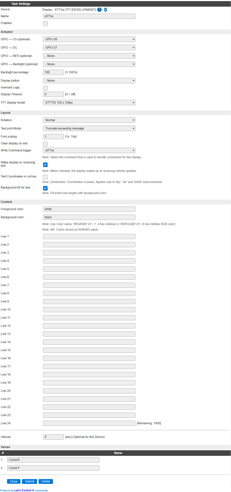
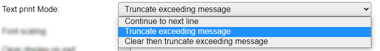
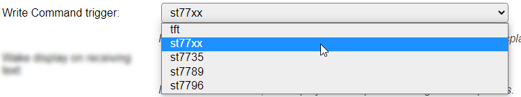

.. include:: ../Plugin/_plugin_substitutions_p11x.repl
.. _P116_page:

|P116_typename|
==================================================

|P116_shortinfo|

Plugin details
--------------

Type: |P116_type|

Name: |P116_name|

Status: |P116_status|

GitHub: |P116_github|_

Maintainer: |P116_maintainer|

Used libraries: |P116_usedlibraries|

Description
-----------

The ST7735, ST7789 and ST7796 chip families drive color TFT displays in various resolutions, and usually support 65535 colors (RGB565 coded).

This plugin supports these display models:

* **ST7735** with resolutions 128 x 128, 128 x 160 and 80 x 160 pixels
* **ST7789** with resolutions 240 x 320, 240 x 240, 240 x 280 and 135 x 240 pixels
* **ST7796** with resolution of 320 x 480 pixels.

The plugin can be configured to show predefined text, a reservation for up to 24 lines is made, but only the lines that can fit on-screen will be shown, or via commands, sent via http or from rules, text or graphical elements like lines, rectangles, circles, pixels, etc., can be shown.

Hardware
---------

A few images, grabbed from suppliers on Aliexpress, showing available & supported displays:

ST7735 128 x 128 pixels
   

ST7735 128 x 160 pixels

ST7735 80 x 160 pixels

ST7789 240 x 320 pixels

ST7789 240 x 240 pixels (This model has no ``CS`` pin available)

ST7789 240 x 280 pixels (some have rounded corners, in that case corner-pixels are addressable but not visible)

ST7789 135 x 240 pixels (separate and integrated modules)

ST7796 320 x 480 pixels display on WT32 SC01 unit

Connections
^^^^^^^^^^^^

These displays are connected using the SPI interface, minimally with 3 signal wires, though most also support the ``CS`` signal, so 4-wire SPI can be used, to allow multiple SPI-connected devices.

The text on most displays is somewhat confusing, as not the usual SPI names are used:

.. code-block:: none

  ESP         TFT
  --------    ------
  3V3     --- VCC (most displays only support 3.3V)
  GND     --- GND
  MOSI    --> SDA
  CLK     --> SCL/SCK
  (gpio)  --> DC
  (gpio)  --> CS (optional, not available on all displays)
  (gpio)  --> RES (optional)
  (gpio)  --> BLK (optional)

  (gpio) = configurable GPIO pin.

Device
------

* **Name** A unique name should be entered here.

* **Enabled** The device can be disabled or enabled. When not enabled the device should not use any resources.

Actuator
^^^^^^^^

* **GPIO -> CS (optional)** Select the GPIO pin to use for the ``CS`` connection. If the display doesn't have a ``CS`` connection it can be set to *None*.
* **GPIO -> DC** The GPIO pin to use for the ``DC`` connection (Data/Command).
* **GPIO -> RES (optional)** Select the GPIO pin to use for the ``RES`` (reset) connection. If the display doesn't have a ``RES`` (or RST) connection, or no free pin is available, it can be set to *None*. If it is set to None, for proper operation it may need too be wired to the Reset connection on the ESP, so the device is initialized correctly.
* **GPIO -> Backlicht (optional)** Select the GPIO pin to use for controlling the backlight. To save power, the backlight can be dimmed, or turned off if the display is turned off. If set to *None*, usually the max. brightness is used for the backlight.
* **Backlight percentage** The backlight can be controlled via PWM modulation on the Backlight (BLK) pin of the display. This is set as a percentage between 1 and 100.
* **Display button** A GPIO pin can be configured to wake the display on demand. This, combined with the **Display Timeout** setting, can preserve the lifetime of the display, and save some power.
* **Inversed Logic** When checked, reverses the pin-state action of the **Display button** gpio. This allows an external circuit, f.e. an IR sensor, that may provide a *high* signal when activated, to wake the display.
* **Display Timeout** Select the timeout in seconds to turn off the display after the last update or wake-up. Only used if the **Display button** is *also* configured.
* **TFT Display model** Select the hardware model that is connected. Currently there are only preset resolutions available.

Available options:

* *ST7735 128 x 128px* Allows about 12 lines of text in the smallest font scaling setting (the 13th line will be distorted, as the bottom 2 pixellines aren't available)
* *ST7735 128 x 160px* Allows 16 lines of text in the smallest font scaling setting.
* *ST7735 80 x 160px* Allows 16 lines of text in the smallest font scaling setting.
* *ST7735 80 x 160px (Color inverted)* Special color inverted configuration as used in f.e. M5Stack StickC.
* *ST7789 240 x 320px* Allows 32 lines of text in the smallest font scaling setting. Predefined text only goes to 24, extra lines can be displayed from rules or external commands.
* *ST7789 240 x 240px* Allows 24 lines of text in the smallest font scaling setting.
* *ST7789 240 x 280px* Allows 28 lines of text in the smallest font scaling setting. Predefined text only goes to 24, extra lines can be displayed from rules or external commands.
* *ST7789 135 x 240px* Allows about 13 lines of text in the smallest font scaling setting (the 14th line may be distorted because of a lack of pixellines).
* *ST7796 320 x 480px* Allows 32 or 48 lines of text in the smallest font scaling setting.

Layout
^^^^^^^^

* **Rotation** Depending on how the display is to be mounted/installed, it may be needed to rotate the content, or with a non-square resolution, to use the display in *Landscape* layout instead of the default *Portrait*.

Available options:

.. image:: P116_RotationOptions.png
   :alt: Rotation

The available options rotate the display in a clock-wise direction.

* **Text print Mode** Defines the handling of text when predefined text or text via the ``txt`` or ``txtfull`` subcommands (see below) is displayed.

Available options:

* *Continue to next line* Simply 'prints' all text to the display, with automatic overflow to the next line(s) if the text doesn't fit on the current line.
* *Truncate exceeding message* Display the provided message, but any excess at the right border of the display is discarded.
* *Clear then truncate exceeding message* Clear from the current cursor position to the end of the display, then display the provided message, but any excess at the right border of the display is discarded.

Default setting is *Truncate exceeding message*.

* **Font scaling** The scaling factor for the currently active font. Select a factor between 1 and 10.

* **Clear display on exit** When checked, will clear the display when the task is disabled, either from settings or via the ``TaskDisable`` command. The screen will be turned off, and when a backlight pin is configured, also the backlight is turned off.

* **Write Command trigger** The command to handle any commands for this device can be selected here. This can make the commands compatible with other (tft) displays, using the same command structure via the ESPEasy Adafruit Graphics helper class.

Available options:

* *tft*
* *st77xx*
* *st7735*
* *st7789*
* *st7796*

The command is handled non-case sensitive. See below for available commands and subcommands.

* **Wake display on receiving text** When checked, the display will be enabled once any content is written to the screen, either triggered by the Interval, or from a command. Default checked.

* **Text Coordinates in col/row** When checked, the coordinates for the ``txp``, ``txz`` and ``txtfull`` subcommands will be handled in cursor columns & rows, instead of pixels. Column and row are calculated from the current font size and font scaling settings.

* **Background-fill for text** When checked, for any text-line sent to the screen, the entire background (including top and bottom lines) will have the provided background color, *unless* transparent is used (Background color == Foreground color). Default checked.

Content
^^^^^^^^

* **Foreground color**
* **Background color**

These are the default colors, used to display the content as configured below (if any). The background color is also used as the Clear screen color.

Colors can be specified in 3 ways:

* *Color name* Some named colors are recognized: White, Black, Red, Green, Blue, Yellow, Orange, Navy, Darkgreen, Cyan, Darkcyan, Maroon, Purple, Olive, Magenta, Lightgrey, Darkgrey, Pink and Greenyellow. If any of these colors is recognized, the name will be shown.
* *#RGB565* A ``#`` prefixed, 1 to 4 digit, hex-coded color value in RGB565 format (5 bits red, 6 bits green, 5 bits blue) giving the max. number of 65535 colors. This is the value that is shown after the settings are saved, and it is not one of the known color names.
* *#RRGGBB* A ``#`` prefixed, 6 digit, hex coded RGB color value. Will be transformed to an RGB565 value!

If the Foreground and Background colors are the same, the background color will become ``transparent``. If the Forground color is empty, as a default ``white`` will be set.

* **Line 1..24** Predefined content can be specified. The number of lines used depends on the size of the display, the font used and the font scaling that is set. On a 240x240 pixel display, with the default font, and font scling set ot 1, all 24 lines will be displayed, but when using font scaling 2, then only the first 12 lines are displayed. If more lines are needed, then they should be set from the rules or an external source, like commands via http.

The usual variables, like ``[Taskname#Valuename]``, or ``%v1%``, system variables, formulas and functions can be used.

Input length is limited to 60 characters per line. If a longer calculated text is needed for a line, then it should be set from the rules or from an external source via http commands.

Next to Line 24, the remaining capacity in characters is displayed.

The total combination of lines * input length can not exceed 1000 characters (sized dynamically), as there is limited storage per task available for these settings. An error message will be shown after (trying to) save the settings, **any excess content will be discarded!**

Example:

* **Interval** By default, Interval will be set to 0. If set to a non-zero value, the pre-configured content will be updated automatically using that interval (seconds). Depending on the **Text print Mode** setting, content that may have been draw from rules or external commands, may be erased.

Values
^^^^^^

The current text-cursor position is available in 2 variables **CursorX** and **CursorY**, that will be updated on every change of text or received command. **No** events are generated, and these values will never be sent to controllers.

The values can be used in rules, if desired. They will follow the **Text Coordinates in col/row** setting.

Commands
----------

.. include:: P116_commands.repl
.. include:: AdaGFX_commands.repl

Values
------

.. include:: AdaGFX_values.repl

.. Events
.. ~~~~~~

.. .. include:: P116_events.repl

Change log
----------

.. versionadded:: 2.0
  ...

  |added| 2021-11-06 Add support for ST7796 displays

  |added| 2021-08 Moved from an external forum to ESPEasy.
