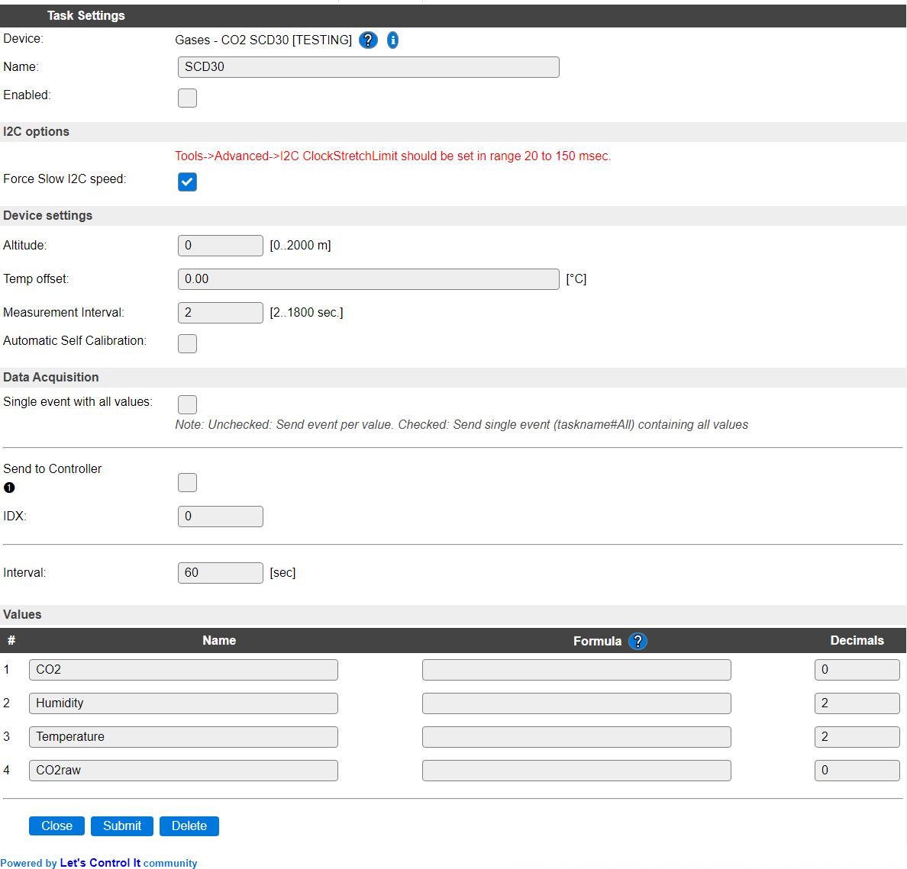

.. include:: ../Plugin/_plugin_substitutions_p11x.repl
.. _P117_page:

|P117_typename|
==================================================

|P117_shortinfo|

Plugin details
--------------

Type: |P117_type|

Name: |P117_name|

Status: |P117_status|

GitHub: |P117_github|_

Maintainer: |P117_maintainer|

Used libraries: |P117_usedlibraries|

Description
-----------

The SCD30 is a CO2 sensor unit that also provides Humidity and Temperature measurement, supports auto-calibration, allows forced recalibration, and has temperature and altitude compensation settings.

Configuration
-------------

* **Name** Required by ESPEasy, must be unique among the list of available devices/tasks.

* **Enabled** The device can be disabled or enabled. When not enabled the device should not use any resources.

I2C options
^^^^^^^^^^^

.. note:: According to manufacturer specification, the I2C ClockStretchLimit setting should be configured at a minimum value of 20 milliseconds, and can take up to 150 msec once a day. For ESP8266 and ESP32 there are somewhat different values to fill, ESP8266 expects microseconds (usec) there, 20000 to 150000, and ESP32 needs 1/80 usec, 1600000 to 12000000, so a factor 80 difference.

The available settings here depend on the build used. At least the **Force Slow I2C speed** option is available, but selections for the I2C Multiplexer can also be shown. For details see the :ref:`Hardware_page`

.. note:: The SCD30 sensor supports a max. I2C Clock Speed of 100 kHz, so **Force Slow I2C speed** should be checked! (ESPEasy has a default setting of 100 kHz for I2C Slow device Clock Speed).

Device Settings
^^^^^^^^^^^^^^^

* **Altitude** Set the altitude above sealevel in meters, where the sensor is placed. The range is 0..2000 meter.

* **Temp offset** Offset for temperature correction. Can be set to compensate any self-heating of the device, by comparing the temperature measurement with another calibrated temperature measured close to the device. The difference can be set here, and is (also) stored in the sensor (but re-written every time ESPEasy initializes the sensor).

* **Measurement Interval**: The default interval for continuous measuring is 2 sec. Here this interval can be increased, if so desired.

* **Automatic Self Calibration**: When enabled, the automatic self-calibration will be activated when the plugin is started. If the calibration is set via the ``scdsetfrc,<co2_ppm>`` command, the calibration is reset to manual, as the ASC overwrites the manually set calibration.

.. warning:: Automatic Self Calibration is a tedious process, that at first run takes at least 7 days to complete, and requires the sensor to be in fresh air for at least 1 hour daily, during the self-calibration period.

The Data Acquisition, Send to Controller and Interval settings are standard available configuration items. Send to Controller only when one or more Controllers are configured.

* **Interval** By default, Interval will be set to 60 sec. The data will be measured and optionally sent to any configured controllers using this interval.

Values
^^^^^^

The used library provides an averaged CO2 value of the last 5 measurements in value ``CO2``. The last single CO2 measurement is also available as ``CO2raw``.

``Humidity`` shows the relative humidity RH in a range of 0..100%.

``Temperature`` shows the temperature of the sensor in degrees Celcius, with the **Temp offset** applied.

Commands available
^^^^^^^^^^^^^^^^^^

.. include:: P117_commands.repl

Change log
----------

.. versionchanged:: 2.0
  ...

  |added|
  2022-02-26 Added commands and settings for measurement interval, automatic calibration and forced recalibration.

  |added|
  2021-11-20 Initial release version.

