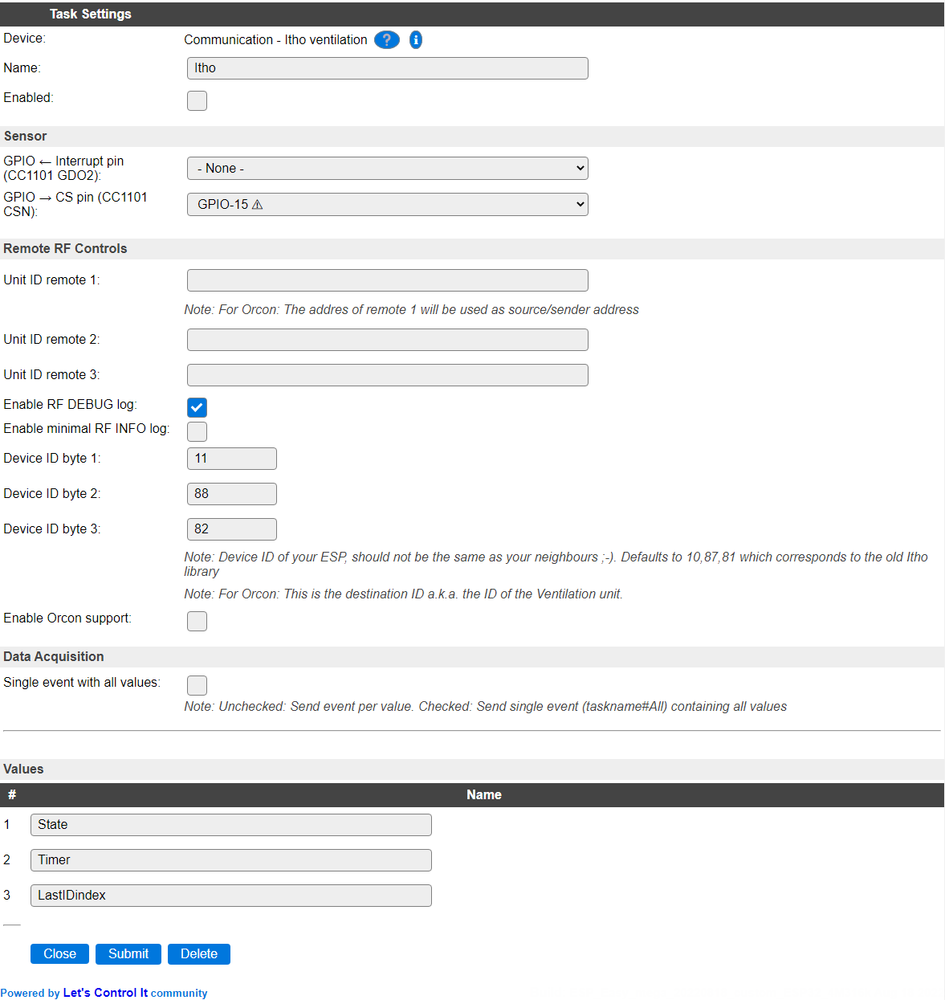

.. include:: ../Plugin/_plugin_substitutions_p11x.repl
.. _P118_page:

|P118_typename|
==================================================

|P118_shortinfo|

Plugin details
--------------

Type: |P118_type|

Name: |P118_name|

Status: |P118_status|

GitHub: |P118_github|_

Maintainer: |P118_maintainer|

Used libraries: |P118_usedlibraries|

Description
-----------

This plugin enables communication with an Itho RFT fan (and some Duco fans) through a CC1101 868 MHz transceiver. It allows controlling the fan speed by simulating an Itho remote, and can also monitor for commands sent by other remotes.

Wiring
------

The CC1101 transceiver is controlled via SPI and also requires an pin for the interrupt to let the ESP know a data packet has arrived. Make sure to enable SPI under the ESPEasy hardware configuration.

.. code-block:: none

  CC1101 pin			ESP pin			Description
  1 - Vcc			Vcc			3.3V
  2 - GND			GND			Ground
  3 - MOSI	<--		D7/GPIO13		Data input to CC1101
  4 - SCK	<--		D5/GPIO14		SPI clock pin
  5 - MISO	-->		D6/GPIO12		Data output from CC1101
  6 - GDO2	-->		Choose			Interrupt pin (see note)
  7 - GDO0			NC			Not in use
  8 - CSN	<--		D8/GPIO15		SPI chip select

.. note:: Any pin of the ESP can be used except for SPI pins, boot related pints (GPIO0, GPIO2, GPIO15), or GPIO16 (no interrupt support). If you use I2C pins for the interrupt make sure to disable I2C in the ESPEasy hardware configuration.

Configuration
-------------

* **Name** Required by ESPEasy, must be unique among the list of available devices/tasks. Used in MQTT commands

* **Enabled** The device can be disabled or enabled. When not enabled the device should not use any resources.

Sensor
^^^^^^

* **GPIO <- Interrupt pin (CC1101 GDO2)**: Input interrupt pin of the ESPEasy, should be connected to CC1101 GDO2. Don't use ESP boot related pints (GPIO0, GPIO2, GPIO15) or GPIO16 (no interrupt support). When this setting is set to ``- None -`` it will be iognored, but receiving the messages sent from other controllers is not possible. Sending commands to the ITHO ventilation unit is still possible.

* **GPIO -> CS pin (CC1101 CSN)**: The output pin to connect to the CS/CSN line of the CC1101 controller. The previous fixed setting of GPIO 15 is filled by default, but can be changed if multiple tranceiver units can be connected to the ESP.

Remote RF Controls
^^^^^^^^^^^^^^^^^^

* **Unit ID remote 1..3**: ID of another remote that controls your Itho fan. When set it allows the plugin to monitor for commands and act on them. The ID consist out of 3 numbers separated by ','. Up to 3 remotes are supported. After the controller is joined with the ventilation unit, and enabling the **Enable minimal RF INFO log** option below, these ID's can be extracted from the logs at the INFO level by pressing a button on the remote. Most remotes will repeat a command ca. 3 times, in case there is disturbance in communication, so that should be easily recognizable.

* **Enable RF DEBUG log**: When enabled all recieved RF packages will be shown in the ESPEasy log at DEBUG level. Useful to determine the ID of other remotes and the messages they send. Disable when not necessary to reduce writing to the log. (Only available when Debug logging is available in the build.)

* **Enable minimal RF INFO lgo**: When enabled, this will write the ID and raw command sent from any device using the same frequency and protocol. Can be used to determine entries for **Unit ID remote 1..3**. Disable when not necessary to reduce writing to the log.

* **Device ID byte 1..3**: Device ID of the ESPEasy plugin, defaults to 10,87,81. The plugin acts as a remote and can have a unique ID. Can be changed from default if you have interference with neighbours. After a change you should again join the ESP with the fan.

* **Enable Orcon support**: Enables the extra protocol for the Orcon brand of ventilation units, that use the same protocol, but with a different command set. To avoid possible interference, it is disabled by default.

Data Acquisition
^^^^^^^^^^^^^^^^

This group of settings, **Single event with all values** and **Send to Controller** settings are standard available configuration items. Send to Controller is only visible when one or more Controllers are configured.

Values
^^^^^^

The plugin has 3 values to indicate the status of the fan:

``State`` shows the state of the last command send to the fan

``Timer`` shows the value of the timer

``LastIDindex`` shows the index of the last remote from which a command was received (1 to 3)

  
Commands available
^^^^^^^^^^^^^^^^^^

.. include:: P118_commands.repl

Rules examples
--------------

Below an example on how to synchronize the plugin with a level switch in Domoticz

.. code-block:: none

	on Itho#State do
	 if [Itho#State]=0
	  Publish domoticz/in,'{"command":"switchlight","idx":IDX,"switchcmd":"Set Level","level":0}'
	 elseif [Itho#State]=1
	  Publish domoticz/in,'{"command":"switchlight","idx":IDX,"switchcmd":"Set Level","level":10}'
	 elseif [Itho#State]=2
	  Publish domoticz/in,'{"command":"switchlight","idx":IDX,"switchcmd":"Set Level","level":20}'
	 elseif [Itho#State]=3
	  Publish domoticz/in,'{"command":"switchlight","idx":IDX,"switchcmd":"Set Level","level":30}'
	 elseif [Itho#State]=4
	  Publish domoticz/in,'{"command":"switchlight","idx":IDX,"switchcmd":"Set Level","level":40}'
	 elseif [Itho#State]=13
	  if [Itho#Timer]=599
	   Publish domoticz/in,'{"command":"switchlight","idx":IDX,"switchcmd":"Set Level","level":50}'
	  endif
	 elseif [Itho#State]=23
	  if [Itho#Timer]=1199
	   Publish domoticz/in,'{"command":"switchlight","idx":IDX,"switchcmd":"Set Level","level":60}'
	  endif
	 elseif [Itho#State]=33
	  if [Itho#Timer]=1799
	   Publish domoticz/in,'{"command":"switchlight","idx":IDX,"switchcmd":"Set Level","level":70}'
	  endif
	 endif
	endon

Change log
----------

.. versionchanged:: 2.0
	.

  |changed|
  2023-03-05: Deprecate ``state`` command, introduce ``itho`` command.

  |added|
	2022-08-18: Add support for Orcon devices.

  |added|
	2022-08-10: Made multi-instance compatible, CS pin configurable and interrupt pin usage optional.

  |added|
	2021-12-26 Initial release version.

