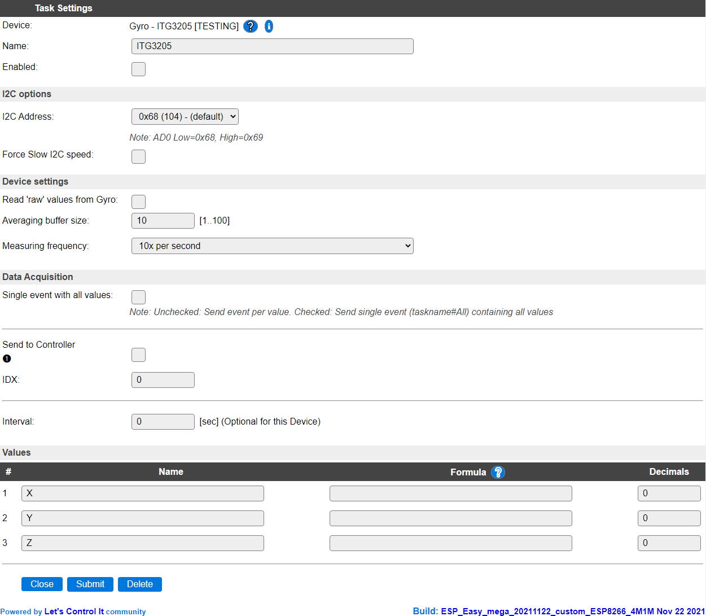

.. include:: ../Plugin/_plugin_substitutions_p11x.repl
.. _P119_page:

|P119_typename|
==================================================

|P119_shortinfo|

Plugin details
--------------

Type: |P119_type|

Name: |P119_name|

Status: |P119_status|

GitHub: |P119_github|_

Maintainer: |P119_maintainer|

Used libraries: |P119_usedlibraries| (Using a modified local copy)

Configuration
-------------

Task settings
~~~~~~~~~~~~~~

* **Name** The name of the task. This should be unique for all devices that are configured. (Initially empty)

* **Enabled** For the device to work it has to be enabled. When checked, the device will be started as soon as the ESP starts. If desired, the device can also be enabled from f.e. a rule by using the ``TaskEnable,<tasknr>`` or ``TaskEnable,<taskname>`` command, or disabled using the corresponding ``TaskDisable,<tasknr>|<taskname>`` commands.

I2C Options 
^^^^^^^^^^^^

The available settings here depend on the build used. At least the **Force Slow I2C speed** option is available, but selections for the I2C Multiplexer can also be shown. For details see the :ref:`Hardware_page`

**I2C Address**: The address the device is using. The ITG3205 chip allows to select a secondary address by pulling the AD0 pin to high (3.3V) to select the secondary address. That address should then be selected here too. Not all available modules allow configuring the secondary address.

Device Settings
^^^^^^^^^^^^^^^^

* **Read 'raw' values from Gyro** When checked the reported values are *not* calibrated. This option is made available as the library provides it, but during testing the raw results didn't seem very useful.

Normally, at startup of the plugin, a calibration is determined by reading 128 measurements, negating the result and averaging that per axis. This is then used to calibrate the actual measurements at every read by adding the calculated offset, and dividing the result by a manufacturer provided constant (14.375).

* **Averaging buffer size** Defines the size of the averaging buffer. To provide more stable & smooth measurements, the results can be averaged by using a buffer size > 1. The maximum buffer size is 100, making the updates change quite slow. The default setting of 10 should provide stable results. Averaging can be disabled by setting the buffer size to 1.

* **Measuring frequency** The measuring frequency determines the number of samples per second that are taken.

The available options:

* *10x per second* The default setting, can be used if the movement of the module is slow or medium fast.
* *50x per second* Can be used if the movement of the module is fast, or a high update interval is needed, then the smoothing of the results can be enhanced by increasing the **Averaging buffer size**.

Data Acquisition
^^^^^^^^^^^^^^^^

This group of settings, **Single event with all values**, **Send to Controller** and **Interval** settings are standard available configuration items. Send to Controller is only visible when one or more Controllers are configured.

**Interval** By default, Interval will be set to 0 sec. It is the frequency used to read the sensor values, averaged by the Averaging buffer, and send these to any Controller(s) configured for this device.

Values
^^^^^^

The names for the values are initially set to a default name, but can be changed if desired. Also, a formula can be entered to re-calculate the value before display/sending to a controller, and the number of decimals can be changed, but these have been set to 0 as the sensor does not provide any decimals itself. Using a formula can cause decimals to be introduced, so this should then be adjusted.

Change log
----------

.. versionadded:: 2.0
  ...

  |added|
  2021-10-28 Initial version.

