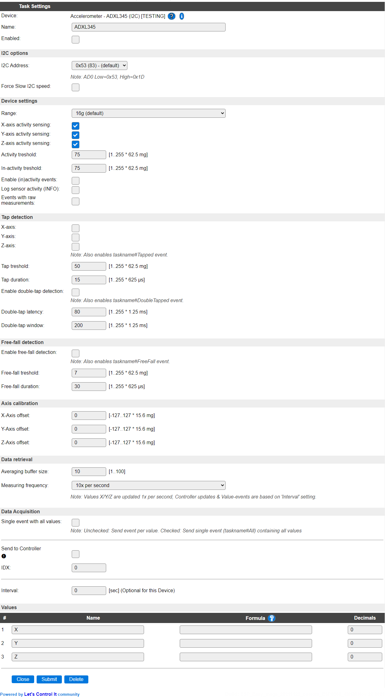

.. include:: ../Plugin/_plugin_substitutions_p12x.repl
.. _P120_page:

|P120_typename|
==================================================

|P120_shortinfo|

Plugin details
--------------

Type: |P120_type|

Name: |P120_name|

Status: |P120_status|

GitHub: |P120_github|_

Maintainer: |P120_maintainer|

Used libraries: |P120_usedlibraries|

Description
-----------

The ADXL345 Acceleration sensor can be used to detect movement of the sensor in X, Y and Z direction, also supports detection of single and double taps, and free falling detection.

This sensor is sometimes combined with an ITG3205 Gyro sensor and a HMC5883L magneto position sensor on a single board, as these sensors are often used together because of their accompanying features.

Configuration
-------------

**Name** A unique name should be entered here.

**Enabled** The device can be disabled or enabled. When not enabled the device should not use any resources.

I2C Options 
^^^^^^^^^^^^

The available settings here depend on the build used. At least the **Force Slow I2C speed** option is available, but selections for the I2C Multiplexer can also be shown. For details see the :ref:`Hardware_page`

**I2C Address**: The address the device is using. Some boards holding this chip offer an extra connection SD0 that can be used to select the address. The available addresses are ``0x53`` and ``0x1D`` (secondary).

.. include:: P120_P125_common.repl

.. Commands available
.. ^^^^^^^^^^^^^^^^^^

.. .. include:: P120_commands.repl

.. Events
.. ~~~~~~

.. .. include:: P120_events.repl

Change log
----------

.. versionchanged:: 2.0
  ...

  |added|
  2021-10-30 Initial release version.

