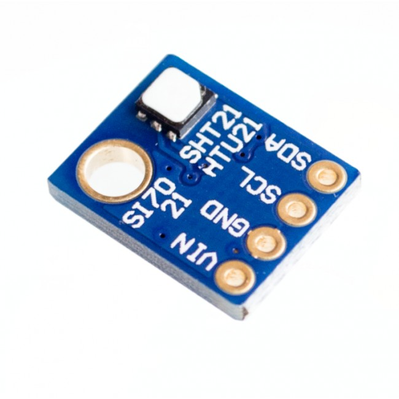
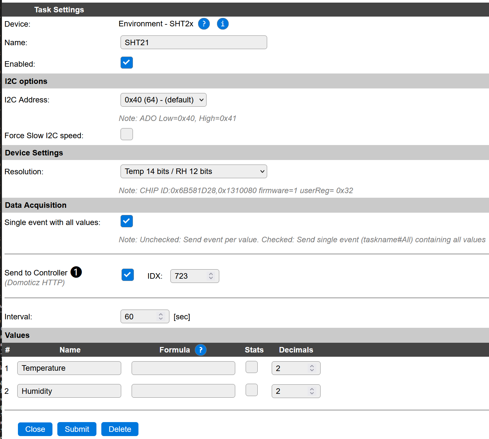

.. include:: ../Plugin/_plugin_substitutions_p12x.repl
.. _P122_page:

|P122_typename|
==================================================

|P122_shortinfo|

Plugin details
--------------

Type: |P122_type|

Name: |P122_name|

Status: |P122_status|

GitHub: |P122_github|_

Maintainer: |P122_maintainer|

Used libraries: |P122_usedlibraries|

Supported hardware
------------------

|P122_usedby|

Note that on the internet there are many temperature/humidity sensor boards with I2C available. The board above mentions SI7021, SHT21 or HTU21. These are separate microchips, check what you have bought. 
The SI7021 and SHT21 are **not** compatible. This plugin only supprts the SHT21, SHT20 and SHT25.

Description
-----------
This plugin support the SHT2x series (SHT20, SHT21, SHT25) of temperature and humidity sensors. These sensors are connected by the I2C bus.

See datasheet:
https://admin.sensirion.com/media/documents/120BBE4C/63500094/Sensirion_Datasheet_Humidity_Sensor_SHT21.pdf

Wiring
------
Connect the device to the I2C bus

Configuration
-------------

**Name** : A unique name should be entered here.

**Enabled** : The device can be disabled or enabled. When not enabled the device should not use any resources.

**I2C Address** : The Device address on the I2C bus. Default address is 0x40.

**Force Slow I2C speed** : Standard I2C setting to select a slow device. The SHT2x does not need slow I2C speed.

**Resolution**: Select one of the supported resolution settings of the device. See datasheet.

Change log
----------

.. versionchanged:: 2.0
  ...

  |added|
  Major overhaul for 2.0 release.

.. versionadded:: 1.0
  ...

  |added|
  Initial release version.

