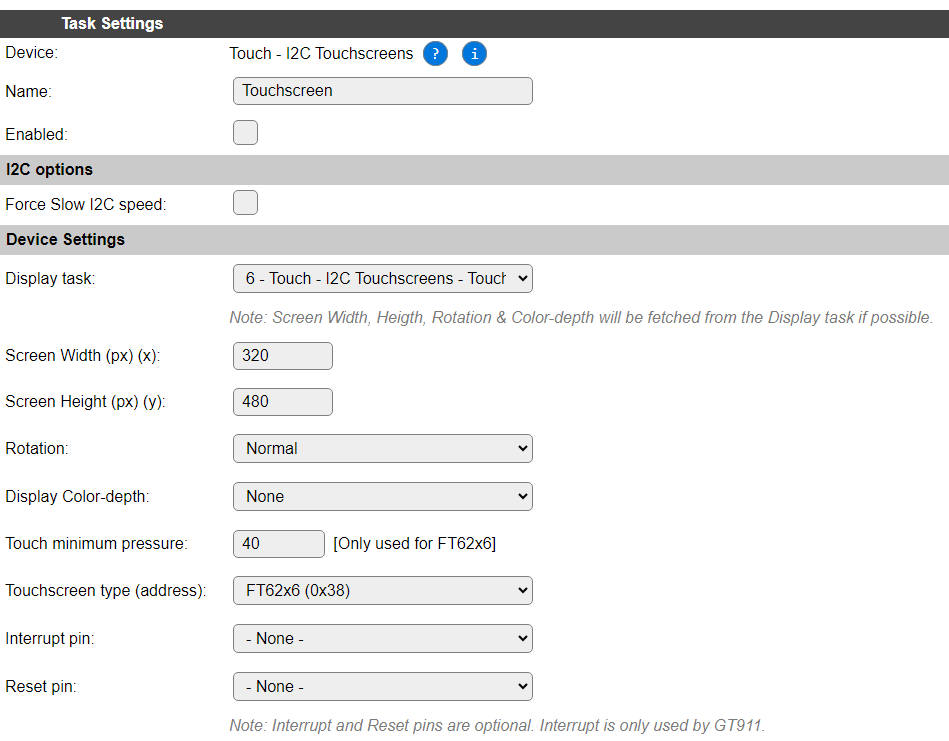
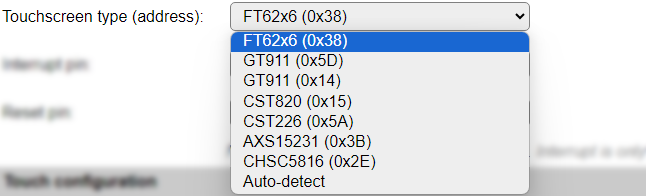

.. include:: ../Plugin/_plugin_substitutions_p12x.repl
.. _P123_page:

|P123_typename|
==================================================

|P123_shortinfo|

Plugin details
--------------

Type: |P123_type|

Name: |P123_name|

Status: |P123_status|

GitHub: |P123_github|_

Maintainer: |P123_maintainer|

Used libraries: |P123_usedlibraries|

Supported hardware
------------------

Some displays are available with a touch overlay mounted on top of the visible side of the display. There's a choice of resistive and capacitive touch overlays. The I2C touch overlays supported in this plugin are of the Capacitive kind, being very easy to interact with, comparable to modern smartphones, where you can use a finger for the interaction. (Resistive touch overlays usually require a special pen to be used, or pressed with a finger-nail, to get a response.)

The supported touch overlays (or touch screens), can be found on several displays, f.e. some M5Stack devices, the WT32-SC01 display unit and the LilyGO LILY Pi ESP32 unit.

Device configuration
--------------------

* **Name**: Required by ESPEasy, must be unique among the list of available devices/tasks.

* **Enabled**: The device can be disabled or enabled. When not enabled the device should not use any resources.

I2C options
^^^^^^^^^^^

The available settings here depend on the build used. At least the **Force Slow I2C speed** option is available, but selections for the I2C Multiplexer can also be shown. For details see the :ref:`Hardware_page`

Device Settings
^^^^^^^^^^^^^^^

* **Display task**: Select the display task the touch screen is mounted on. By default, the current task is selected (and ignored), as any other guess would be wrong, and there is no 'None' selection available.

When choosing the correct task, the current display resolution, color depth and rotation settings are tried to be fetched from that task, and copied here in the matching settings. If no settings can be obtained, defaults will be applied.

The configured display will be used to draw the objects, if any, that can be configured below, on.

* **Screen Width (px) (x)**: Width of the display, the (horizontal) ``x`` coordinate, in pixels.

* **Screen Height (px) (y)**: Height of the display, the (vertical) ``y`` coordinate, in pixels. Top/Left coordinate is 0,0.

* **Rotation**: The rotation setting should match the rotation setting of the display, and can be selected as Normal (0), +90, +180 or +270 degrees.

* **Display Color-depth**: If the display settings have been retrieved successfully, this setting can not be changed, but will be used from the display. This value is used to select the correct color mappings for displaying the Objects.

* **Touch minimum pressure**: This setting determines the relative pressure or sensitivity of the FT62x6 touch displays. Lower values make it more sensitive. The range is 0 to 255. Only applicable for the FT62x6 controller.

* **Touchscreen Type (Address)**: Select the type of touchscreen installed, available options:

* *FT62x6 (0x38)*: Focaltech FT62x6/FT52x6 touchscreen controller family. Default selection.

* *GT911 (0x5D)*: GT911 touchscreen controller, default address.

* *GT911 (0x14)*: GT911 touchscreen controller, alternate address.

* *CST820 (0x15)*: CST816/CST820 touchscreen controller family.

* *CST226 (0x5A)*: CST226 touchscreen controller.

* *AXS15231 (0x3B)*: AXS15231 touchscreen controller.

* *Auto-detect*: Select this option to have the plugin auto-detect the used touchscreen controller. This auto-detect is mostly based on an I2C device being available at the shown addresses, so might get confused if a non-touchscreen I2C device at one of these addresses is installed.

|

* **Interrupt pin**: Select the GPIO that is connected to the IRQ connection of a GT911 touchscreen controller. The IRQ pin is only used for detection & address configuration, combined with the **Reset pin**, if available and configured. Only used for GT911 controller.

* **Reset pin**: Select the GPIO that is connected to the Reset connection of a GT911 touchscreen controller. Similar to the **IRQ pin**, only used for the GT911 controller.

.. note:: The **Interrupt** and **Reset** GPIO pins are only used for the GT911 controller, and are optional

.. include:: Touch_Configuration.repl

Change log
----------

.. versionadded:: 2.0
  ...

  |added|
  Initial release version.

