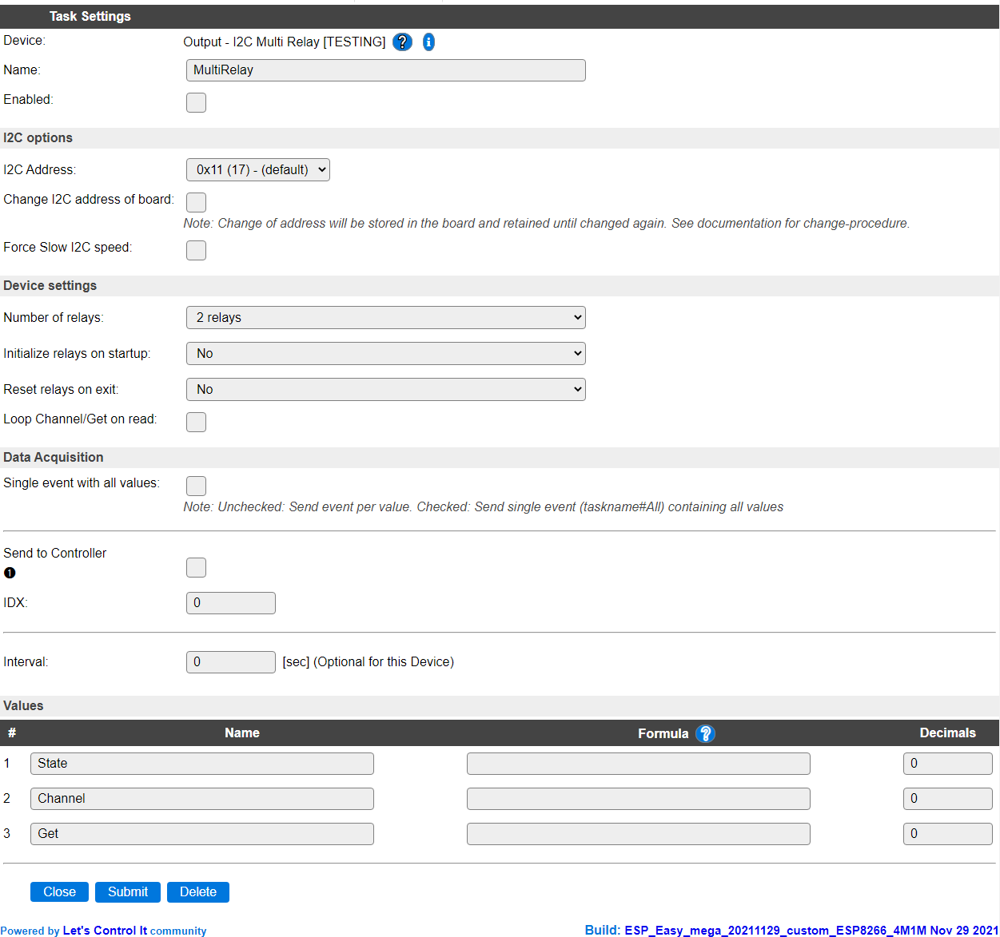
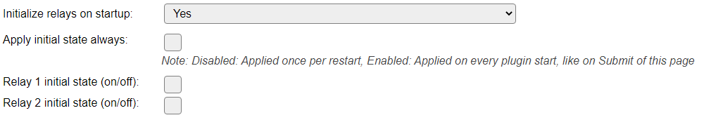

.. include:: ../Plugin/_plugin_substitutions_p12x.repl
.. _P124_page:

|P124_typename|
==================================================

|P124_shortinfo|

Plugin details
--------------

Type: |P124_type|

Name: |P124_name|

Status: |P124_status|

GitHub: |P124_github|_

Maintainer: |P124_maintainer|

Used libraries: |P124_usedlibraries|

Description
-----------

This plugin is the interface to the Seeed Studio I2C multi relay boards (either solid state or mechanical).

Each channel can be switched separately, or multiple relays at once, by sending the appropriate commands (see below).

Supported hardware
------------------

* `Seeed Studio Grove SPDT 4 Channel Relay`_
* `Seeed Studio Grove 2 Channel Solid State Relay`_
* `Seeed Studio Grove 4 Channel Solid State Relay`_
* `Seeed Studio Grove 8 Channel Solid State Relay`_

.. _Seeed Studio Grove SPDT 4 Channel Relay: https://wiki.seeedstudio.com/Grove-4-Channel_SPDT_Relay/
.. _Seeed Studio Grove 2 Channel Solid State Relay: https://wiki.seeedstudio.com/Grove-2-Channel_Solid_State_Relay/
.. _Seeed Studio Grove 4 Channel Solid State Relay: https://wiki.seeedstudio.com/Grove-4-Channel_Solid_State_Relay/
.. _Seeed Studio Grove 8 Channel Solid State Relay: https://wiki.seeedstudio.com/Grove-8-Channel_Solid_State_Relay/

Configuration
-------------

* **Name**: A unique name should be entered here.

* **Enabled**: The device can be disabled or enabled. When not enabled the device should not use any resources.

I2C Options 
^^^^^^^^^^^^

The available settings here depend on the build used. At least the **Force Slow I2C speed** option is available, but selections for the I2C Multiplexer can also be shown. For details see the :ref:`Hardware_page`

* **I2C Address**: The address the device is using.

* **Change I2C address of board**: These boards allow to change their I2C address. Once changed the address will be retained in the board non-volatile memory, until changed again. Currently addresses ``0x11`` to ``0x18`` are supported.
 
The procedure to change the address is:

* Connect only 1 of these boards to the I2C bus (other I2C devices *can* stay connected)
* Select the current board address in the **I2C Address** field. Use the Tools / I2C Scanner feature to retrieve the current board address, if needed.

.. .. comment

* Enable the **Change I2C address of board** option.
* Submit the page (saving the settings). This will increment the board' I2C address to the next one in the list.
* Optional: Use the Tools / I2C Scanner feature to verify that the board now has the next address.
* The **I2C Address** of the task will be updated to the new address.
* Repeat above steps until the desired address is set. After reaching the highest address, the default address ``0x11`` will be set.
* Save the settings using the Submit button.

After changing the address, a next board can be connected that uses another board address, most likely ``0x11``. Each board will require an additional task to be configured.

Device Settings
^^^^^^^^^^^^^^^

* **Number of relays**: Select the number of relays on the board connected.

When changing the number of relays, the page will be submitted and the settings saved.

* **Initialize relays on startup**: To initialize the relay on/off state after startup of the plugin, this option can be set to Yes. When changing the setting the page will be submitted and the settings saved.

* **Apply initial state always**: Off by default, then the initialization state will be sent only once after a restart of the ESP unit. When Enabled the initialization state will be sent on every start of the plugin, like after a Submit of the settings page.

* **Relay # initial state (on/off)**: The on or off state the relay should be set to on initialization of the plugin. Will show a checkbox for the number of relays configured (2, 4 or 8).

.. .. comment

* **Reset relays on exit**: To set the relay on/off state when the plugin is disabled, this option can be set to Yes. When changing the setting the page will be submitted and the settings saved.

* **Relay # exit-state (on/off)**: The on or off state the relay should be set to when the plugin is disabled. Will show a checkbox for the number of relays configured (2, 4 or 8).
 
.. note:: This will also be applied when Submitting the device settings page!

* **Loop Channel/Get on read**: When enabled, will update the Channel and Get values with the selected channel and its current state (0=off, 1=on). The channel will be incremented each interval (read action).

Data Acquisition
^^^^^^^^^^^^^^^^

The Data Acquisition, Send to Controller and Interval settings are standard available configuration items. Send to Controller only when one or more Controllers are configured.

Values
^^^^^^

The Values available for this sensor, are ``State``, holding the decimal value of the current channel_bitmap, ``Channel`` and ``Get``, showing the channel and its on/off state (1/0) of the last ``multirelay,get,<channel>`` command or when **Loop Channel/Get on read** is checked.

Commands available
------------------

.. include:: P124_commands.repl

.. Events
.. ~~~~~~

.. .. include:: P124_events.repl

Change log
----------

.. versionchanged:: 2.0
  ...

  |added|
  2021-11-19 Initial release version.

