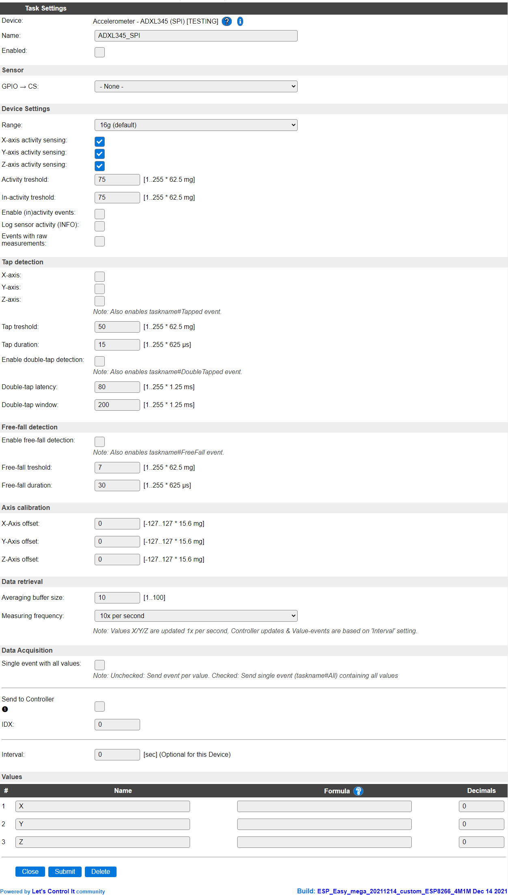

.. include:: ../Plugin/_plugin_substitutions_p12x.repl
.. _P125_page:

|P125_typename|
==================================================

|P125_shortinfo|

Plugin details
--------------

Type: |P125_type|

Name: |P125_name|

Status: |P125_status|

GitHub: |P125_github|_

Maintainer: |P125_maintainer|

Used libraries: |P125_usedlibraries|

Description
-----------

The ADXL345 Acceleration sensor can be used to detect movement of the sensor in X, Y and Z direction, also supports detection of single and double taps, and free falling detection.

This sensor is sometimes combined with an ITG3205 Gyro sensor and a HMC5883L magneto position sensor on a single board, as these sensors are often used together because of their accompanying features.

Configuration
-------------

**Name** A unique name should be entered here.

**Enabled** The device can be disabled or enabled. When not enabled the device should not use any resources.

Sensor
^^^^^^

**GPIO -> CS**: The GPIO pin that is to be used for controlling the ``CS`` signal of the board. Each SPI device should have its own CS pin, the other SPI signals can be shared among devices.

.. note:: Not all boards that claim to support SPI connections actually do. This may be caused by substandard production methods, or by ommitting parts to reduce cost. Usually, the same board also supports being connected via I2C, and that has worked reliably on all tests.

.. include:: P120_P125_common.repl

.. Commands available
.. ^^^^^^^^^^^^^^^^^^

.. .. include:: P125_commands.repl

.. Events
.. ~~~~~~

.. .. include:: P125_events.repl

Change log
----------

.. versionchanged:: 2.0
  ...

  |added|
  2021-12-14 Initial release version.

