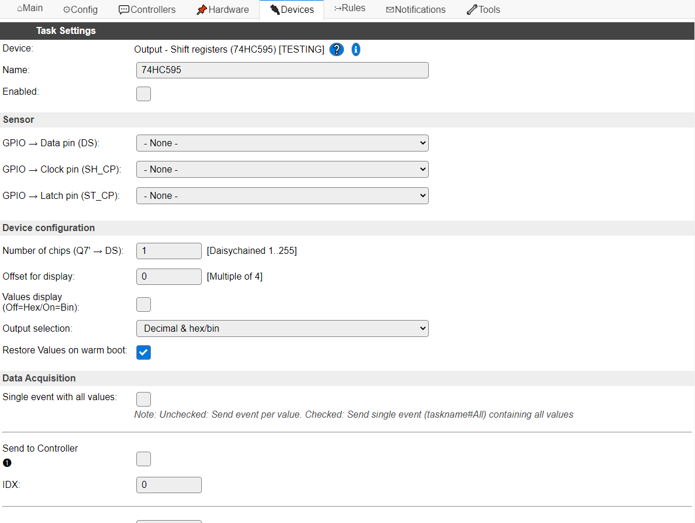
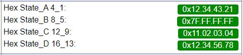
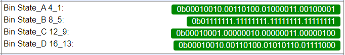

.. include:: ../Plugin/_plugin_substitutions_p12x.repl
.. _P126_page:

|P126_typename|
==================================================

|P126_shortinfo|

Plugin details
--------------

Type: |P126_type|

Name: |P126_name|

Status: |P126_status|

GitHub: |P126_github|_

Maintainer: |P126_maintainer|

Used libraries: |P126_usedlibraries|

Description
-----------

The 74HC595 Shift registers can be used to connect many output pins to an ESP using only 3 GPIO pins, as these shift registers can easily be daisy chained. There are several shift registers compatible with the 74HC595, like the 74HC164 or TPIC6B595, and probably a couple more.

When connecting many shift registers daisy-chained, it is important to ensure that not *too* many are connected to a single GPIO output pin, as that could overload that pin. It is advised to use a buffer chip for all used GPIOs for every 4 to 5 shift registers. When using a Schmitt-trigger buffer, it will also clean up the signal further down the line. Any buffer will introduce a small delay in the signal, possibly reducing the number of shift registers that can be controlled. A few useful answers are in this `Stack Exchange question`_

The output pins can be used to control f.e. relays or LEDs. NB: When using 74HC164, be aware that these don't use an output latch buffer, meaning the outputs are activated immediately according to the bits sent, so these are less applicable for relays. The logic is built so that on crash or reboot of the ESP, the last used state can be restored from RTC memory (enabled by default), so the state of the outputs is kept. This is limited to max. 16 shift registers, as that is the size of the memory reserved per task in RTC memory. This memory only survives a warm boot, *not* a reset or power-cycle!

The register outputs are **not** updated during initialization of the plugin; only when changing a pin state, or using the ``ShiftOut,Update`` command, the shift register outputs are updated.

Configuration
-------------

* **Name** A unique name should be entered here.

* **Enabled** The device can be disabled or enabled. When not enabled the device should not use any resources.

Sensor
^^^^^^

* **GPIO -> Data pin (DS)**: Select the GPIO pin that is connected to the Data in pin ``DS`` of the (first) shift register. Any daisy chained register has its ``DS`` pin connected to the ``Q7'`` pin of the previous shift register.

* **GPIO -> Clock pin (SH_CP)**: Select the Clock pin of all shift registers.

* **GPIO -> Latch pin (ST_CP)**: Select the Latch pin of all shift registers.

Device configuration
^^^^^^^^^^^^^^^^^^^^

* **Number of chips (Q7' -> DS)**: The number of chips daisy-chained to each other. Default: 1, max. 255 (compile-time defined, technically limited to 255), allowing for max. 2040 output pins.

* **Offset for display**: This setting determines which set of chip states are displayed on the Devices screen, but, more importantly, which will be restored from RTC memory on a warm boot of the ESP.

ESPEasy stores the current values of each task in RTC memory (that is retained during a warm boot, *not* a reset or power cycle), and restores their values if possible. This plugin uses the setting **Restore Values on warm boot** to determine if these values should then be used as the new state for the shift registers, allowing the outputs to survive a warm boot of the ESP.

Using **Offset for display**, the chips that will be restored, with a maximum of 16, are configured. This value is always rounded to a multiple of 4, and lower than the number of chips configured.

* **Values display (Off=Hex/On=Bin)**: The display on the Devices page is custom formatted to show the state of the outputs of the shift registers in either Hex (default) or Bin format, having a separator per chip (8 bits) for readability.

Some random values, Hex display (default)

Some random values, Bin display (16 chips visible)

NB: The State values are grouped per 4 chips. To be read from right to left in chip-order, see image below. If less chips are configured, only available states are shown. Display is started at the **Offset for display** + 1 chip.

* **Output selection**: Choose the values that are sent out to any controllers configured, or when getting the value from processing ``[<taskname>#<valuename>]``.

These are the available options:

.. image:: P126_OutputOptions.png
  :alt: Output selection options

If ``Decimal & hex/bin`` is selected, the value is output twice, formatted as decimal and as hexadecimal or binary, separated by a comma.

If either of the Hex/bin options is selected, but no ``Values display (Off=Hex/On=Bin)`` option is available, then the output will be formatted as hexadecimal.

* **Restore Values on warm boot**: By default, the register states are restored from RTC memory, so the outputs are in their previous state after a warm boot of the ESP. When turned off, all outputs will be turned off (low) on the next update.

The Data Acquisition, Send to Controller and Interval settings are standard available configuration items. Send to Controller only when one or more Controllers are configured.

* **Interval**: By default, Interval will be set to 0 sec. as this is optional for this plugin. Every Interval setting, the current output states will be read from the runtime object (*not* from the shift registers!) and stored in the Values fields, so they can be restored on a warm boot of the ESP.

Values
^^^^^^

The Values ``State_A`` to ``State_D`` are used to store the state of up to 16 shift registers to survive a warm boot.

Commands
~~~~~~~~

.. include:: P126_commands.repl

Change log
----------

.. versionchanged:: 2.0

  |added| 2022-01-28 Added to ESPEasy as a new plugin.

.. _Stack Exchange question: https://electronics.stackexchange.com/questions/40242/what-problems-could-occur-when-chaining-40-shift-registers