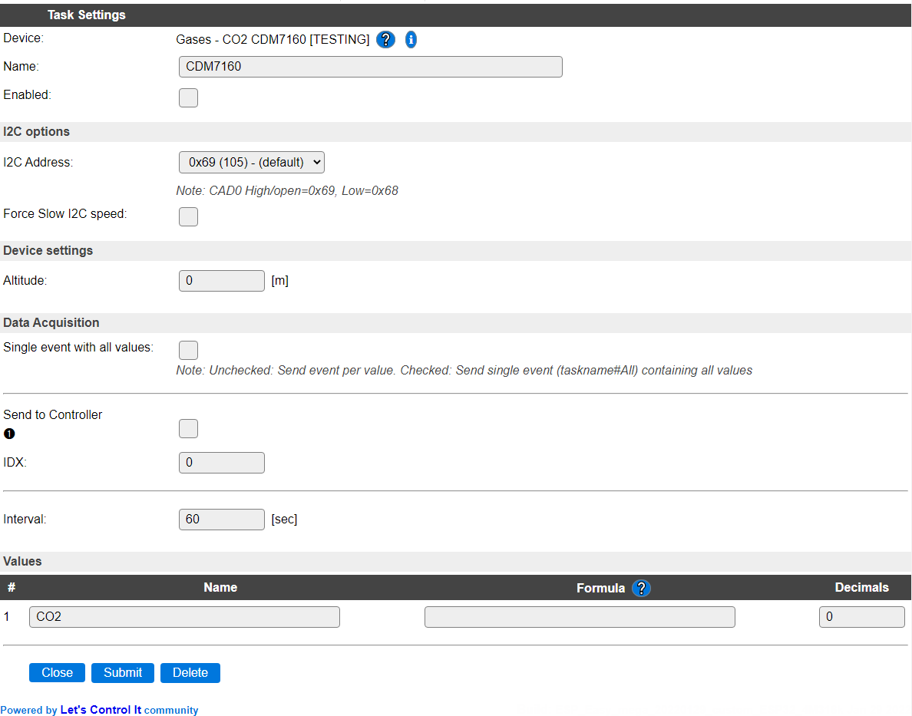

.. include:: ../Plugin/_plugin_substitutions_p12x.repl
.. _P127_page:

|P127_typename|
==================================================

|P127_shortinfo|

Plugin details
--------------

Type: |P127_type|

Name: |P127_name|

Status: |P127_status|

GitHub: |P127_github|_

Maintainer: |P127_maintainer|

Used libraries: |P127_usedlibraries|

Description
-----------

I2C CO2 sensor with altitude correction. Though the sensor also supports a serial connection and a PWM output, only I2C communication is supported by this plugin.

Usable measured values will be in the range 400..5000, outside that range the measurements are unreliable (and probably unrealistic).

NB: During power-on of the sensor, the reported values are completely out of range, > 15000, so these values are ignored. This will stabilize within a few minutes, and acceptable measurments will be reported.

If the measured values returned are > 10000, this is reported in the log (Info level), and most likely the sensor needs to be cleaned, when not in the initialization phase.

Image of a CDM7160 sensor (image sourced from Aliexpress)

Configuration
--------------

* **Name** A unique name should be entered here.

* **Enabled** The device can be disabled or enabled. When not enabled the device should not use any resources.

I2C Options 
^^^^^^^^^^^^

The available settings here depend on the build used. At least the **Force Slow I2C speed** option is available, but selections for the I2C Multiplexer can also be shown. For details see the :ref:`Hardware_page`

* **I2C Address**: The address the device is using. Depending on the state of the ``CAD0`` pin, the address can be changed, open or high state selects the default address 0x69, when connected to GND, the configured address is 0x68. If more than 2 sensors have to be connected, an I2C multiplexer (in a custom ESPEasy build) can be used to use more than 2 sensors on a single ESPEasy unit.

Device Settings
^^^^^^^^^^^^^^^^

* **Altitude**: To compensate for local air pressure, the altitude relative to sea-level of the location where the sensor is installed can be entered. As usual for this type of setting, the altitude is registered in ``meter``.

Data Acquisition
^^^^^^^^^^^^^^^^

The Data Acquisition, Send to Controller and Interval settings are standard available configuration items. Send to Controller is only visible when one or more Controllers are configured.

* **Interval** By default, Interval will be set to 60 sec. The minimum value allowed is 1 sec. but for measuring CO2 values, that don't change very quickly, reasonable values could be between 10 and 300 sec.

Values
^^^^^^

The measured value is available in ``CO2``. A formula can be set to recalculate. The number of decimals is by default set to 0, as decimals are not available from the sensor.

Commands
~~~~~~~~

.. include:: P127_commands.repl

Change log
----------

.. versionchanged:: 2.0

  |added| 2021-12-31 Moved to main repository as Plugin 127 Gases - CO2 CDM7160 from the ESPEasyPluginPlayground (P176).
