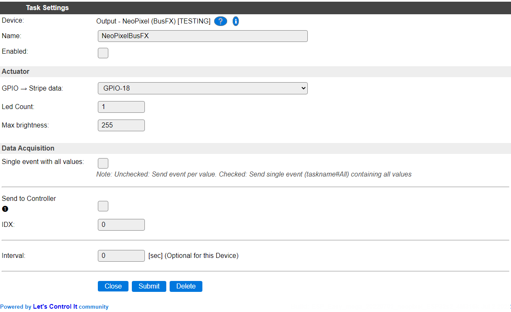

.. include:: ../Plugin/_plugin_substitutions_p12x.repl
.. _P128_page:

|P128_typename|
==================================================

|P128_shortinfo|

Plugin details
--------------

Type: |P128_type|

Name: |P128_name|

Status: |P128_status|

GitHub: |P128_github|_

Maintainer: |P128_maintainer|

Used libraries: |P128_usedlibraries|

Description
-----------

The NeoPixel (BusFX) plugin is designed to use strings of NeoPixel LEDs, like the WS2811/WS2812/WS2813, to show light-effects.

Supported hardware
------------------

LED strips (sometimes called stripes) using the WS281x type (and clones) of multi-color LEDs, capable of displaying 24 bits of color (16 million colors). Each LED is separately addressable, and the entire stripe can be controlled using a single GPIO pin on the ESP.

|P128_usedby|

Power consumption
-----------------

.. include:: NeoPixel_Power.rst

Configuration
-------------

* **Name** A unique name should be entered here.

* **Enabled** The device can be disabled or enabled. When not enabled the device should not use any resources.

Actuator
~~~~~~~~

* **GPIO -> Stripe data**: Select the GPIO pin the stripe is connected to (Only available on ESP32!)

Due to the design of the used library and the methods used, on ESP8266 only GPIO-2 can be used to connect the LED stripe:

* **Led Count**: Set up the number of leds that are available on the stripe. (Current maximum is 300).

* **Max brightness**: The maximum brightness allowed for the stripe. Range: 1..255. This is also the initial brightness set during initialization. Can *not* be overridden by the ``dim`` subcommand, and also the maximum value for the ``rainbow`` subcommand.

Data Aquisition
~~~~~~~~~~~~~~~

The Data Acquisition, Send to Controller and Interval settings are standard available configuration items. Send to Controller only when one or more Controllers are configured.

**Interval** By default, Interval will be set to 0 sec. This is optional. When set, the **Values** will be sent to any configured controllers, and events generated to be handled in rules.

Values
~~~~~~

The value names are fixed and not configurable. These names are:

* **Mode**: The currently active **mode** (numeric value)
* **Lastmode**: The previously active mode (numeric value)
* **Fadetime**: Currently set fade time value (milliseconds)
* **Fadedelay**: The delay time used during fade in or out (milliseconds)

Commands available
^^^^^^^^^^^^^^^^^^

.. include:: P128_commands.repl

Change log
----------

.. versionadded:: 2.0
  ...

  |added|
  2022-07-02: Max brightness setting.

  |added|
  Initial release version.

