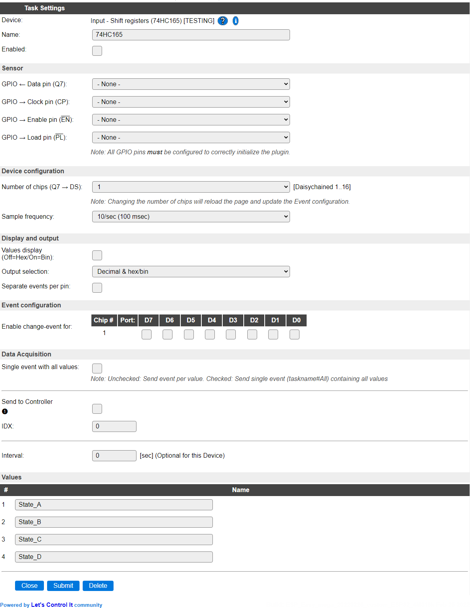
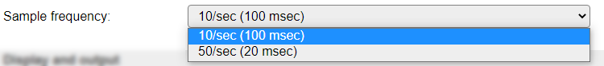
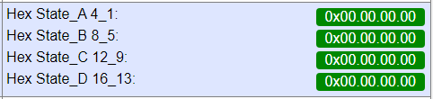
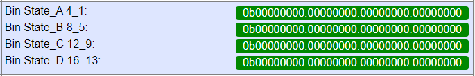
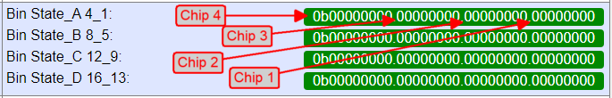
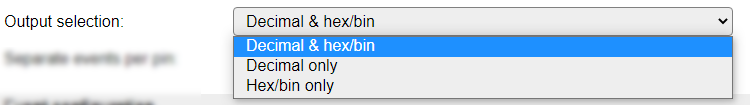
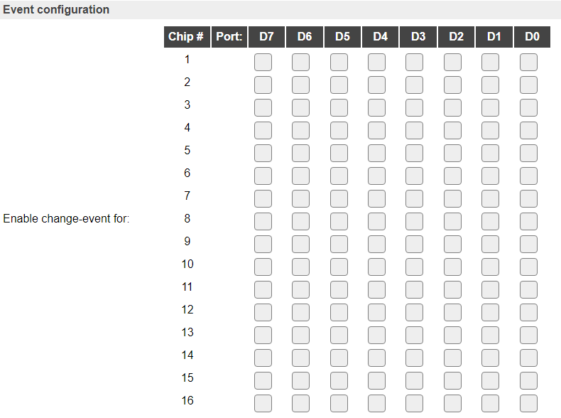

.. include:: ../Plugin/_plugin_substitutions_p12x.repl
.. _P129_page:

|P129_typename|
==================================================

|P129_shortinfo|

Plugin details
--------------

Type: |P129_type|

Name: |P129_name|

Status: |P129_status|

GitHub: |P129_github|_

Maintainer: |P129_maintainer|

Used libraries: |P129_usedlibraries|

Description
-----------

The 74HC165 Shift registers can be used to connect many input pins to an ESP using only 3 or 4 GPIO pins, as these shift registers can easily be daisy chained.

When connecting many shift registers daisy-chained, it is important to ensure that not *too* many are connected to a single GPIO output pin, as that could overload that pin. It is advised to use a buffer chip for all used GPIOs for every 4 to 5 shift registers. When using a Schmitt-trigger buffer, it will also clean up the signal further down the line. Any buffer will introduce a small delay in the signal, possibly reducing the number of shift registers that can be controlled. A few useful answers are in this `Stack Exchange question`_ (issue is similar for input and output shift registers)

The input pins can be used to read f.e. switches, like contacts along a model-train track, or reed contacts. Any debouncing should be done in hardware by adding a capacitor at the switch.

Configuration
-------------

* **Name**: A unique name should be entered here.

* **Enabled**: The device can be disabled or enabled. When not enabled the device should not use any resources.

Actuator
^^^^^^^^

* **GPIO -> Data (Q7)**: Select the GPIO pin that is connected to the Data out pin of the (first) shift register. Any daisy chained register has its ``DS`` pin connected to the ``Q7`` pin of the previous shift register.

* **GPIO -> Clock (CP)**: Select the Clock pin of all shift registers.

* **GPIO -> Enable (EN) (optional)**: Select the Enable pin of all shift registers, or set to None if not used or not available.

* **GPIO -> Load (PL)**: Select the Load pin of all shift registers.

NB: At least **Data**, **Clock** and **Load** GPIO pins need to be configured for the plugin to be able to function as intended.

Device configuration
^^^^^^^^^^^^^^^^^^^^

* **Number of chips (Q7 -> DS)**: The number of chips daisy-chained to each other. Default: 1, max. 16 (compile-time defined, technically limited to 16), allowing for max. 128 input pins. When changing the number of chips, the page will be submitted and reloaded to update the Event configuration.

* **Sample frequency**: The interval of reading the inputs from the shift registers, 10 times per second or 50 times per second.

Display and output
^^^^^^^^^^^^^^^^^^

* **Values display (Off=Hex/On=Bin)**: The display on the Devices page is custom formatted to show the state of the inputs of the shift registers in either Hex (default) or Bin format, having a separator per chip (8 bits) for readability.

All zeroes, Hex display (default)

All zeroes, Bin display

NB: The State values are grouped per 4 chips. To be read from right to left in chip-order, see below. If less chips are configured, only available states are shown.

* **Output selection**: Choose the values that are sent out to any controllers configured, or when getting the value from processing ``[<taskname>#<valuename>]``.

These are the available options:

If ``Decimal & hex/bin`` is selected, the value is output twice, formatted as decimal and as hexadecimal (``0x`` prefix) or binary (``0b`` prefix), separated by a comma.

If either of the Hex/bin options is selected, but no ``Values display (Off=Hex/On=Bin)`` option is available, then the output will be formatted as hexadecimal.

* **Separate events per pin**: When enabled, sends separate events per pin, including the pin number, to be processed via rules. F.e. ``<TaskName>#<pin>=<state>,<chip>,<port>,<pin>``. When disabled, all pins can be handled by a single rule, as it's generated like: ``<TaskName>=<state>,<chip>,<port>,<pin>``.

Event configuration
^^^^^^^^^^^^^^^^^^^

To select for which input an event should be generated, a matrix is shown, listing the pins per chip that can be separately enabled.

When all 16 chips are configured, the configuration looks like this:

The Data Acquisition, Send to Controller and Interval settings are standard available configuration items. Send to Controller only when one or more Controllers are configured.

* **Interval** By default, Interval will be set to 0 sec. as this is optional. Every Interval setting, the current output states will be read from the runtime object (*not* from the shift registers!) and stored in the Values fields, so they can be restored on a warm boot of  the ESP.

Values
^^^^^^

The Values ``State_A`` to ``State_D`` are used to show the state of up to 16 shift registers. (Custom formatted like set in **Output selection**.) Values that are not going to be filled are not shown here, and no events will be generated either.

Commands
~~~~~~~~

.. include:: P129_commands.repl

Events
~~~~~~

.. include:: P129_events.repl

Change log
----------

.. versionchanged:: 2.0

  |added| 2022-02-23 Added to ESPEasy as a new plugin.

.. _Stack Exchange question: https://electronics.stackexchange.com/questions/40242/what-problems-could-occur-when-chaining-40-shift-registers