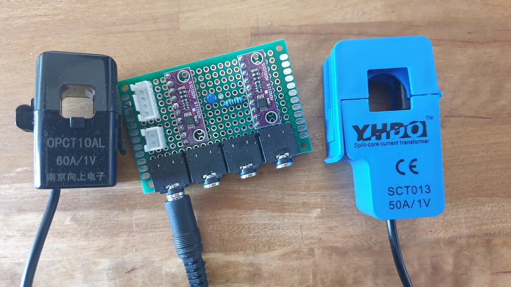
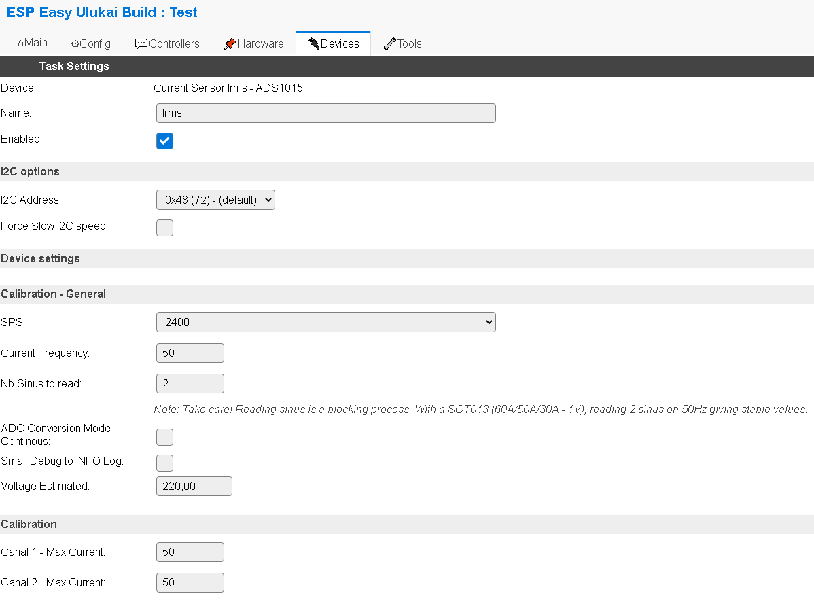

.. include:: ../Plugin/_plugin_substitutions_p13x.repl
.. _P130_page:

|P130_typename|
==================================================

|P130_shortinfo|

Plugin details
--------------

Type: |P130_type|

Name: |P130_name|

Status: |P130_status|

GitHub: |P130_github|_

Maintainer: |P130_maintainer|

Used libraries: |P130_usedlibraries|

Introduction
------------

This plugin can be used to measure Current usage through `Irms <https://en.wikipedia.org/wiki/Root_mean_square method>` using an ADS1015 through I2C.
It is the most simple schematic I succeed to create.
To get it to work, you have to buy an ADS1015 board, an ESP32 (not that ESP8266 might be too slow), and current sensors (I encouraged you to buy the black version, more robust, and smaller).
The only requirement is to buy a current sensor doing the conversion over 1Vac. You have to choose the right calibration in other cases you may definitely break your ADS1015. Say you bought a 30A/1V current sensor, if you try to measure a current of 60A, output voltage will be 2V and your ADS1015 will be burned out!
Note that each ADS1015 can manage TWO sensors! as I'm using the ADS1015 in a differential mode (this avoid managing an offset voltage and a complicated way to get a full range measure)
As ADS1015 can have four I2C addresses, you can manage up to EIGHT current sensors within one ESPEasy unit.

Specifications:
 * Output: Irms Current
 * Input: 1Vac through current sensor

Wiring
------

.. code-block:: none

  ESP                ADS1015
  GPIO (SCL)  <-->   SCL
  GPIO (SDA)  <-->   SDA
                     ADDR (choose on our side, see note below)

  Power
  3.3V        <-->   VCC
  GND         <-->   GND
  
  Current Sensor 1 (Canal 1)
  P1          <-->   ADC0
  P2          <-->   ADC1

  Current Sensor 2 (Canal 2)
  P1          <-->   ADC2
  P2          <-->   ADC3

The ADDR pin have to be used to set the wanted address of your choice (have a look on datasheet to configure one)

Setup
-----

Task settings
~~~~~~~~~~~~~

* **Device**: Name of plugin
* **Name**: Name of the task (example name **Irms**)
* **Enable**: Should the task be enabled or not

I2C options
^^^^^^^^^^^

* **I2C Address**: Default 0x48 is used.
* **Force Slow I2C speed**: not needed for ADS1015, and should not be used as it can reduce sampling rate

Calibration - General
^^^^^^^^^^^^^^^^^^^^^

* **SPS** : Sample Per Second : based on my tests, 2400 SPS give the same real SPS as 3600 because of internal code of ESPEasy. Setting to 2400 will slo down the internal converter of the ADS1015 and so, sampling will have a more stable result.
* **Current Frequency** : Needed to calculate the period of sampling for a sinus
* **Nb Sinus to read** : more sinus implies more accuracy, BUT also more blocking time in plugin, SO: I suggest 2 sinus for 50Hz (even for 60Hz too)
* **ADC Conversion Mode Continuous** : this option was coded for test purposes but do not give better result, I suggest to leave it UNchecked (the default) 
* **Small Debug to INFO log** : this allow you to get statistic of each conversion on serial console without switching global log level to debug (becuase it is slowing down conversion rate, and so bad results)
* **Voltage estimated** : this is to get from plugin a power conversion. as it is not a real value, the power value is an estimated one based on this voltage.

Calibration
^^^^^^^^^^^

This is where you specify the calibration of the current sensor you connected, say you have connected a current sensor given for 50A/1V, you will indicate 50.

* **Canal 1 - Max current** : Current value for 1V
* **Canal 2 - Max current** : Current value for 1V

Where to buy
------------

.. csv-table::
 :header: "Store", "Link"
 :widths: 5, 40

 "AliExpress ESP32",""
 "AliExpress ADS1015 board",""
 "AliExpress SCT013",""
 "AliExpress OPCT10AL",""

* **Note : to simply help this famous project ESPEasy, just bought through referral link above!**

Change log
----------

.. versionadded:: 1.0
  ...

  |added|
  Initial release version.

