.. include:: ../Plugin/_plugin_substitutions_p13x.repl
.. _P131_page:

|P131_typename|
==================================================

|P131_shortinfo|

Plugin details
--------------

Type: |P131_type|

Name: |P131_name|

Status: |P131_status|

GitHub: |P131_github|_

Maintainer: |P131_maintainer|

Used libraries: |P131_usedlibraries|

Description
-----------

The popular NeoPixel multi-color leds are available in many configurations, either as separate leds or led-stripes and also in a pre-mounted matrix configuration. They are easy to implement, as they only require a single GPIO pin to control up to several hundreds of these pixels.

This plugin is created to use 1 or more matrices of NeoPixels, and allows to draw graphic elements, write text or display bmp files, with a configurable brightness.

When using multiple matrices, we use the term 'Tile' in this context, they need to use the same layout and rectangular size per matrix. The Tiles are also configurable in layout and rectangular size.

This plugin uses the same AdafruitGFX_Helper module, as used in some other Display plugins, like :ref:`P095_page` and :ref:`P116_page`, and implements the same graphic commands. The AdafruitGFX_Helper module is 'limited' to 65535 (RGB565 coded) colors, but the used library uses a smart color mapping scheme to display colors as accurate as possible.

Matrix and Tile layouts
~~~~~~~~~~~~~~~~~~~~~~~

Several Matrix and Tile layout configurations are possible, and supported. Reasons for having a specific layout are usually driven by the challenges of mechanical construction for these types of display. Common requirement is that all matrices and tiles are electrically connected as a single, uninterrupted, serial stream of NeoPixel leds.

.. note:: **Credits**: Most of this layout-description and the images are based on and copied from the documentation available at the `Adafruit NeoPixel Uber-guide <https://learn.adafruit.com/adafruit-neopixel-uberguide/neomatrix-library>`_

**Matrix**: A Matrix is a rectangular set of NeoPixel leds, with configurable width, height, starting led, orientation and direction.

**Tile**: A Tile is a rectangular set of same size/layout Matrices, with configurable width, height, starting matrix, orientation and direction.

The plugin handles both single matrices - all NeoPixels in a single uniform grid - and tiled matrices - multiple matrices combined into a larger display:

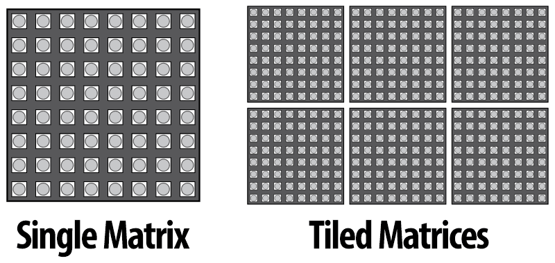

Let's begin with the declaration for a single matrix, because it's simpler to explain. We'll be using an 8*5 matrix of NeoPixels. When looking at this matrix with the text in a readable orientation, the first pixel, #0, is at the top left. Each successive pixel is right one position - pixel 1 is directly to the right of pixel 0, and so forth. At the end of each row, the next pixel is at the left side of the next row. This isn't something we decide in code... it's how the NeoPixels are hard-wired in this circuit board comprising the matrix.

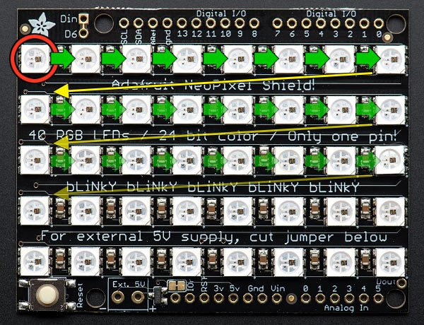

The first pixel is in Top/Left postition. We refer to this layout as Row mode and Progressive. Row mode means the pixels are arranged in horizontal lines (the opposite, in vertical lines, is column mode). Progressive means each row proceeds in the same direction. Some matrices will reverse direction on each row, as it can be easier to wire that way, especially when using a very wide matrix. We call that a zigzag layout.

However, if we want to use this matrix in the "tall" direction, so the display is standing up on the desk with the ``Din`` connection at the right-top. When we turn the board this way, the matrix layout changes:

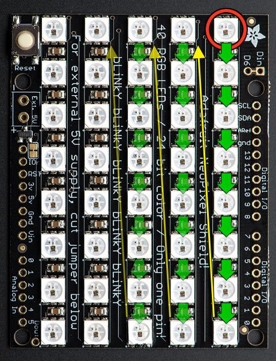

Now the first pixel is at Top/Right. Pixels increment top-to-bottom - it's now in Column mode. The flow-direction of the columns is still Progressive though.

Similar configuration options are available for tiles. Making more specific mounting configurations possible, like this:

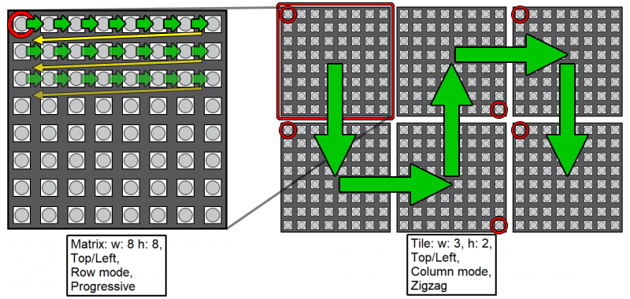

As shown in these examples, neither a Matrix nor a Tile has to be square, though both have to be rectangular to result in a correct display setup.

NB: The maximum number of matrices/NeoPixels that can be connected is not determined, though when having > 1500 NeoPixels on a single GPIO pin, this can cause timing issues when the ESP is not fast enough to update all leds within the available time-window, resulting in the content being distorted.

Signal wiring
~~~~~~~~~~~~~

.. note:: If the matrices use a VCC higher than 3.3V, f.e. 5V (and they usually do), a level converter for 3V3 to 5V should be used when connecting the display to the ESP, as the ESP might be damaged, or the logic levels don't match the requirements of the display (high level ~70% of VCC = 3.5V @ VCC 5V), and may not work properly.

.. code-block:: text

   ESP        Level converter    5V   NeoMatrix 1  5V    NeoMatrix 2  5V    NeoMatrix n
   ----       ---------------    |    -----------  |     -----------  |     -----------
   3V3   -->  LV           HV  <-+->  VCC          +->   VCC          +->   VCC ...
   GND   ---  GND ------- GND   ---   GND - GND    ---   GND - GND    ---   GND ...
   GPIO  -->  LV1 ------> HV1 -[470]- DIN - DOUT   -->   DIN - DOUT   -->   DIN ...

NB: It is advised to use a single 220 to 470 ohm resistor in the wiring from ESP (after the level converter) to the first NeoPixel ``Din`` for better signal stability.

Power consumption
~~~~~~~~~~~~~~~~~

.. include:: NeoPixel_Power.rst

Also, when using several matrices sequentially, separate wiring should be added for VCC and GND to each group of matrices, to avoid burning out the pcb traces of the matrix where the power is connected. For groups of 4 to 8 matrices, it is advised to use separate wiring for power to each group, and only connect the GND and signal connections Dout/GND to Din/GND of the next group, but **never** the VCC pins.

Configuration
-------------

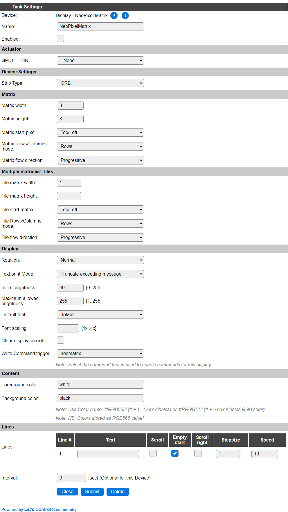

Task settings
~~~~~~~~~~~~~

* **Name** The name of the task. This should be unique for all devices that are configured. (Initially empty)

* **Enabled** For the device to work it has to be enabled. When checked, the device will be started as soon as the ESP starts. If desired, the device can also be enabled from f.e. a rule by using the ``TaskEnable,<tasknr>`` or ``TaskEnable,<taskname>`` command, or disabled using the corresponding ``TaskDisable,<tasknr>|<taskname>`` commands.

Actuator
~~~~~~~~

* **GPIO -> DIN** Select the GPIO pin that's wired to the ``DIN`` input on the first matrix.

* **Strip Type**: Select the type of the LEDs mounted on the matrices:

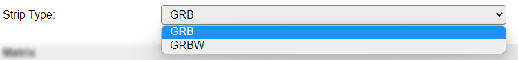

*GRB* : Most commonly, the LEDs are of GRB type.

*GRBW* : If the LEDs also support Brightness control, then the GRBW type should be selected.

Matrix
~~~~~~

* **Matrix width**: The number of NeoPixels that form the width of 1 Matrix. Range: 1..100.
* **Matrix height**: The number of NeoPixels that form the height of 1 Matrix. Range: 1..100.
* **Matrix start-pixel**: The location of the first NeoPixel of the Matrix. Available options:

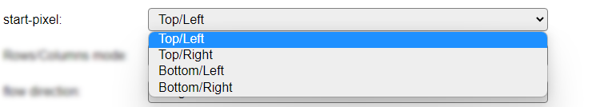

* **Matrix Rows/Columns mode**: The direction of how the pixels are installed in the Matrix. Available options:

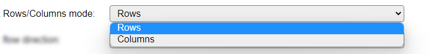

* **Matrix flow-direction**: The flow of the pixels on the Matrix. Available options:

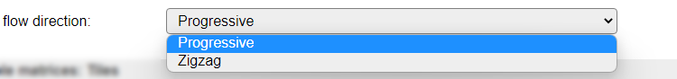

Multiple matrices: Tiles
~~~~~~~~~~~~~~~~~~~~~~~~

* **Tile width**: The number of Matrices that form the width of the Tile. Range: 1..32.
* **Tile height**: The number of Matrices that form the height of the Tile. Range: 1..32.
* **Tile start-matrix**: The location of the first Matrix in the Tile. Available options:

* **Matrix Rows/Columns mode**: The direction of how the Matrices are connected in the Tile. Available options:

* **Matrix flow-direction**: The flow of the Matrices in the Tile. Available options:

Display
~~~~~~~

* **Rotation** Depending on how the display is to be mounted/installed, it may be needed to rotate the content, or with a non-square resolution, to use the display in *Landscape* layout instead of the default *Portrait*.

Available options:

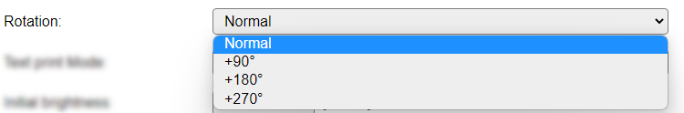

The available options rotate the display in a clock-wise direction.

NB: Because of the above Matrix & Tile configuration, this option is less relevant for this display, but available in the AdafruitGFX_Helper module, so still included here as the accompanying ``rot`` subcommand is also supported.

* **Text print Mode** Defines the handling of text when predefined text or text via the ``txt`` or ``txtfull`` subcommands (see below) is displayed.

Available options:

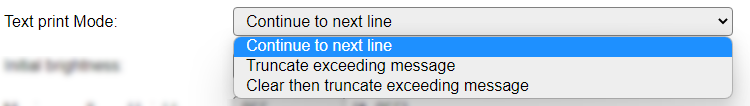

* *Continue to next line* Simply 'prints' all text to the display, with automatic overflow to the next line(s) if the text doesn't fit on the current line.
* *Truncate exceeding message* (Default) Display the provided message, but any excess at the right border of the display is discarded.
* *Clear then truncate exceeding message* Clear from the current cursor position to the width of the display, then display the provided message, but any excess at the right border of the display is discarded.

Default setting is *Continue to next line*.

* **Initial brightness**: The brightness that the display is initially set to. Default is 40, to protect both the eyes and the power-supply powering the display. Range: 0..255.

* **Maximum allowed brightness**: The brightness that is the maximum it can be set to, either from UI or via the ``brightness`` command, to optionally help protect both the eyes and the power-supply powering the display. Default is 255. Range: 1..255.

* **Font scaling** The scaling factor for the currently active font. Select a factor between 1 and 4.

* **Clear display on exit** When checked, will clear the display when the task is disabled, either from settings or via the ``TaskDisable`` command. This will fill the display with black pixels, turning all NeoPixels off.

* **Write Command trigger** The command to handle any commands for this device can be selected here. This way you can have different commands when multiple displays are configured. It is processing most commands via the ESPEasy Adafruit Graphics helper class.

Available options:

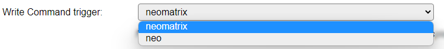

* *neomatrix*
* *neo*

The command is handled non-case sensitive. See below for available commands and subcommands.

Content
^^^^^^^^

* **Foreground color**
* **Background color**

These are the default colors, used to display the content as configured below (if any).

Colors can be specified in 3 ways:

* *Color name* Some named colors are recognized: White, Black, Red, Green, Blue, Yellow, Orange, Navy, Darkgreen, Cyan, Darkcyan, Maroon, Purple, Olive, Magenta, Lightgrey, Darkgrey, Pink and Greenyellow. If any of these colors is recognized, the name will be shown.
* *#RGB565* A ``#`` prefixed, 1 to 4 digit, hex-coded color value in RGB565 format (5 bits red, 6 bits green, 5 bits blue) giving the max. number of 65535 colors. This is the value that is shown after the settings are saved, and it is not one of the known color names.
* *#RRGGBB* A ``#`` prefixed, 6 digit, hex coded RGB color value. Will be transformed to an RGB565 value on save!

If the Foreground and Background colors are the same, the background color will become ``transparent``. If the Foreground color is empty, as a default ``white`` will be set.

Lines
^^^^^

* **Line 1..n** Predefined content can be specified. The number of lines shown depends on the Tile height of the display.

The usual variables, like ``[Taskname#Valuename]``, or ``%v1%``, system variables, formulas and functions can be used.

Input length is limited to 50 characters per line. If a longer calculated text is needed for a line, then it should be set from the rules or from an external source via http commands.

Per **Line** you can define if Scrolling should be used for displaying the content. When enabled, the other available options will be used to scroll the text.

* **Scroll**: Enables (horizontal) scrolling of the content. NB: Scrolling will *only* be enabled if the content length won't fit on the display!
* **Empty start**: When checked, the display will start empty, and the text will be scrolled in. It will also scroll out until the display is empty again. (Default enabled). When unchecked, the display will start with the content that fits on the display, and scroll until the 'other' end of the text is visible. The display won't be empty when having this setting off.
* **Scroll right**: By default, scrolling will be from right to left, when this option is checked, scrolling will be from left to right direction.
* **Stepsize**: The number of pixels that each step will scroll. Range 1..16, default 1.
* **Speed**: The number of 0.1 seconds before the next scroll step will be applied. Range 1..600 (0.1 second to 60 seconds), default 10 (1 step per second).

If more then 1 line is shown, next to the last Line the remaining capacity in characters is displayed.

The total combination of lines * input length can not exceed 1000 characters (sized dynamically), as there is limited storage per task available for these settings. An error message will be shown after (trying to) save the settings, **any excess content will be discarded!**

Example:

* **Interval** By default, Interval will be set to 0. If set to a non-zero value, the pre-configured content will be updated automatically using that interval (seconds). Depending on the **Text print Mode** setting, content that may have been draw from rules or external commands, may be erased.

Commands
~~~~~~~~

.. include:: P131_commands.repl

.. include:: AdaGFX_commands.repl

Values
------

.. include:: AdaGFX_values.repl

Change log
----------

.. versionchanged:: 2.0
  ...

  |added| 2022-04-16 New plugin.
