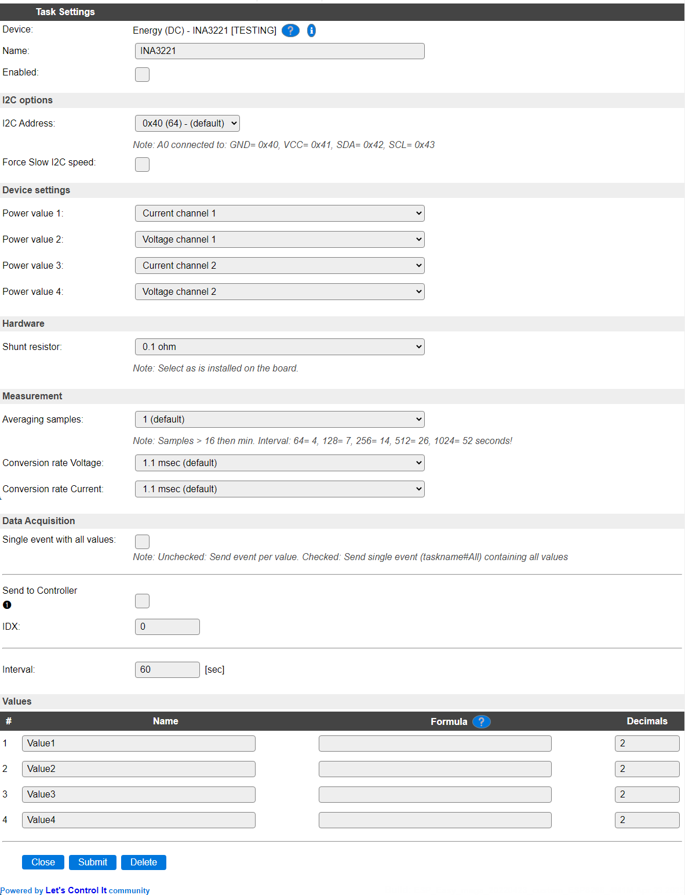
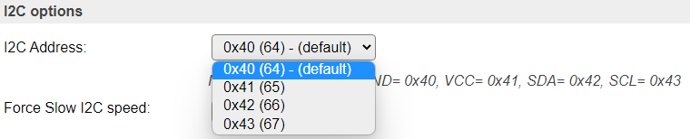
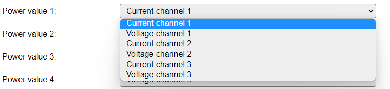
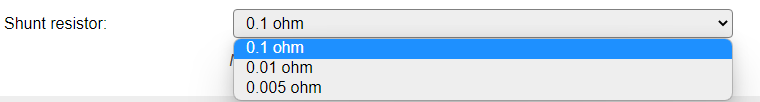
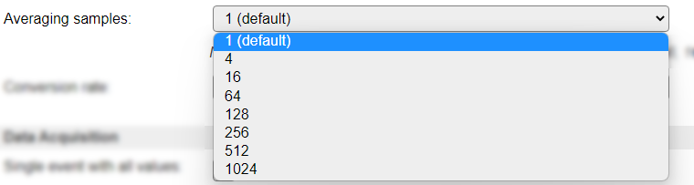
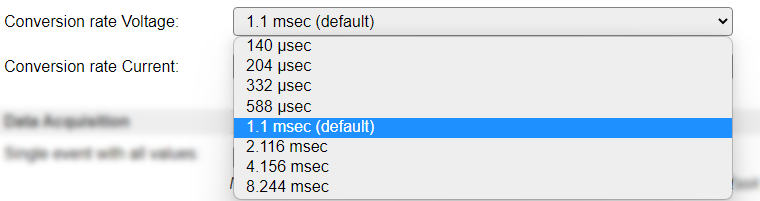

.. include:: ../Plugin/_plugin_substitutions_p13x.repl
.. _P132_page:

|P132_typename|
==================================================

|P132_shortinfo|

Plugin details
--------------

Type: |P132_type|

Name: |P132_name|

Status: |P132_status|

GitHub: |P132_github|_

Maintainer: |P132_maintainer|

Used libraries: |P132_usedlibraries|

Description
-----------

The INA3221 Voltage/Current sensor can be used to measure voltage and/or current for DC input, up to 26V. It has 3 separate channels available.

It can be used to replace the :ref:`p027_page`, except that the I2C protocol isn't directly compatible, so it is not a drop-in replacement.

Configuration
-------------

**Name** A unique name should be entered here.

**Enabled** The device can be disabled or enabled. When not enabled the device should not use any resources.

I2C Options 
^^^^^^^^^^^^

The available settings here depend on the build used. At least the **Force Slow I2C speed** option is available, but selections for the I2C Multiplexer can also be shown. For details see the :ref:`Hardware_page`

**I2C Address**: The address the sensor is using. The different addresses can be selected by connecting the appropriate signal to ``A0``. Often also documented on the board.

Device Settings
^^^^^^^^^^^^^^^

* **Power value 1..4**: As a plugin only has 4 available output values and the sensor has 6 values available, here we have to select what output receives what measured value.

Available options are:

* *Current channel 1..3*: Measure the current from channel 1..3.
* *Voltage channel 1..3*: Measure the voltage from channel 1..3.

NB: To get all measured values, an extra Task can be configured to provide the measurements not handled in the current task, or you could f.e. configure separate tasks for Voltage and Current measurements. These tasks shouldn't interfere, assuming both get the same configuration settings for **Shunt resistor**, **Averaging samples** and **Conversion rate Voltage** / **Conversion rate Current**.

Hardware
^^^^^^^^

* **Shunt resistor**: As there are different hardware configurations available for the board, using different shunt resistor values, here you can select the value that is present on the board used.

Measurement
^^^^^^^^^^^

* **Averaging samples**: To increase the accuracy of measurements, the chip allows to take the average value for a set of samples. The desired number of samples can be selected in this setting, default: 1.

When combining a higher number of samples with a longer **Conversion rate**, taking all possible measurements will require more time, affecting the **Interval** that would be feasible for a reliable measurement. The worst-case scenarios (maximum **Conversion rate** settings) have been calculated, and are shown as a note below this setting.

* **Conversion rate Voltage/Current**: To change the accuracy of measurements, a different conversion rate can be selected. Lowering the conversion rate will decrease the accuracy, and allow a higher sampling frequency, but as the measurements are read at a smallest **Interval** of 1 second, there isn't much use in lowering the conversion rate. When increasing the conversion rate, accuracy will increase, but, also depending on the **Averaging samples** configured, increases the time it takes to complete all measurements. (Calculation formula below).

There are separate **Conversion rate** settings for the **Voltage** and **Current** measurements, as that's available in the chip.

To calculate the minimally required **Interval** setting for the task, this formula can be used:

  | (3 * Averaging samples * Conversion rate Voltage) + (3 * Averaging samples * Conversion rate Current), and round that up to a seconds value.

  | Example: (Worst case) 3 * 1024 * 0.008244 + 3 * 1024 * 0.008244 = 50.65 seconds => ~51 minimum Interval.

  | Example: (Default case) 3 * 1 * 0.00144 + 3 * 1 * 0.00144 = 0.008 seconds => 1 minimum Interval.

Data Acquisition
^^^^^^^^^^^^^^^^

The Data Acquisition, Send to Controller and Interval settings are standard available configuration items. Send to Controller only when one or more Controllers are configured.

Values
^^^^^^

The Values available for this sensor, are named ``Value1`` through ``Value4``, and can be adjusted as desired. The Formula field can be used to recalculate the shown results.

.. Commands available
.. ^^^^^^^^^^^^^^^^^^

.. .. include:: P132_commands.repl

.. Events
.. ~~~~~~

.. .. include:: P132_events.repl

Change log
----------

.. versionchanged:: 2.0
  ...

  |added|
  2022-04-23 Initial release version.

