.. include:: ../Plugin/_plugin_substitutions_p13x.repl
.. _P132_page:

|P132_typename|
==================================================

|P132_shortinfo|

Plugin details
--------------

Type: |P132_type|

Name: |P132_name|

Status ESP32: |P132_status|

Status ESP8266: |P132_status_lb|

GitHub: |P132_github|_

Maintainer: |P132_maintainer|

Used libraries: |P132_usedlibraries|

Description
-----------

This plugin had support for INA3221 only, and has been extended with support for more types of INA sensors, though this extension is by default not enabled for ESP8266 builds. That version is available in :ref:`original-documentation`.

Support for INAxxx DC Voltage/Current/Power measurement sensors, INA3221, INA219, INA226, INA228, INA230, INA231 and INA260.

Existing plugin settings are forward compatible with the new settings.

Configuration
-------------

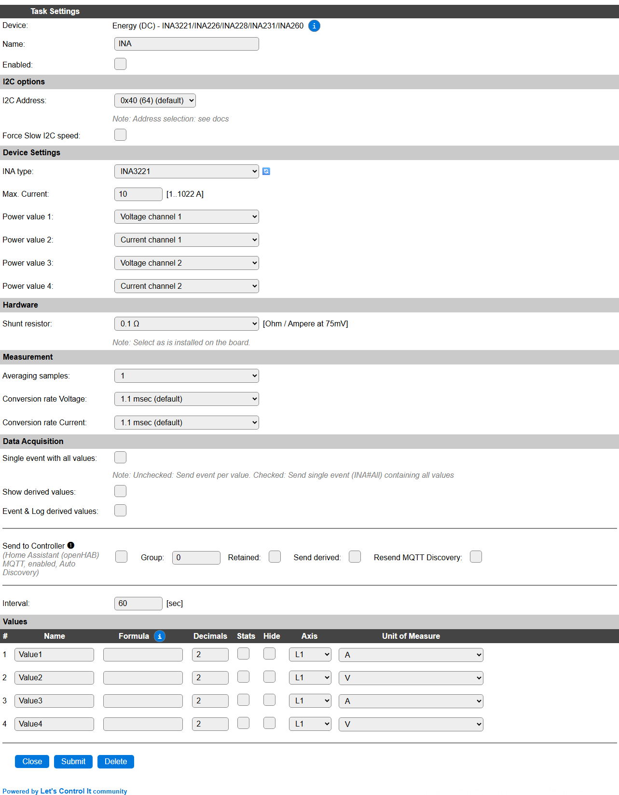

* **Name** A unique name should be entered here.

* **Enabled** The device can be disabled or enabled. When not enabled the device should not use any resources.

I2C Options 
^^^^^^^^^^^^

The available settings here depend on the build used. At least the **Force Slow I2C speed** option is available, but selections for the I2C Multiplexer can also be shown. For details see the :ref:`i2c-bus` page

* **I2C Address**: The address the sensor is using. The different addresses can be selected by connecting the appropriate signal to ``A0`` and ``A1`` when available. Often also documented on the board.

For ``INA3221`` the range is limited to the first 4 addresses, for other INA types, 16 addresses are available:

Selectable I2C addresses:

.. csv-table::
    :header: "Address", "A0", "A1", ""
    :widths: 10, 10, 10, 70

    "0x40","GND","GND",""
    "0x41","VS+","GND",""
    "0x42","SDA","GND",""
    "0x43","SCL","GND",""
    "0x44","GND","VS+",""
    "0x45","VS+","VS+",""
    "0x46","SDA","VS+",""
    "0x47","SCL","VS+",""
    "0x48","GND","SDA",""
    "0x49","VS+","SDA",""
    "0x4A","SDA","SDA",""
    "0x4B","SCL","SDA",""
    "0x4C","GND","SCL",""
    "0x4D","VS+","SCL",""
    "0x4E","SDA","SCL",""
    "0x4F","SCL","SCL",""

Device Settings
^^^^^^^^^^^^^^^

* **INA type**: Select the INA chip type you want to connect. This has to match with what is auto-detected by the library. As INA231 is often recognized as an INA226, this is an accepted alternative. And also the other way around. The difference is only in the specifications of the chip, from software side they are practically identical.

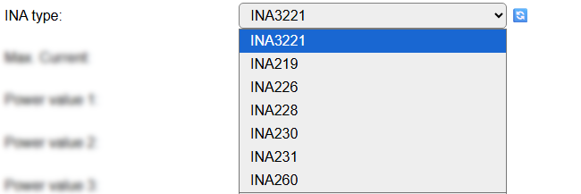

NB: INA219 is already supported by :ref:`P027_page` but is still added here as it is supported by the used library.

* **Max. Current**: Configure the max. to be expected/measured current, so the library can optimize the configuration combined with the **Conversion rate** and **Shunt resistor** settings, below. Range is ``1..1022 A``, default set at ``10``.

* **Power value 1..4**: Most INA types have 3 ``Power values`` available, only INA3221 has 9 values available. As a plugin only has 4 available output values, here we have to select what output receives what measured value.

Available options for ``INA3221`` are:

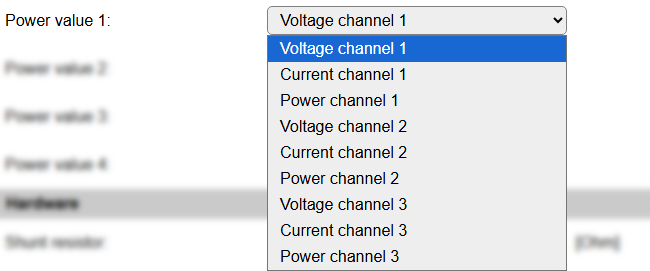

* *Voltage channel 1..3*: Measure the voltage from channel 1..3.
* *Current channel 1..3*: Measure the current from channel 1..3.
* *Power channel 1..3*: Calculated power from channel 1..3.

Other INA types the available options are:

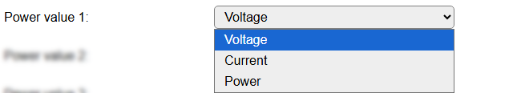

* *Voltage*: Measure the voltage in V.
* *Current*: Measure the current in mA.
* *Power*: Measure the power in mW. (Needs ``VBus`` to be connected to the sensor)

Hardware
^^^^^^^^

* **Shunt resistor**: Here you can select the resistance or shunt that is used, this should match closely with the **Max. Current** setting:

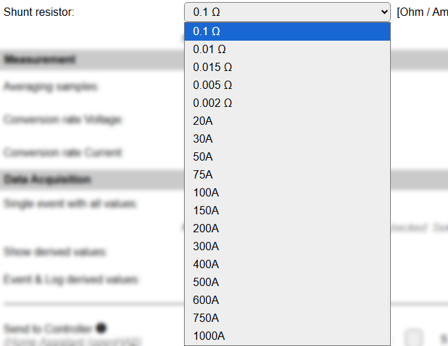

On many boards a shunt resistor is installed, that has one of the available resistance values. When larger currents are to be measured, an external shunt is mounted, and the sensor is connected via the Kelvin Connection that are available on the shunt (the small screws). The pre-installed shunt resistor must then be removed from the sensor-board, to avoid possible damage. These shunt are mostly specified for the current at wich a measurable voltage of 75 mV is reached. Some preselected values, up to the max. range of the sensor of ca. 1022 A, are selectable.

NB: ``INA260`` has an internal shunt resistor of ``2 mOhm``, so when selecting that **INA type**, the setting is fixed at that value.

Measurement
^^^^^^^^^^^

* **Averaging samples**: To increase the accuracy of measurements, the chip allows to take the average value for a set of samples. The desired number of samples can be selected in this setting, default: 1.

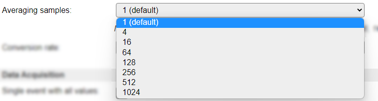

This setting is *not* available for ``INA219``, as this chip has the Averaging samples setting combined with the **Conversion rate**.

When combining a higher number of samples with a longer **Conversion rate**, taking all possible measurements will require more time, affecting the **Interval** that would be feasible for a reliable measurement. The worst-case scenarios (maximum **Conversion rate** settings) have been calculated, and are shown as a note below this setting.

* **Conversion rate Voltage/Current**: To change the accuracy of measurements, a different conversion rate can be selected. Lowering the conversion rate will decrease the accuracy, and allow a higher sampling frequency, but as the measurements are read at a smallest **Interval** of 1 second, there isn't much use in lowering the conversion rate. When increasing the conversion rate, accuracy will increase, but, also depending on the **Averaging samples** configured, increases the time it takes to complete all measurements. (Calculation formula below).

There are separate **Conversion rate** settings for the **Voltage** and **Current** measurements, as that's available in the chip.

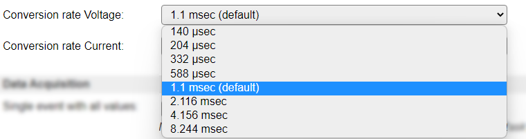

To calculate the minimally required **Interval** setting for the task, this formula can be used:

  | (3 * Averaging samples * Conversion rate Voltage) + (3 * Averaging samples * Conversion rate Current), and round that up to a seconds value.

  | Example: (Worst case) 3 * 1024 * 0.008244 + 3 * 1024 * 0.008244 = 50.65 seconds => ~51 minimum Interval.

  | Example: (Default case) 3 * 1 * 0.00144 + 3 * 1 * 0.00144 = 0.008 seconds => 1 minimum Interval.

For ``INA219`` a different **Conversion rate** selector is available:

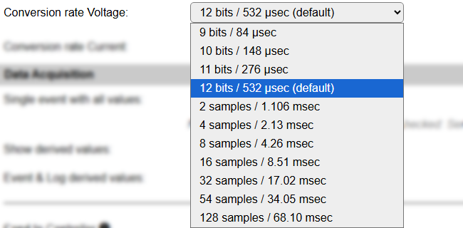

Also for ``INA228`` a different **Conversion rate** selector is available:

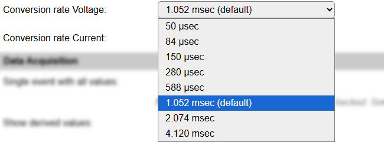

.. include:: DataAcquisition.repl

Values
^^^^^^

The Values available for this sensor, are named ``Value1`` through ``Value4``, and can be adjusted as desired. The Formula field can be used to recalculate the shown results. Decimals should probably be set too.

Per Value is a **Stats** checkbox available, that when checked, gathers the data and presents recent data in a graph, as described here: :ref:`Task Value Statistics:  <Task Value Statistics>`

|

|

.. _original-documentation:

Original documentation
----------------------

Description
-----------

The INA3221 Voltage/Current sensor can be used to measure voltage and/or current for DC input, up to 26V. It has 3 separate channels available.

It can be used to replace the :ref:`p027_page`, except that the I2C protocol isn't directly compatible, so it is not a drop-in replacement.

Configuration
-------------

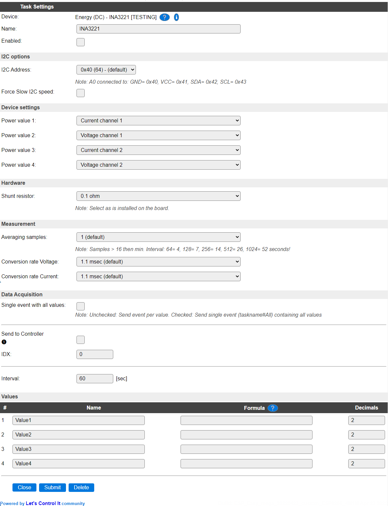

**Name** A unique name should be entered here.

**Enabled** The device can be disabled or enabled. When not enabled the device should not use any resources.

I2C Options 
^^^^^^^^^^^^

The available settings here depend on the build used. At least the **Force Slow I2C speed** option is available, but selections for the I2C Multiplexer can also be shown. For details see the :ref:`i2c-bus` page

**I2C Address**: The address the sensor is using. The different addresses can be selected by connecting the appropriate signal to ``A0``. Often also documented on the board.

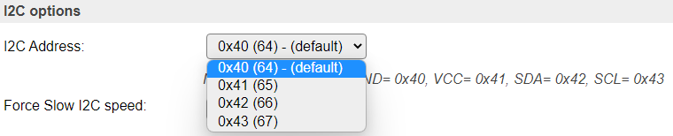

Device Settings
^^^^^^^^^^^^^^^

* **Power value 1..4**: As a plugin only has 4 available output values and the sensor has 6 values available, here we have to select what output receives what measured value.

Available options are:

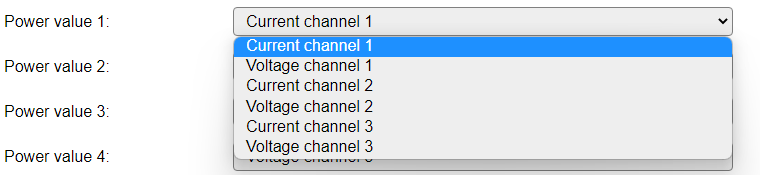

* *Current channel 1..3*: Measure the current from channel 1..3.
* *Voltage channel 1..3*: Measure the voltage from channel 1..3.

NB: To get all measured values, an extra Task can be configured to provide the measurements not handled in the current task, or you could f.e. configure separate tasks for Voltage and Current measurements. These tasks shouldn't interfere, assuming both get the same configuration settings for **Shunt resistor**, **Averaging samples** and **Conversion rate Voltage** / **Conversion rate Current**.

Hardware
^^^^^^^^

* **Shunt resistor**: As there are different hardware configurations available for the board, using different shunt resistor values, here you can select the value that is present on the board used.

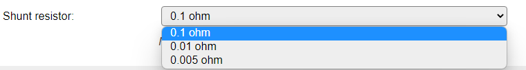

Measurement
^^^^^^^^^^^

* **Averaging samples**: To increase the accuracy of measurements, the chip allows to take the average value for a set of samples. The desired number of samples can be selected in this setting, default: 1.

When combining a higher number of samples with a longer **Conversion rate**, taking all possible measurements will require more time, affecting the **Interval** that would be feasible for a reliable measurement. The worst-case scenarios (maximum **Conversion rate** settings) have been calculated, and are shown as a note below this setting.

* **Conversion rate Voltage/Current**: To change the accuracy of measurements, a different conversion rate can be selected. Lowering the conversion rate will decrease the accuracy, and allow a higher sampling frequency, but as the measurements are read at a smallest **Interval** of 1 second, there isn't much use in lowering the conversion rate. When increasing the conversion rate, accuracy will increase, but, also depending on the **Averaging samples** configured, increases the time it takes to complete all measurements. (Calculation formula below).

There are separate **Conversion rate** settings for the **Voltage** and **Current** measurements, as that's available in the chip.

To calculate the minimally required **Interval** setting for the task, this formula can be used:

  | (3 * Averaging samples * Conversion rate Voltage) + (3 * Averaging samples * Conversion rate Current), and round that up to a seconds value.

  | Example: (Worst case) 3 * 1024 * 0.008244 + 3 * 1024 * 0.008244 = 50.65 seconds => ~51 minimum Interval.

  | Example: (Default case) 3 * 1 * 0.00144 + 3 * 1 * 0.00144 = 0.008 seconds => 1 minimum Interval.

.. include:: DataAcquisition.repl

Values
^^^^^^

The Values available for this sensor, are named ``Value1`` through ``Value4``, and can be adjusted as desired. The Formula field can be used to recalculate the shown results.

.. Commands available
.. ^^^^^^^^^^^^^^^^^^

.. .. include:: P132_commands.repl

.. Events
.. ~~~~~~

.. .. include:: P132_events.repl

Change log
----------

.. versionchanged:: 2.0
  ...

  |added| 2025-12-27 Extended adding INA219, INA226, INA228, INA230, INA231 and INA260.

  |added|
  2022-04-23 Initial release version.

