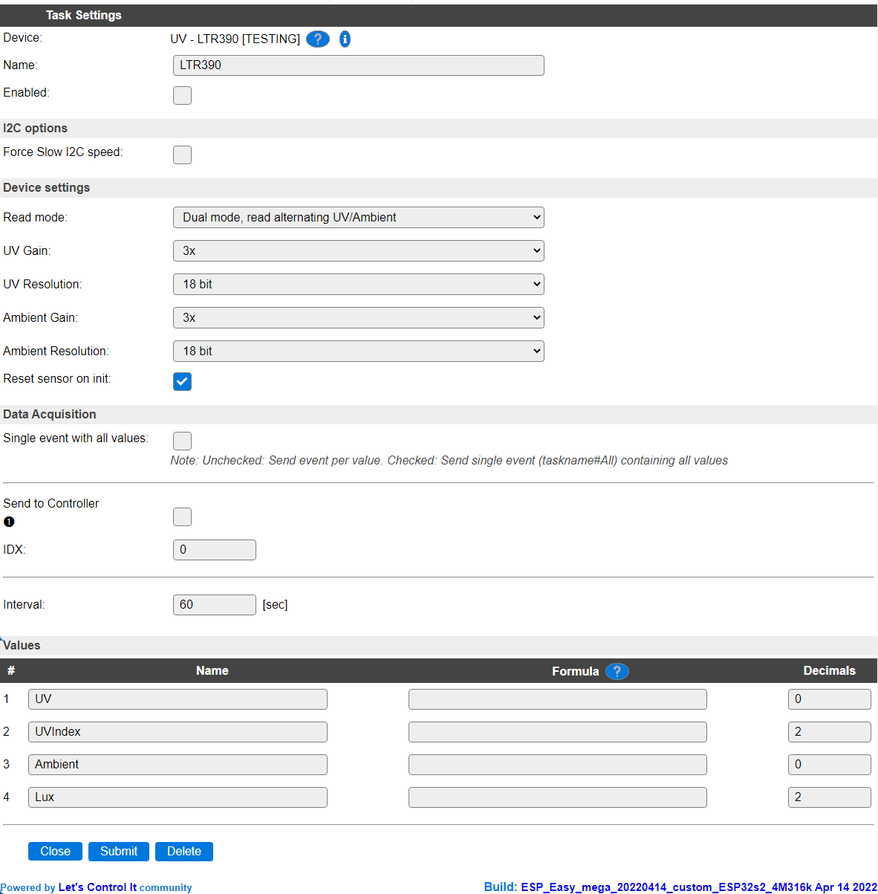
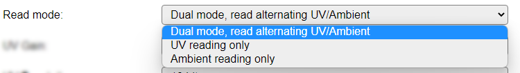
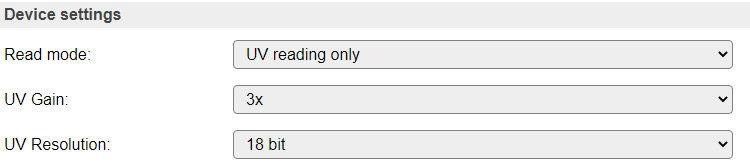
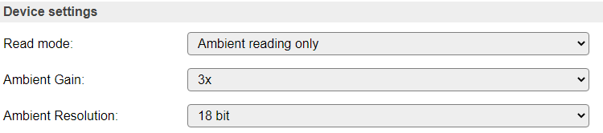
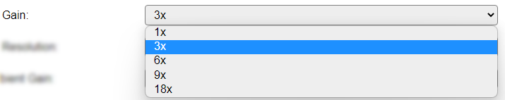
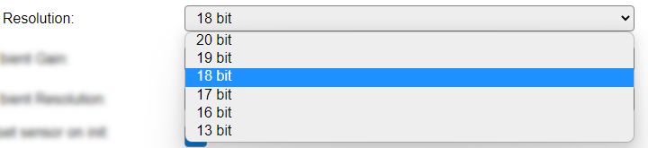

.. include:: ../Plugin/_plugin_substitutions_p13x.repl
.. _P133_page:

|P133_typename|
==================================================

|P133_shortinfo|

Plugin details
--------------

Type: |P133_type|

Name: |P133_name|

Status: |P133_status|

GitHub: |P133_github|_

Maintainer: |P133_maintainer|

Used libraries: |P133_usedlibraries|

Description
-----------

I2C UV and Ambient light sensor with UVIndex and Lux calculation.

Configuration
--------------

* **Name** A unique name should be entered here.

* **Enabled** The device can be disabled or enabled. When not enabled the device should not use any resources.

I2C Options 
^^^^^^^^^^^^

The available settings here depend on the build used. At least the **Force Slow I2C speed** option is available, but selections for the I2C Multiplexer can also be shown. For details see the :ref:`Hardware_page`

Device Settings
^^^^^^^^^^^^^^^^

* **Read mode**: As the sensor has 2 measuring options, the kind of measurement can be selected. By default, Dual mode is selected.

Available options:

* **Dual mode, read alternating UV/Ambient** Read both UV and Ambient alternating, and apply separate settings for Gain and Resolution when switching the measuring mode. Calculates both the UVIndex and Lux values.
* **UV reading only** Read only UV, and calculate the UVIndex from it (according to manufacurer specification).
* **Ambient reading only** Read Ambient light sensor value (ALS), and calculate the Lux value from that.

When selecting a different Read mode, the settings will be saved and the page reloaded, as the available options change when choosing a different option.

* **UV Gain** The Gain determains the amplification of the signal measured. Depending on the desired range of values, this can be adjusted.
* **Ambient Gain**

* **UV Resolution** The sensor is capable of returning the measurement in different resolutions, as selected here.
* **Ambient Resolution**

The time that is needed to determine the measurement increases with the resolution selected. The sensor is only read if a new measurement is actually available.

The Gain and Resolution are factored in for the calculation of the UVIndex and Lux values.

Data Acquisition
^^^^^^^^^^^^^^^^

This group of settings, **Single event with all values**, **Send to Controller** and **Interval** settings are standard available configuration items. Send to Controller is only visible when one or more Controllers are configured.

**Interval** By default, Interval will be set to 60 sec. It is the frequency used to read sensor values and send these to any Controllers configured for this device.

Values
^^^^^^

The measured values are available in ``UV`` and ``Ambient``, and the calculated values in ``UVIndex`` and ``Lux``. A formula can be set to recalculate. The number of decimals is by default set to 0 for UV and Ambient, as decimals are not available from the sensor, but after calculating the UVIndex and Lux they are.

.. Commands
.. ~~~~~~~~

.. .. include:: P133_commands.repl

Change log
----------

.. versionchanged:: 2.0

  |added| 2022-03-26 Initially added.
