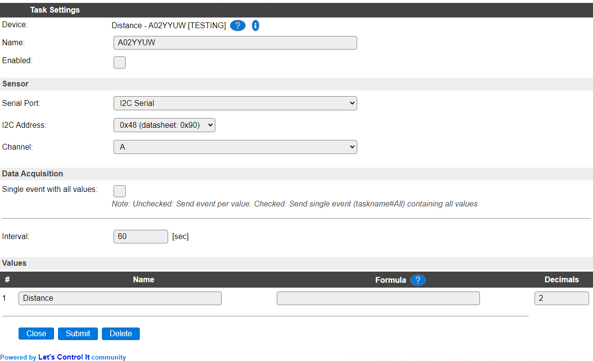

.. include:: ../Plugin/_plugin_substitutions_p13x.repl
.. _P134_page:

|P134_typename|
==================================================

|P134_shortinfo|

Plugin details
--------------

Type: |P134_type|

Name: |P134_name|

Status: |P134_status|

GitHub: |P134_github|_

Maintainer: |P134_maintainer|

Used libraries: |P134_usedlibraries|

Description
-----------

Ultrasonic distance sensor, with an effective range of 30 to 4500 mm.

Configuration
--------------

* **Name** A unique name should be entered here.

* **Enabled** The device can be disabled or enabled. When not enabled the device should not use any resources.

Sensor
^^^^^^

See: :ref:`SerialHelper_page`

Data Acquisition
^^^^^^^^^^^^^^^^

This group of settings, **Single event with all values**, **Send to Controller** and **Interval** settings are standard available configuration items. Send to Controller is only visible when one or more Controllers are configured.

**Interval** By default, Interval will be set to 60 sec. It is the frequency used to read sensor values and send these to any Controllers configured for this device.

Values
^^^^^^

The measured value is available in ``Distance``. A formula can be set to recalculate. The number of decimals is by default set to 2.

Change log
----------

.. versionchanged:: 2.0

  |added| 2022-08-01 Initially added.
