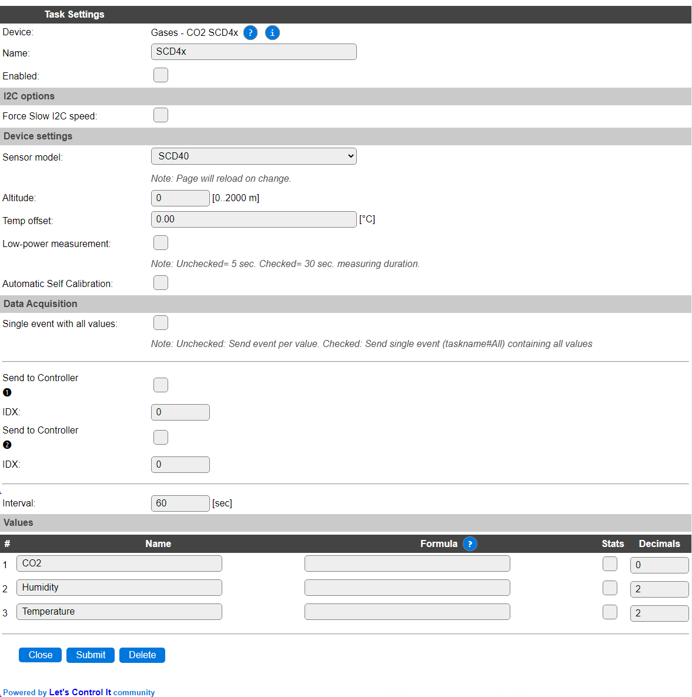

.. include:: ../Plugin/_plugin_substitutions_p13x.repl
.. _P135_page:

|P135_typename|
==================================================

|P135_shortinfo|

Plugin details
--------------

Type: |P135_type|

Name: |P135_name|

Status: |P135_status|

GitHub: |P135_github|_

Maintainer: |P135_maintainer|

Used libraries: |P135_usedlibraries|

Description
-----------

The SCD40 and SCD41 are CO2 sensor units that also provide Humidity and Temperature measurement, support auto-calibration, and have temperature and altitude compensation settings. By using the low-power operation option the measurements will be available slower, but average power usage will be much lower.

The SCD41 measures CO2 values up to 5000 ppm (SCD40 up to 2000 ppm), and also supports single-shot measurement, to enable really low average power consumption as it will enter a power-saving state when not measuring.

Configuration
-------------

* **Name**: Required by ESPEasy, must be unique among the list of available devices/tasks.

* **Enabled**: The device can be disabled or enabled. When not enabled the device should not use any resources.

I2C options
^^^^^^^^^^^

The available settings here depend on the build used. At least the **Force Slow I2C speed** option is available, but selections for the I2C Multiplexer can also be shown. For details see the :ref:`Hardware_page`

.. note:: According to the documentation, the SCD4x sensors support a max. I2C Clock Speed of 100 kHz, but during testing it worked fine at the regular 400 kHz speed, so your milage may vary. If the readings are out of range, or other issues arise, **Force Slow I2C speed** should be checked! (ESPEasy has a default setting of 100 kHz for I2C Slow device Clock Speed).

Device Settings
^^^^^^^^^^^^^^^

* **Sensor model**: Select the sensor model used, available options:

* *SCD40* The default, 'basic', sensor model, that can measure CO2 up to 2000 ppm and does not support Single-shot measurements (might show values when configured, but the values are undefined).

* *SCD41* The 'advanced' model that supports measuring CO2 up to 5000 ppm and Single-shot measurements.

When this setting is changed, the page is saved and reloaded to show/hide the extra setting to enable **Single-shot measurements (SCD41 only)**.

* **Altitude**: Set the altitude above sealevel in meters, where the sensor is placed. The range is 0..2000 meter.

* **Temp offset**: Offset for temperature correction. Can be set to compensate any self-heating of the device, by comparing the temperature measurement with another calibrated temperature measured close to the device. The difference can be set here, and can then be stored in the sensor by using the ``scd4x,storesettings`` command.

.. note:: ESPEasy will not update the Altitude or Temperature offset of the sensor if the values are set to 0.

* **Low-power measurement**: To use the low power mode of the chip, this option can be checked. Instead of the regular 5 seconds per measurement, it will take up to 30 seconds to obtain a result.

* **Single-shot measurements (SCD41 only)**: (Not shown when **Sensor model** SCD40 is selected) This option enables the use of Single-shot measurements, that will be started on every **Interval** trigger, and provide a result 5 seconds later. By using this option with a long Interval the power consumption can be really low, as it does not continuously perform measurements, but puts the chip in a power-saving mode until the next measurement. This option only works when having a SCD41 sensor connected, when enabled on an SCD40 the values are undefined, even though they may seem somewhat reasonable.

* **Automatic Self Calibration**: When enabled, the automatic self-calibration will be activated when the plugin is started. If the calibration is reset via the ``scd4x,factoryreset`` command, the calibration is reset to initial factory settings, and calibration data will have to be built up again.

.. warning:: Automatic Self Calibration is a useful process to ensure long term stability of the sensor, and assumes the sensor is exposed to fresh air of 400 ppm at least once per 7 days.

Data Acquisition
^^^^^^^^^^^^^^^^

This group of settings, **Single event with all values**, **Send to Controller** and **Interval** settings are standard available configuration items. Send to Controller is only visible when one or more Controllers are configured.

* **Interval** By default, Interval will be set to 60 sec. The data will be collected and optionally sent to any configured controllers using this interval.

Values
^^^^^^

The plugin provides measurements ``CO2`` in ppm, ``Humidity`` in a range of 0..100%, and ``Temperature`` in degrees Celcius, with the **Temp offset** applied.

Per Value is a **Stats** checkbox available, that when checked, gathers the data and presents recent data in a graph, as described here: :ref:`Task Value Statistics:  <Task Value Statistics>`

Commands available
^^^^^^^^^^^^^^^^^^

.. include:: P135_commands.repl

Get Config Values
^^^^^^^^^^^^^^^^^

Get Config Values retrieves values or settings from the sensor or plugin, and can be used in Rules, Display plugins, Formula's etc. The square brackets **are** part of the variable. Replace ``<taskname>`` by the **Name** of the task.

.. include:: P135_config_values.repl

Change log
----------

.. versionchanged:: 2.0
  ...

  |added|
  2022-08-03 Initial release version.

