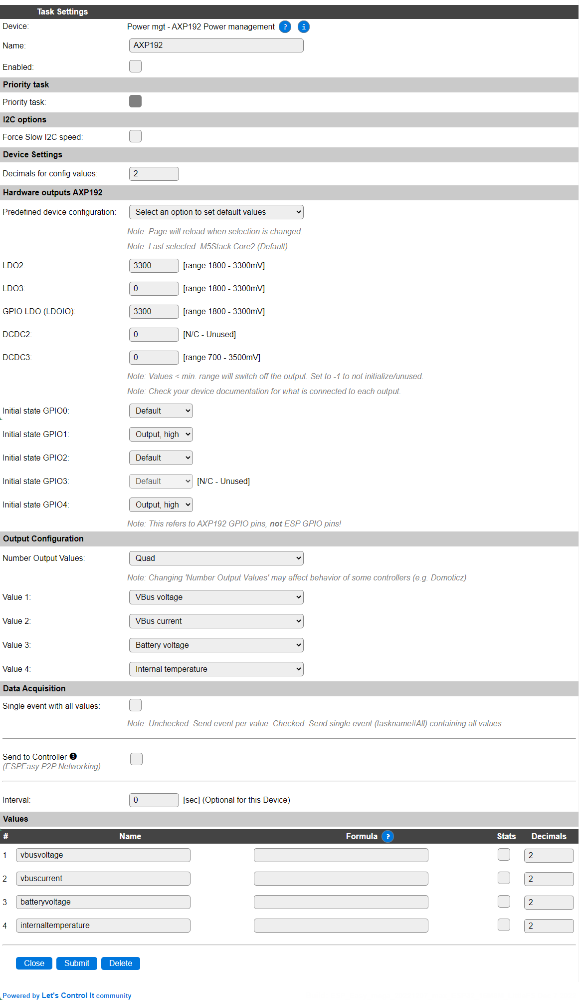
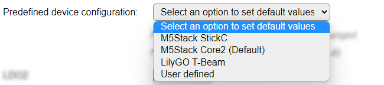
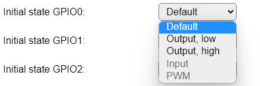
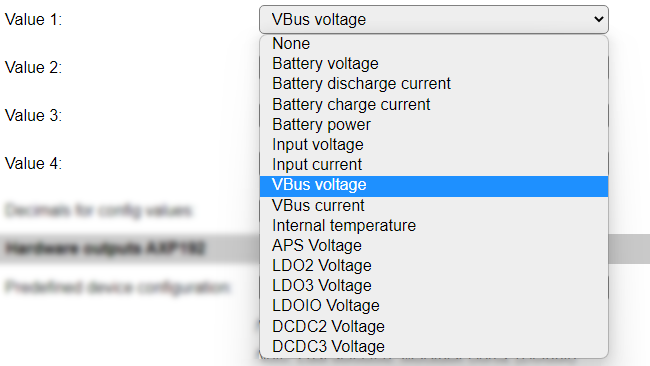

.. include:: ../Plugin/_plugin_substitutions_p13x.repl
.. _P137_page:

|P137_typename|
==================================================

|P137_shortinfo|

Plugin details
--------------

Type: |P137_type|

Name: |P137_name|

Status: |P137_status|

GitHub: |P137_github|_

Maintainer: |P137_maintainer|

Used libraries: |P137_usedlibraries|

Description
-----------

I2C Power management controller. As found in some ESP32 models of M5Stack and TTGO.

Plugin is only available in ESP32 builds, as the library uses some software constructs that aren't available for ESP8266, and this controller is currently only found to be used with ESP32 boards.

Configuration
--------------

* **Name** A unique name should be entered here.

* **Enabled** The device can be disabled or enabled. When not enabled the device should not use any resources.

.. include:: PriorityTask.rst

I2C Options 
^^^^^^^^^^^^

The available settings here depend on the build used. At least the **Force Slow I2C speed** option is available, but selections for the I2C Multiplexer can also be shown. For details see the :ref:`Hardware_page`

Device Settings
^^^^^^^^^^^^^^^^

* **Decimals for config values**: The number of decimals to use for presenting the Config values (see below for a list of available values).

Hardware outputs AXP192
^^^^^^^^^^^^^^^^^^^^^^^

* **Predefined device configuration** The plugin provides presets for some specific devices:

* *Select an option to set default values* This option will always be selected when opening the page.

* *M5Stack StickC* Settings for the M5Stack StickC hardware.

* *M5Stack Core2 (Default)* Settings for the M5Stack Core and Core2, and derived special models, hardware. This is the default predefined configuration.

* *LilyGO T-Beam* Settings for the LilyGO T-Beam series of GPS/LoRa devices with optional OLed display.

* *User defined* To be able to configure are available output pins the User defined option is available, f.e. when using a custom designed, or not yet supported, hardware setup.

When available, new predefined devices will be added. The User defined option will stay the last option.

The **LDO2**, **LDO3**, **LDOIO**, **DCDC2** and **DCDC3** outputs of the AXP192 can be set at a predefined value. When setting a value below 1800 mV, or 700 mV for the DCDC pins, the output will be turned off. Above 3300 mV is not supported/allowed, except for the DCDC3 pin that allows up to 3500 mV. Stepsize/resolution is ca. 100 mV.

.. warning:: Check board documentation for what each output is actually connected to, and the allowed voltage range for that output.

For the available GPIO pins (on AXP192, *not* ESP!), the initial state can be selected. The available options are:

* *Default* Doesn't set the state of the GPIO pin.

* *Output, low* Sets the state to low level (0 V).

* *Output, high* Sets the state to high level.

* *Input* Not supported yet.

* *PWM* Not supported yet.

Output Configuration
^^^^^^^^^^^^^^^^^^^^

* **Number Output Values**: Select the number of values that have to be available. The default is set to *Quad*, as there are far more than 4 values available for display.

Available options: *Single* (1), *Dual* (2), *Triple* (3) and *Quad* (4).

* **Value 1..4**: Select the desired value to be available in the Values fields. The name of the Values will be set to a matching default automatically, but can be changed afterward.

Available options:

* *None*: To leave the value empty/0.00

* *Battery voltage*: The voltage measured at the Battery connection.

* *Battery discharge current*: The current that the battery is being discharged with.

* *Battery charge current*: The current that the battery is being charged with.

* *Battery power*: The power available from the battery.

* *Input voltage*: The input voltage for the controller.

* *Input current*: The input current used by the controller.

* *VBus voltage*: The voltage at the VBus output.

* *VBus current*: The current delivered via the VBus output.

* *Internal temperature*: The internal chip temperature.

* *APS Voltage*: The voltage at the APS output.

* *LDO2 voltage*: The voltage at the LDO2 output.

* *LDO3 voltage*: The voltage at the LDO3 output.

* *LDOIO voltage*: The voltage at the GPIO (on AXP192, not ESP!) outputs.

* *DCDC2 voltage*: The voltage at the DCDC2 output.

* *DCDC3 voltage*: The voltage at the DCDC3 output.

.. note:: Not all options hold usable values for all boards, some may even be not connected. Check the board documentation for available values.

Data Acquisition
^^^^^^^^^^^^^^^^

This group of settings, **Single event with all values**, **Send to Controller** and **Interval** settings are standard available configuration items. Send to Controller is only visible when one or more Controllers are configured.

**Interval** By default, Interval will be set to 0 sec. as it is optional. When set > 0 it is the frequency used to read sensor values and send these to any Controllers configured for this device.

Values
^^^^^^

The measured values are available in variables, where the names are determined by the selected **Value 1..4** settings. A formula can be set to recalculate. The number of decimals can be set as desired, and defaults to 2.

By enabling the **Stats** checkbox per Values entry, you enable the gathering of statistics, that can produce a nice graph of the collected values.

Commands
~~~~~~~~

.. include:: P137_commands.repl

Extra values
~~~~~~~~~~~~

As this controller has more values available than can be set to the regular Values outputs, all values are also available from the Get Config feature.

.. include:: P137_values.repl

Change log
----------

.. versionchanged:: 2.0

  |added| 2022-08-25 Initially added.
