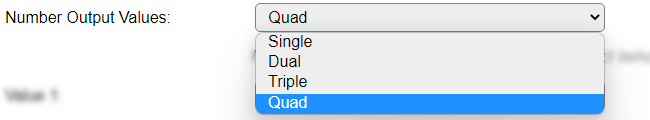

.. include:: ../Plugin/_plugin_substitutions_p13x.repl
.. _P138_page:

|P138_typename|
==================================================

|P138_shortinfo|

Plugin details
--------------

Type: |P138_type|

Name: |P138_name|

Status: |P138_status|

GitHub: |P138_github|_

Maintainer: |P138_maintainer|

Used libraries: |P138_usedlibraries|

Description
-----------

I2C Power management controller. As found in some ESP32 models of M5Stack and TTGO.

Plugin is only available in ESP32 builds, as this controller is currently only found to be used with ESP32 boards. It can be used on ESP8266, though untested.

Configuration
--------------

* **Name** A unique name should be entered here.

* **Enabled** The device can be disabled or enabled. When not enabled the device should not use any resources.

I2C Options 
^^^^^^^^^^^^

The available settings here depend on the build used. At least the **Force Slow I2C speed** option is available, but selections for the I2C Multiplexer can also be shown. For details see the :ref:`Hardware_page`

Device Settings
^^^^^^^^^^^^^^^^

* **Decimals for config values**: The number of decimals to use for presenting the Config values (see below for a list of available values).

* **Event on PowerSource change**: When checked the plugin will generate an event ``<taskname>#PowerChanged`` with argument 0 or 1 for battery or external power (the new state).

Output Configuration
^^^^^^^^^^^^^^^^^^^^

* **Number Output Values**: Select the number of values that have to be available. The default is set to *Quad*, as there are far more than 4 values available for display.

Available options: *Single* (1), *Dual* (2), *Triple* (3) and *Quad* (4).

* **Value 1..4**: Select the desired value to be available in the Values fields. The name of the Values will be set to a matching default automatically, but can be changed afterward.

Available options:

* *None*: To leave the value empty/0.00

* *Battery current*: The current measured at the Battery connection.

* *Charge undervoltage*: The (fixed) voltage at which charging of the battery is started by the controller.

* *Stop voltage*: The (fixed) configured voltage at which the battery is no longer being charged.

* *Input current*: The input current used by the controller.

* *Charge level*: The charge level of the battery.

* *Power source*: The power source used by the ESP, 0 = battery, 1 = External (USB) power.

Data Acquisition
^^^^^^^^^^^^^^^^

This group of settings, **Single event with all values**, **Send to Controller** and **Interval** settings are standard available configuration items. Send to Controller is only visible when one or more Controllers are configured.

**Interval** By default, Interval will be set to 0 sec. as it is optional. When set > 0 it is the frequency used to read sensor values and send these to any Controllers configured for this device.

Values
^^^^^^

The measured values are available in variables, where the names are determined by the selected **Value 1..4** settings. A formula can be set to recalculate. The number of decimals can be set as desired, and defaults to 2.

.. Commands
.. ~~~~~~~~

.. .. include:: P138_commands.repl

Extra values
~~~~~~~~~~~~

As this plugin has more values available than can be set to the regular Values outputs, all values are also available from the Get Config feature.

.. include:: P138_values.repl

Extra events
~~~~~~~~~~~~

Besides the regular events, of ``<taskname>#<valuename>=<value>`` or ``<taskname>#All=<value1>,..<valueN>`` when the **Interval** is set, there can be an extra event generated:

.. include:: P138_events.repl

Change log
----------

.. versionchanged:: 2.0

  |added| 2022-08-26 Initially added.
