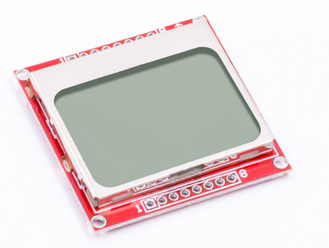
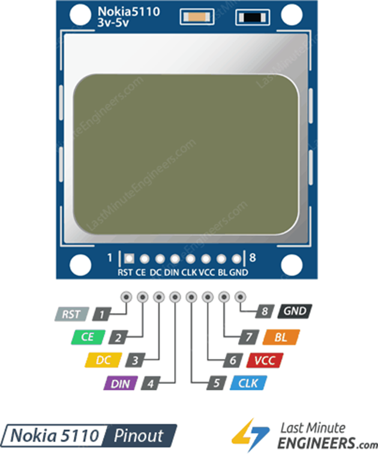
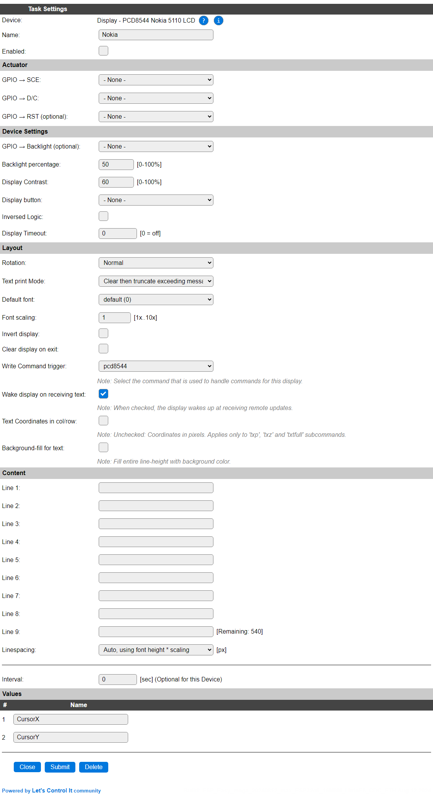
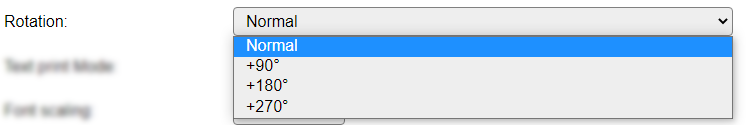
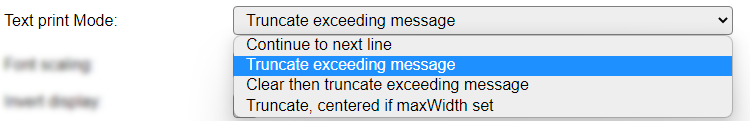
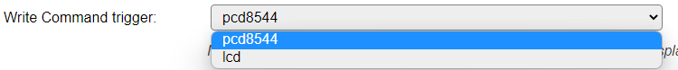

.. include:: ../Plugin/_plugin_substitutions_p14x.repl
.. _P141_page:

|P141_typename|
==================================================

|P141_shortinfo|

Plugin details
--------------

Type: |P141_type|

Name: |P141_name|

Status: |P141_status|

GitHub: |P141_github|_

Maintainer: |P141_maintainer|

Used libraries: |P141_usedlibraries|

Description
-----------

The Philips chip PCD8544 is used for driving a monochrome LCD display, often known as the Nokia 5110 LCD display, as the display was installed in that mobile phone.

The monochrome display has an 84 x 48 pixel resolution.

The plugin can be configured to show predefined text, a reservation for up to 9 lines is made, but only the lines that can fit on-screen will be shown, or via commands, sent via http or from rules, text or graphical elements like lines, rectangles, circles, pixels, etc., can be shown.

Hardware
---------

An image, grabbed from a supplier, showing the display:

Nokia 5110 84 x 48 pixels
   
Connections
^^^^^^^^^^^^

These displays are connected using the SPI interface, using at least 4 signal wires, implementing CS (SCE) to allow multiple SPI-connected devices.

The text on most displays is somewhat confusing, as not the usual SPI names are used:

.. code-block:: none

  - RST pin resets the display. It's an active low pin meaning; you can reset the display by pulling it low. You can also connect this pin to the Arduino reset so that it will reset the screen automatically.
  - CE(Chip Enable) pin is used to select one of many connected devices sharing same SPI bus. It's an active low pin as well.
  - D/C(Data/Command) pin tells the display whether the data it's receiving is a command or displayable data.
  - DIN is a serial data pin for SPI interface.
  - CLK is a serial clock pin for SPI interface.
  - VCC pin supplies power for the LCD which we connect to the 3.3V volts pin on the Arduino.
  - BL(Backlight) pin controls the backlight of the display. To control its brightness, you can add a potentiometer or connect this pin to any PWM-capable Arduino pin.
  - GND should be connected to the ground of Arduino

  ESP         LCD
  --------    ------
  (gpio)  --> RST (optional)
  (gpio)  --> SCE (=CS/CE)
  (gpio)  --> D/C
  MOSI    --> DIN(MOSI)
  CLK     --> SCLK
  3V3     --- VCC (the displays only support 3.3V)
  (gpio)  --> LED (optional)
  GND     --- GND

  (gpio) = configurable GPIO pin.

Device
------

* **Name** A unique name should be entered here.

* **Enabled** The device can be disabled or enabled. When not enabled the device should not use any resources.

Actuator
^^^^^^^^

* **GPIO -> SCE** Select the GPIO pin to use for the ``SCE``, a.k.a. ``CS``, connection.
* **GPIO -> D/C** The GPIO pin to use for the ``D/C`` connection (Data/Command).
* **GPIO -> RST (optional)** Select the GPIO pin to use for the ``RST`` (reset) connection. If the display doesn't have a ``RST`` connection, or no free pin is available, it can be set to *None*.
* **GPIO -> Backlight (optional)** Select the GPIO pin to use for controlling the backlight. To save power, the backlight can be dimmed, or turned off if the display is turned off. If set to *None* and the ``LED`` input connected to ``VCC``, the max. brightness is used for the backlight.
* **Backlight percentage** The backlight can be controlled via PWM modulation on the Backlight (LED) pin of the display. This is set as a percentage between 0 and 100%.
* **Display Contrast**: The PCD8544 supports setting the contrast level, to get an optimally visible display content. This can be fine-tuned here. Range: 0..100%.
* **Display button** A GPIO pin can be configured to wake the display on demand. This, combined with the **Display Timeout** setting, can preserve the lifetime of the display, and save some power.
* **Inversed Logic** When checked, reverses the pin-state action of the **Display button** gpio. This allows an external circuit, f.e. an IR sensor, that may provide a *high* signal when activated, to wake the display.
* **Display Timeout** Select the timeout in seconds to turn off the display after the last update or wake-up. Only used if the **Display button** is *also* configured.

Layout
^^^^^^^^

* **Rotation** Depending on how the display is to be mounted/installed, it may be needed to rotate the content, or, as we have a non-square resolution, to use the display in *Portrait* layout instead of the default *Landscape*.

Available options:

The available options rotate the display content in a counter clock-wise direction.

* **Text print Mode** Defines the handling of text when predefined text or text via the ``txt`` or ``txtfull`` subcommands (see below) is displayed.

Available options:

* *Continue to next line* Simply 'prints' all text to the display, with automatic overflow to the next line(s) if the text doesn't fit on the current line.
* *Truncate exceeding message* Display the provided message, but any excess at the right border of the display is discarded.
* *Clear then truncate exceeding message* Clear from the current cursor position to the end of the display, then display the provided message, but any excess at the right border of the display is discarded.
* *Truncate, centered when MaxWidth set*: Like *Truncate exceeding message*, but can center the content when a max. width for the text is provided.

Default setting is *Clear then truncate exceeding message*.

* **Font scaling** The scaling factor for the currently active font. Select a factor between 1 and 10.

* **Invert display**: This monochrome display supports inverting the content. The default can be set here.

* **Clear display on exit** When checked, will clear the display when the task is disabled, either from settings or via the ``TaskDisable`` command. The screen will be cleared, turned off, and when a backlight pin is configured, also the backlight is turned off.

* **Write Command trigger** The command to handle any commands for this device can be selected here.

Available options:

* *pcd8544*
* *lcd*

The command is handled non-case sensitive. See below for available commands and subcommands.

* **Wake display on receiving text** When checked, the display will be enabled once any content is written to the screen, either triggered by the Interval, or from a command. Default checked.

* **Text Coordinates in col/row** When checked, the coordinates for the ``txp``, ``txz`` and ``txtfull`` subcommands will be handled in cursor columns & rows, instead of pixels. Column and row are calculated from the current font size and font scaling settings.

* **Background-fill for text** When checked, for any text-line sent to the screen, the entire background (including top and bottom lines) will have the provided background color, *unless* transparent is used (Background color == Foreground color). Default unchecked.

Content
^^^^^^^^

* **Line 1..9** Predefined content can be specified. The number of lines used depends on the font used, the font scaling that is set and the rotation.

The usual variables, like ``[Taskname#Valuename]``, or ``%v1%``, system variables, formulas and functions can be used.

Input length is limited to 60 characters per line. If a longer calculated text is needed for a line, then it should be set from the rules or from an external source via http commands.

Next to Line 9, the remaining capacity in characters is displayed.

The total combination of lines * input length can not exceed 540 characters (sized dynamically). An error message will be shown after (trying to) save the settings, **any excess content will be discarded!**

* **Linespacing** When using a font scale > 1 the whitespace between the lines can be quite big. To be able to fine-tune that, this option is available, allowing 0 .. 14 pixels fixed linespacing, or use the default 'Auto' setting that calculates the linespacing based on font height and scale.

* **Interval** By default, Interval will be set to 0. If set to a non-zero value, the pre-configured content (if any) will be updated automatically using that interval (seconds). Depending on the **Text print Mode** setting, content that may have been draw from rules or external commands, may be erased.

Values
^^^^^^

The current text-cursor position is available in 2 variables **CursorX** and **CursorY**, that will be updated on every change of text or received command. **No** events are generated, and these values will never be sent to controllers.

The values can be used in rules, if desired. They will follow the **Text Coordinates in col/row** setting.

Commands
----------

.. include:: P141_commands.repl
.. include:: AdaGFX_commands.repl

Values
------

.. include:: AdaGFX_values.repl

.. Events
.. ~~~~~~

.. .. include:: P141_events.repl

Change log
----------

.. versionadded:: 2.0
  ...

  |added| 2022-08-25 Migrated (rewritten) from the ESPEasyPluginPlayground to ESPEasy using the ESPEasy AdafruitGFX Helper.
