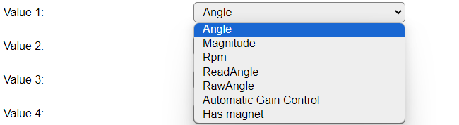

.. include:: ../Plugin/_plugin_substitutions_p14x.repl
.. _P142_page:

|P142_typename|
==================================================

|P142_shortinfo|

Plugin details
--------------

Type: |P142_type|

Name: |P142_name|

Status: |P142_status|

GitHub: |P142_github|_

Maintainer: |P142_maintainer|

Used libraries: |P142_usedlibraries|

Description
-----------

The AS5600 is a magnetic angle sensor, with 4096 step resolution for 360 degrees, effectively giving a resolution of 0.087 degrees. By using the low-power operation options the measurements will be available somewhat slower, but average power usage will be much lower.

The used library also has implemented a rotational speed measurement, when enough samples are available between reading the measurement.

Suggested implementations include contactless potentiometers, wind direction sensors and motor- or wind-powered rpm measurements.

Configuration
-------------

.. image:: P142_DeviceConfiguration.png
  :alt: Device configuration

* **Name**: Required by ESPEasy, must be unique among the list of available devices/tasks.

* **Enabled**: The device can be disabled or enabled. When not enabled the device should not use any resources.

I2C options
^^^^^^^^^^^

The available settings here depend on the build used. At least the **Force Slow I2C speed** option is available, but selections for the I2C Multiplexer can also be shown. For details see the :ref:`Hardware_page`

* **I2C Address**: The address the sensor is using. The AS5600 uses I2C address 0x36 and the AS5600L has address 0x40, allowing 2 of these sensor on an I2C bus without using an I2C multiplexer.

Device Settings
^^^^^^^^^^^^^^^

* **Output range**: Select the desired output range used, available options:

* *Degrees* The default setting gives 0..360 degree value for the ``Angle`` selection.

* *Radians* Recalculated angle value in radians.

|

* **Generate Events only when changed**: When enabled, events will only be generated if (one of) the selected value(s) changes.

* **Generate Events only when magnet detected**: When selected will suppress sending events if the magnet isn't close enough to the sensor (0.5..3mm).

* **Log basic data (Info)**: When enabled the plugin will write INFO logging with the raw angle value, the calculated angle, magnitude (magnetic strength), rotational speed and the state of the magnet (detected or not).

Sensor setup
^^^^^^^^^^^^

* **Direction Counter-clockwise**: When checked, the direction is reverted to be counter-clockwise.

* **Start position**: When the angle measurement is to be limited to specific region, the starting position can be set here, in 0.087 degree steps.

* **Max position**: To complete setting the measurement limits for a specific region, a maximum position has to be set as well, with a minimum of 18 degrees, or ca. 205 steps.

* **Angle offset**: To avoid having to move the device to set a 0-position, the angle offset can be adjusted here, from -359.99 to +359.99 degrees.

Power management
^^^^^^^^^^^^^^^^

* **Power mode**: To reduce the power used by the chip, this option can be configured. Available options:

* *Normal*: No power reduction, normal operation. Always on, chip uses ca. 6.5 mA.

* *Low power mode 1*: Major reduction in power use, polling time is 5 msec ensuring fast responses, chip uses ca. 3.4 mA.

* *Low power mode 2*: Greater reduction in power use, polling time is 20 msec for a quick response, chip uses ca. 1.8 mA.

* *Low power mode 3*: Greatest reduction in power use, polling time is 100 msec, chip uses ca. 1.5 mA. When using this as the default power mode, and as a potentiometer, response is quite sluggish during use. For use as a wind-direction sensor it may be the desirable setting.

|

* **Power watchdog**: When using this option, and not using *Low power mode 3*, after 1 minute of (nearly) no change in angle position, the sensor is put into *Low power mode 3* until a change of more than 4 LSB (least significant bits) is detected. Then it will return to the previously set power mode, until the next 1 minute of (nearly) no change in measurement.

Sensitivity & filtering
^^^^^^^^^^^^^^^^^^^^^^^

* **Hysteresis**: To avoid nervous-like fast changing angle values, a hysteresis can be applied, from 0 (off) to 3 LSBs (Least significant bits):

* **Slow filter**: To further stabilize the measurement both a slow filter and a fast filter are available in the chip. The slow filter has these available options:

The Slow filter reduces the response speed, smoothing the reported measurement changes.

* **Fast filter**: For reducing noise during measurement, the fast filter can be enabled, f.e. when a fast response is required and the slow filter is set to a low value, the fast filter can reduce frequent but small changes in measurement.

Output Configuration
^^^^^^^^^^^^^^^^^^^^

* **Number Output Values**: Choose the required number of values that should be visible in the Devices page, and send to any configured controllers. The default, and maximum possible, is 4 (quad), minimum is 1 (single).

* **Value 1..4**: Select the value to be output in the selected variable:

* *Angle*: The currently measured angle, either in degrees or radians, depending on the **Output range** setting.

* *Magnitude*: The magnetic strength sensed.

* *Rpm*: The rotational speed, if any. Only applicable if used as a rotational sensor.

* *ReadAngle*: The filtered angle value in 0..4095 step range, with Angle offset, Start position and Max position applied.

* *RawAngle*: The unfiltered angle value in 0..4095 step range.

* *Automatic Gain Control*: An automatic gain control is applied, this value returns the current value. When operating the sensor on 5V (an I2C level converter should be used then) the AGC range is 0..255, when operating on 3.3V the AGC range is 0..128.

* *Has magnet*: The state of an available magnet (0 = no magnet, 1 = magnet detected).

Data Acquisition
^^^^^^^^^^^^^^^^

This group of settings, **Single event with all values**, **Send to Controller** and **Interval** settings are standard available configuration items. Send to Controller is only visible when one or more Controllers are configured.

* **Interval** By default, Interval for this plugin is set to 0 sec. as events will be generated when a measurement is available. When an Interval is set, the data will be collected and optionally sent to any configured controllers using the interval.

Values
^^^^^^

Per Value is a **Stats** checkbox available, that when checked, gathers the data and presents recent data in a graph, as described here: :ref:`Task Value Statistics:  <Task Value Statistics>`

Get Config Values
^^^^^^^^^^^^^^^^^

Get Config Values retrieves values or settings from the sensor or plugin, and can be used in Rules, Display plugins, Formula's etc. The square brackets **are** part of the variable. Replace ``<taskname>`` by the **Name** of the task.

.. include:: P142_config_values.repl

Change log
----------

.. versionchanged:: 2.0
  ...

  |added|
  2024-07-02 Initial release version.

