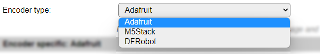

.. include:: ../Plugin/_plugin_substitutions_p14x.repl
.. _P143_page:

|P143_typename|
==================================================

|P143_shortinfo|

Plugin details
--------------

Type: |P143_type|

Name: |P143_name|

Status: |P143_status|

GitHub: |P143_github|_

Maintainer: |P143_maintainer|

Used libraries: |P143_usedlibraries|

Description
-----------

To handle user input from a rotary encoder, without an timing critical code, several manufacurers have introduced integrated rotary encoders with a small controller board that interacts with the outside world via I2C. Currently this plugin supports the I2C Rotary encoders available from Adafruit, M5Stack and DFRobot.

The encoders supported have somewhat different capabilities, but they all provide a counter values, and can be pressed to act like a pushbutton. All models also support 1 or more Leds, some with 24 bit color capability (NeoPixel).

Hardware
--------

Configuration
-------------

* **Name**: Required by ESPEasy, must be unique among the list of available devices/tasks.

* **Enabled**: The device can be disabled or enabled. When not enabled the device should not use any resources.

I2C options
^^^^^^^^^^^

* **I2C Address**: Depending on the selected **Encoder type**, different I2C Addresses are available. Adafruit supports 8 addresses, M5Stack only supports 1 address and DFRobot can be configured for 4 different addresses.

The available settings here depend on the build used. At least the **Force Slow I2C speed** option is available, but selections for the I2C Multiplexer can also be shown. For details see the :ref:`Hardware_page`

Device Settings
^^^^^^^^^^^^^^^

* **Encoder type**: Select the rotary encoder used, available options:

* *Adafruit* The Adafruit I2C Rotary encoder (product-ID 4991), with 1 on-board NeoPixel Led that can be independently controlled.

* *M5Stack* The M5Stack I2C Rotary encoder (product-ID U135), with 2 on-board NeoPixel Leds, that can be controlled independently.

* *DFRobot* The DFRobot I2C Rotary encoder (product-ID 2575), with 20 on-board mono-color Leds, mounted in a circle, that will light up clockwise when increasing the counter value. The number of rotations/detent to move for lighting up a Led can be set using the Gain. See below for detailed description.

When this setting is changed, the page is saved and reloaded to change the I2C Address selector and show/hide the encoder specific settings.

Encoder specific: Adafruit
^^^^^^^^^^^^^^^^^^^^^^^^^^

* **Neopixel 1 initial color**: The Led can be set at a specific color when the task is started. This color is specified in RGB values (0..255).

* **Initial brightness**: To reduce the rather bright light the NeoPixel Led can produce, the brightness can be set. Because of the way this is applied, it may affect the resulting color when setting the brightness very low. The range is 1 (dimmed) to 255 (max. brightness).

Encoder specific: M5Stack
^^^^^^^^^^^^^^^^^^^^^^^^^

* **Neopixel 1 initial color**: The first Led can be set at a specific color when the task is started. This color is specified in RGB values (0..255).

* **Neopixel 2 initial color**: The second Led can be set at a specific color when the task is started. This color is specified in RGB values (0..255).

* **Initial brightness**: To reduce the rather bright light the NeoPixel Leds can produce, the brightness can be set. This is applied to both leds. Because of the way this is applied, it may affect the resulting color when setting the brightness very low. The range is 1 (dimmed) to 255 (max. brightness).

* **Color map Leds**: When the Color mapping feature is used, this can be applied to both or just 1 of the Leds. That is selected here. Available options:

* *Both leds* The same color is set to both leds using the configured mapping.

* *Led 1 only* Only Led 1 is applied with the mapped color, the other Led can be set using the rules command, see below.

* *Led 2 only* Only Led 2 is applied with the mapped color, the other Led can be set using the rules command, see below.

Encoder specific: DFRobot
^^^^^^^^^^^^^^^^^^^^^^^^^

* **Led vs. rotation gain**: The Leds on the board always light up related to the current Counter state. The relation between the number of detents the encoder is rotated, and the number of leds lighting up, can be configured between 51: 1 led/detent (1 rotation lights up all leds) and 1: ~2.5 rotation lighting up 1 additional led (or reducing the number of leds when turning counter-clockwise).

In Generic settings:

* **Offset to position**: The DFRobot encoder only has a Counter range of 0..1023. To allow the position to use negative encoder positions, an offset can be applied, f.e. 511 so a range of -511..512 with a 0 center position can be used.

Generic settings
^^^^^^^^^^^^^^^^

* **Initial encoder position**: The Counter value the encoder will be set to when starting the task.

* **Lowest encoder position**:

* **Highest encoder position**: When the encoder should have an absolute minimum and maximum Counter value, f.e. when being used as a volume control or when controlling a servo, the lowest and highest marks can be set. When turn counter-clockwise and the Counter reaches the lowest value, continuing to turn the knob will nu longer decrease the Counter value. When reverting the rotation, the Counter will immediately be incremented again, until the highest value is reached. This option is disabled when lowest and highest have the same value.

* **Offset to position**: Only available for DFRobot encoder, see above in **Encoder specific: DFRobot** section.

* **Button action**: Select the action the button should have when pressed. Available options:

* *Pushbutton*: Pushbutton action, will set the ``State`` value to 0 when pressed, and 1 when released. Also, and event ``<taskname>#State=<state>`` is generated. Initial state is 1.
* *Pushbutton (inverted)*: Like Pushbutton, except state is 1 when pressed, and 0 when released. Initial state is 0.
* *Toggle switch*: Pressing the button will toggle the state value between 1 (in itial value) and 0.

* **Enable Pushbutton longpress**: When checked, pressing the button longer before releasing will set the state to 11 for the *Pushbutton* button action, and 10 for the *Pushbutton (inverted)* button action. This state corresponds with the regular Switch plugin longpress events. Also this state is used in the generated events.

* **Longpress min. interval**: The minimal duration the button has to be pressed to be recognized as a longpress. Range 500..5000 milliseconds.

* **Counter color mapping**: Select the desired color mapping from the current Counter value. Not available for DFRobot encoder. Available options:

* *None*: Color mapping is disabled.
* *Color mapping*: Colormap lines #1..#10 are interpreted for setting the color of the Led(s), where each line *must* have 4 comma separated values to be interpreted:

``<counter cutoff>,<red>,<green>,<blue>``

``<counter cutoff>``: If the Counter value is equal or below this value, the set RGB color will be set on the Led(s)

``<red>,<green>,<blue>``: The red, green and blue values, range 0..255, to be used.

Example Color mapping configuration:

With this Color mapping, the Led(s) will be green when the Counter is 0, orange-ish in ranges -1..-9 and 1..10, and red when -10 or lower, or > 10. This can be adjusted for different colors or ranges. The lowest position is set to -20 and the highest to 20.

* *Color gradient*: Similar to the Color mapping, the Color gradient uses 4 comma separated values in the Colormap #1..#10 lines, but instead of an exact color, it calculates the relative gradient color between 2 provided colors that the Counter value matches:

With this color gradient setting, the Led(s) will be turning from green to blue when the Counter goes below 0, and from green to red when the Counter value changes from 0 to 20.

NB: Colors will not be exact when a lower value is selected for **Initial brightness**, or when the brightness is changed from rules.

* **Led(s) off on exit**: When checked, all controlled leds on the encoders will be turned off, either by setting the color to black, or setting the encoder position to 0 (DFRobot).

Data Acquisition
^^^^^^^^^^^^^^^^

This group of settings, **Single event with all values** and **Send to Controller** settings are standard available configuration items. Send to Controller is only visible when one or more Controllers are configured.

Values
^^^^^^

The plugin provides the ``Counter`` and ``State`` values.

Commands available
^^^^^^^^^^^^^^^^^^

.. include:: P143_commands.repl

Events
^^^^^^

.. include:: P143_events.repl

Change log
----------

.. versionchanged:: 2.0
  ...

  |added|
  2022-11-22 Initial release version.

