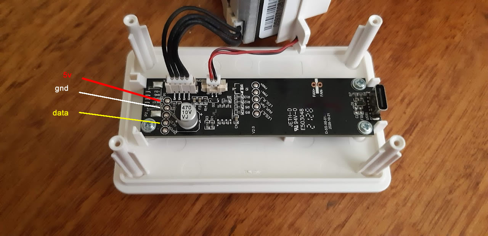
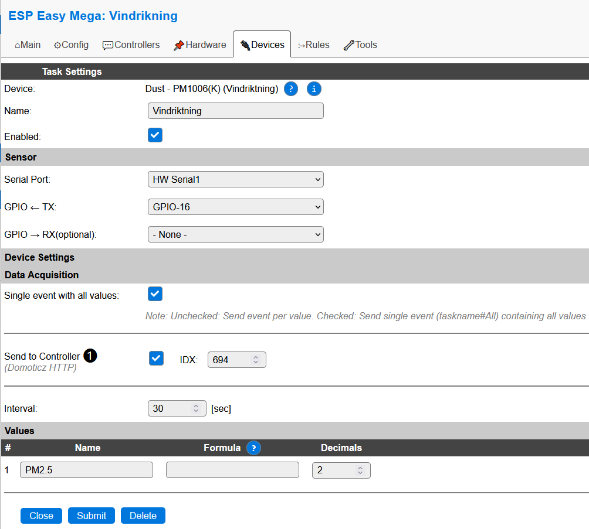

.. include:: ../Plugin/_plugin_substitutions_p14x.repl
.. _P144_page:

|P144_typename|
==================================================

|P144_shortinfo|

Plugin details
--------------

Type: |P144_type|

Name: |P144_name|

Status: |P144_status|

GitHub: |P144_github|_

Maintainer: |P144_maintainer|

Used libraries: |P144_usedlibraries|

Description
-----------

This plugin supports the dust sensor used in the Ikea Vindriktning. The PM1006K sensor uses a serial protocol to communicate with the controller. The Vindriktning contains a controller that sets up the sensor and reads the value regularly. 
This plugin is intended to eavedrop this communication. All sensor reading results are copied to the plugin.

Note: The current plugin does not support direct communication with the PM1006(K) sensor. However, the plugin can be extended later to also support standalone control of this device.

Hardware
---------

The Vindrikting can be bought by Ikea. The device can be opened easily by 4 screws. Inside there is room for a Wemos D1 mini or a similar form factor. The 5 Volt power is available on the Vindrikning solder pads. 
Also the data received from the sensor is available on a solder pad. Images of a hacked Vindrikning are available on the internet.

Connections
^^^^^^^^^^^^

.. code-block:: none
   
  Vindriktning  ESP    Signal
  VCC           VSUP   5V supplied by Vindrikning
  GND           GND    Ground
  data          RX     Serial data from Vindrikning

See :ref:`SerialHelper_page` for the options to connect a serial communication to the ESP. The TX signal of the UART is not connected to the Vindrikning. 
A future version of the plugin might use both TX and RX to directly control the PMS1006(K) sensor without using the Ikea Vindrikning controller.

Power to the ESP is supplied by the Vindrikning processor board and must be connected to the 5V input of the ESP board. This is the same power as supplied to the Vindrikning using the USB connector at the back. 
In case the ESP board has its own USB connector this connector can be used to supply the power to the system and have a debug connection to your PC. Never connect both USB connectors at the same time, this may cause serious power issues.

Device configuration
--------------------

task settings
^^^^^^^^^^^^^
**Name** : A unique name should be entered here.

**Enabled** : The device can be disabled or enabled. When not enabled the device should not use any resources.

Sensor
^^^^^^

**Serial Port** : Select the serial port to be used. Choices depend on the type of ESP chip being used. 

See :ref:`SerialHelper_page` for the available options.

Commands
--------

This plugin does not support additinal commands.

Change log
----------

.. versionadded:: 2.0
  ...

  |added| 2023-04-10 Created.
