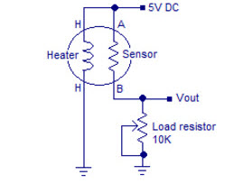
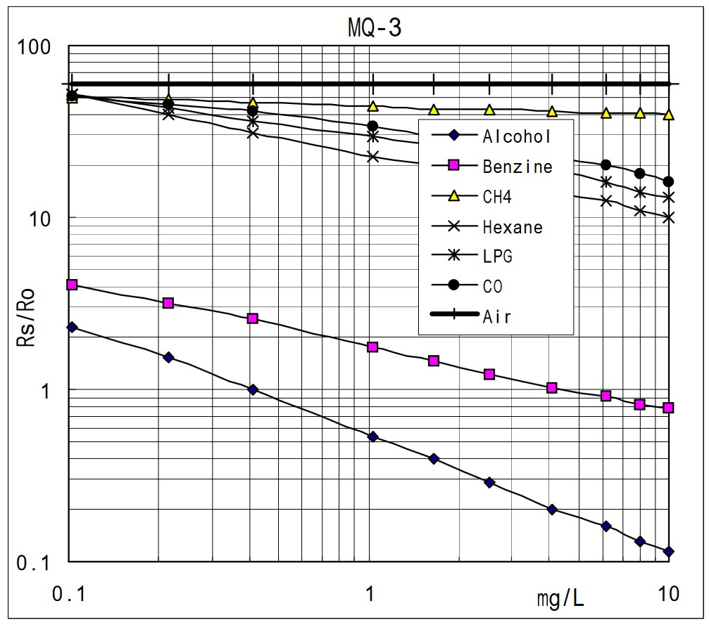
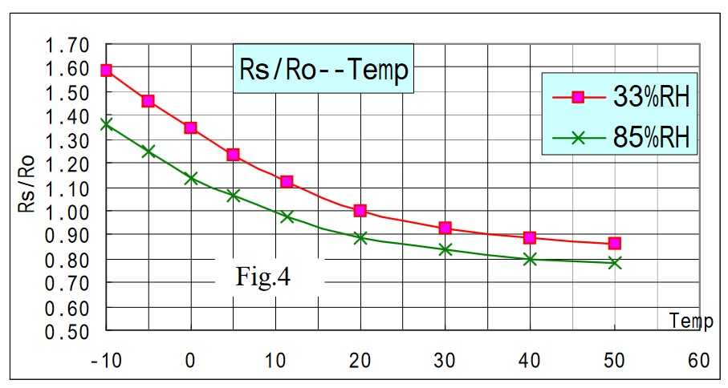
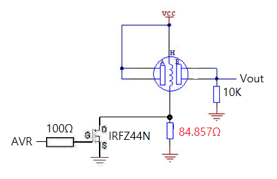
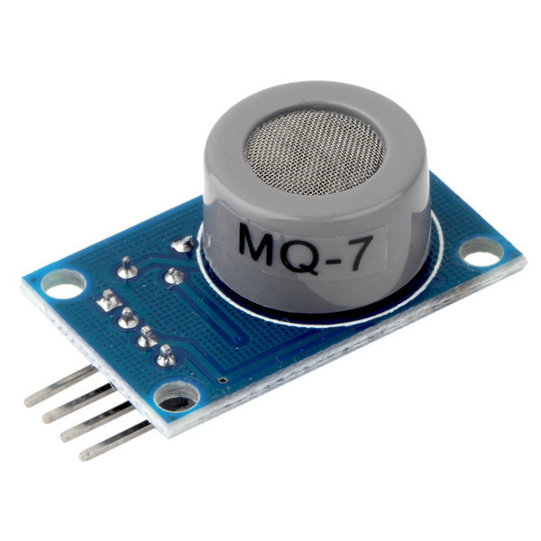
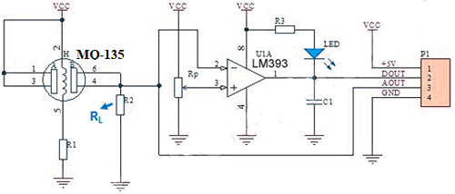
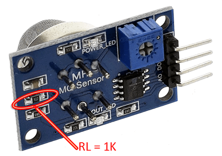
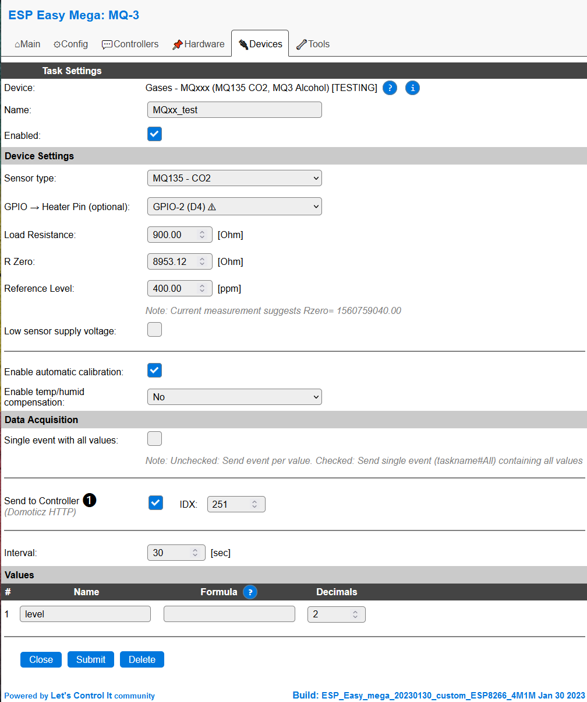
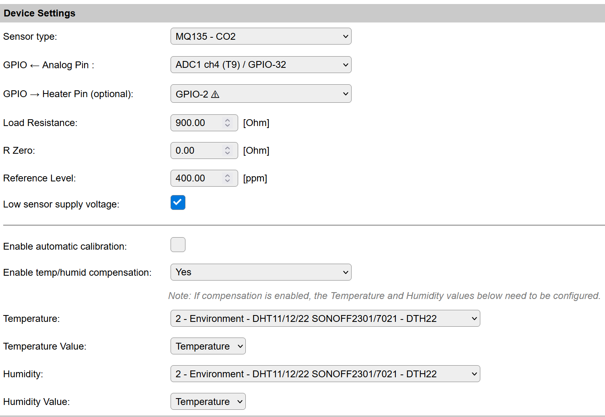

.. include:: ../Plugin/_plugin_substitutions_p14x.repl
.. _P145_page:

|P145_typename|
==================================================

|P145_shortinfo|

Plugin details
--------------

Type: |P145_type|

Name: |P145_name|

Status: |P145_status|

GitHub: |P145_github|_

Maintainer: |P145_maintainer|

Used libraries: |P145_usedlibraries|

Description
-----------

This plugin supports gas sensors for which the resistance depends on a gas concentration. These cheap sensors are tuned for specific gasses although they always respond to multiple gasses. The sensors are sold as MQ-xxx (MQ-3, MQ-135, etc).

The analog value of the sensors is determined by a resistance (``Rsensor``). The sensor is typically used in series with a load resistor (``Rload``). 
The voltage is over ``Rload`` is connected to the analog input of the ESP. A sensor and gas specific conversion formula is used to convert the measured voltage to a gas concentration.

Typical MQ-xxx sensor connection:

The plugin can be configured to select one of the predefined sensor types. Various parameters can be tuned to adapt the conversion.

Basic algorithm
^^^^^^^^^^^^^^^

The MQ-xxx series of sensors contain a resistor that depends on the concentration of certain gases in the environment. This relation is typically provided in the datasheets as a curve on a logarithmic plot. Figure below shows this relation for the MQ-3 sensor. In the indicated range the plot is close to linear. 
The plugin uses a conversion algoritm based upon a linear relation in the log-log plot. This results in two parameters parA and parB that determine this linear relation.

Example MQ-xxx sensor gas level to resistance graph:

All plots use a normalized sensor resistance ratio (``Rsensor/Rzero``) as input. The ratio ``Rsensor/Rzero`` is the measured sensor resistance divided by a reference resistance value ``Rzero``. 
The value of ``Rzero`` is the value the sensor has when a reference gas concentration is measured. As the plot is logaritmic, changing ``Rzero`` equals shifting the curve up or down. This means ``Rzero`` can be used to calibrate the sensor.

The measurement algoritm is done in two steps: 
1) Convert the measured voltage in the resistance value of ``Rsensor``. 
2) Apply the approximated curve for the given sensor type and gas type.

* The current plugin algorithm assumes the sensor is connected to a supply voltage of 5 Volt with an ESP analog input range of 3.3 Volt. As alternative configuration the sensor can be powered by a low voltage of 3.3 Volt. 
  The load resistance ``Rload`` is a device setting. Ohms law is used to determine the sensor's resistance ``Rsensor``.

* Several examples were found in literature to apply the linear log-log relation to convert the measured ``Rsensor`` value into a gas concentation level. The plugin uses a table with sensor specific data. Per sensor the algorithma and associated parameters are provided.
  Other sensors can be added, given the correct data can be produced.

Temperature and humidity compensation
^^^^^^^^^^^^^^^^^^^^^^^^^^^^^^^^^^^^^

The MQ-xxx series of sensors is depending on the environment temperature and humidity. The datasheets often provide a graph that shows the relation between the ``Rsensor/Rzero`` ratio and environment temperature for various relative humidity levels. Figure below shows this relation for the MQ-3 sensor.
From the plot it is clear that this relation is not linear.

Example MQ-xxx temperature and humidity influence on sensor resistance

The plugin uses a calibration algorithm for the MQ-135 as found on the internet. Other sensors are waiting for proper measurement data and assocaited algorithms.

Compensation can be enabled for all sensors. The temperature and humidity values must be provided by external sensors. If enabled the plugin tasks and values for both temperature and Humidity must be configured. 
In case a sensor type does not support compensation the output level will be the same as for compensation turned off.

Calibration
^^^^^^^^^^^

The plugin uses a ratio (``Rsensor/Rzero``) as input to determine the gas level. By changing the value of ``Rzero`` the resulting sensor value can be tuned. 
With every measurement the plugin calculates what ``Rzero`` should be if the current concentration level equals the reference level. This is the reverse formula for the relation between ``level`` and (``Rsensor/Rzero``) ratio.
The plugin will log this value as ``Rcal``. The value is shown in the logging (log output page or on the serial terminal). If a safe value can be calculated the value will also be shown as a suggestion on device settings page.

The user shall take care the sensor is well heated and in a clean air environment (reference for most sensors) for some time. If the ``Rcal`` value is stable it can be copied to the ``Rzero`` setting on the settings page. 
For the MQ-135 the reference level for CO2 can be configured on the device page. Typically the level is around 400ppm in fresh air, but local conditions may differ. Most other sensors use a predefined value for the clean air level.

Autocalibration
^^^^^^^^^^^^^^^

The user can switch on autocalibration for the plugin. If autocalibration is switched on the plugin measures the calibration value ``Rcal`` over a full day. Once a day it uses the lowest value of the day as new value for ``Rzero``. 
Note that this asumes that at least once a day the reference level is reached. Don't use autocalibration if levels can be high for a day or longer! Autocalibration will cause a jump in the value once a day when ``Rzero`` is updated.

Heater control
^^^^^^^^^^^^^^

Some sensors require manipulation of the heater part (e.g. MQ-7). An optional digital output pin can be selected to control the heater. As soon as a pin is assigned the plogin will apply a measurement pattern:

* Apply a high level to heatup the sensor after starting the plugin or changing the heater pin assignment (90s)

* Apply a high level to outgas residual gasses in the sensor (60s)

* Apply a low level to cool down the sensor (60s)

* Apply a low level and measure the analog value (30s)

* Repeat outgassing

Note that when heater control is switched on the gas level is measured and updated once per 150 seconds. The ouput pin can be used to bypass a series resistor for the heater part of the sensor. 
The value of this series resistor can be calculated from the sensor specifications in the datasheets.

Final thoughts about the sensors
^^^^^^^^^^^^^^^^^^^^^^^^^^^^^^^^

The MQ-xxx sensors are cheap sensors for various types of gas. They are primary used to warn for high levels of gas and not for accurate level reporting. For reporting these sensors have several drawbacks:

* They respond to multiple gasses. Although each sensor type is tuned to one or a few gasses also other gasses will influence the readings.

* They depend on the temperature and humidity. Compensation is partly possible, but requires non-linear formulas. 

* The Rsensor/Rzero relation is not completely linear of the logarithmic scales. This reduces the accuracy of the measurements.

* The sensors are known to drift over time. For good results they shall be calibrated regularly.

Although the serious issues with this kind of sensors they provide a cheap way to do some trend analysis of your environment. They can be used to control ventilation or provide warnings about air quality. 
As long as values are not taken absolute it is fun to play with them. I use a MQ-135 as CO2 sensor next to a ndir MHZ-19 sensor. They both increase the reading strongly when working in a closed room. 
However the MQ-135 keeps the values high much longer than the MHZ-19. Sometimes the MQ-135 detects "gasses" while the MHZ-19 is quiet. 
It was fun to learn how to build a ESPeasy plugin and I will play with these sensors. But I won't use them for accurate logging of a specific gas.

Hardware
---------

Sensors can be bought as a component. The internet is full of development boards that contain the sensor with load resistor connected. These boards also provide a comparator that compares the output value with a preset value for a simple digital output.

Development board with MQ-7 CO sensor:

   
Schematics for development board:

Connections
^^^^^^^^^^^^

The sensor analog output is connected to an analog input on the ESP. The digital output provided on development boards is not used by the plugin. You can use the digital input plugin instead (P001).
The plugin uses the standard ESPeasy mechanism to select an analog input pin. Selection options depend on the type of ESP used.
See analog input plugin for more information about the available analog inputs for each of the supported ESP versions.

In case the sensor needs heater control an additional circuit is required to switch the heater resistor between two levels. The switch, usually a transistor, is connected to a digital output pin.

Load resistor remarks
^^^^^^^^^^^^^^^^^^^^^

The manufactors of the MQ-xxx sensors provide the conversion plots given a set of environment conditions. This includes the supply voltage and a prescribed range for the load resistor Rload. 
Unfortunately most of the cheap development boards put a standard 1kOhm resistor on the board. For most sensors this value is far too low. The plugin can handle such values. 
However, a too low value for the load resistor decreases the range of the output voltage signal and thus the accuracy of the measurent. It also uses the sensor in a range that is not supported by the manufator.
It is advised to replace this resistor by a value fitting the range advised by the manufactor. You can find the correct range in the datasheet for the sensor. 

Location of Rload on many of the cheap development boards:

Many ESP8266 boards use resistors to divide the analog input value to map the 1 Volt input range of the ESP to the 3.3 Volt supply range. These resistors are in parallel with the Rload on the sensor board. 
This shall be taken into account when determining the ``Rload`` value for the plugin.

The plugin assumes a supply voltage of 5 Volt for the sensor and an input range of 3.3 Volt for the Analog input. This implies that the input may get out of range for very high gas levels. 
Please check the expected range for the given sensor and Rload combination. If clipping is expected the load resistor might be decreased. Other options are to use/change the input divider resistors on the ESP board or apply a 3.3 volt power to the sensor. 
Note that the plugin only supports the 3v3 supply option as alternative. Using 3v3 officailly uses the sensor out of specification range. For other configurations you have to change settings in the code and build the plugin yourself.

Device
------

* **Name** A unique name should be entered here.

* **Enabled** The device can be disabled or enabled. When not enabled the device should not use any resources.

* **Sensor type** Dropdown box to select one of the predefined sensors. Used to determine the correct conversion algorithm.

* **Heater Pin** Optional selection of a heater control pin. If a valid pin is selected heater control algoritm is switched on

* **Load Resistance** Value of the connected load resistor (``Rload``)

* **R Zero** Reference resistance value for the sensor (``Rzero``). This is the main calibration value, see sensor description.

* **Reference Level** Reference gas concentration level for calibration of ``Rzero``.

* **Low sensor supply voltage** Tick to switch the algoritm to assume a 3v3 power supply for the sensor.

* **Enable automatic calibration** Checkbox to enable automatic calibration. 

* **Enable temp/hmid compensation** Enable temperature and humidity compensation. This requires an external temperature and humidity sensor that deliver the actual data.

* **Temperature Task** Dropdown box to select the task for the compensation temperature.

* **Temperature Value** Dropdown box to select the value for the compensation temperature.

* **Humidity Task** Dropdown box to select the task for the compensation humidity.

* **Humidity Value** Dropdown box to select the value for the compensation humidity.

On ESP32 the analog input can be selected.

* **Analog Pin** Select one of the available analog input pins on the ESP32

Commands
----------

This plugin does not support additinal commands.

Values
------

This group of settings, **Single event with all values** and **Send to Controller** settings are standard available configuration items. Send to Controller is only visible when one or more Controllers are configured.

Change log
----------

.. versionadded:: 2.0
  ...

  |added| 2023-01-08 Created.
