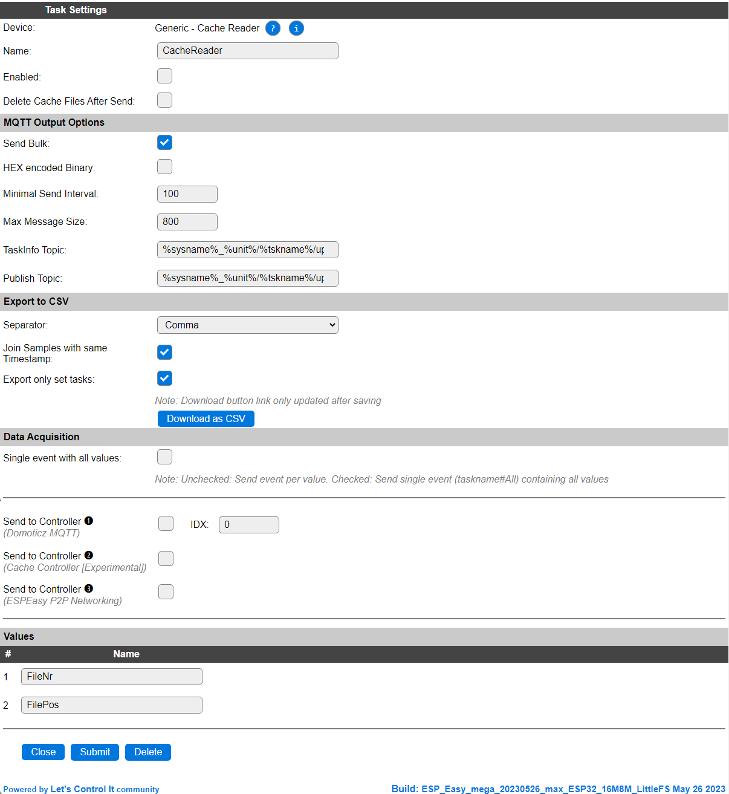

.. include:: ../Plugin/_plugin_substitutions_p14x.repl
.. _P146_page:

|P146_typename|
==================================================

|P146_shortinfo|

Plugin details
--------------

Type: |P146_type|

Name: |P146_name|

Status: |P146_status|

GitHub: |P146_github|_

Maintainer: |P146_maintainer|

Used libraries: |P146_usedlibraries|

.. Supported hardware
.. ------------------

|P146_usedby|

Description
------------

This plugin aids in (re)sending data, accumulated by the Cache Controller on the local file system, to a MQTT controller.

It will re-send the data using the original plugin via the original controller it was supposed to be sent out, but no network connection was available, like when collecting data in a car, storing the values in a Dummy Device task as that will include the timestamp, and sending it out once the home location, with WiFi is available again.

Data will be sent out to the configured Controller, while the (Dummy) task(s) collecting data should be sending their data to the Cache Controller, that will have to be configured (and enabled!) separately on the Controllers tab.

Device Configuration
--------------------

* **Name**: Required by ESPEasy, must be unique among the list of available devices/tasks.

* **Enabled**: The device can be disabled or enabled. When not enabled the device should not use any resources.

* **Delete Cache Files After Send**: After successfully sending out the data, the cache files will be removed when this setting is enable. When leaving this option disabled, might cause data to be sent multiple time, depending on the receiving controller to deduplicate the received data.

MQTT Output Options
^^^^^^^^^^^^^^^^^^^

* **Send bulk**: When enabled will send the data in a bulk message when possible, when disabled separate messages will be sent. N.B. also CSV export can be sent in bulk, even with combining data based on the same timestamp.

* **HEX Encoded Binary**: Determines if any binary data will be hex encoded when sent. Depends on the receiving (MQTT) controller is this option is needed.

* **Minimal Send Interval**: The minimal required send interval, defaults to 100 msec, but when using an external MQTT server, this might need to be increased to accommodate the TOS (Terms of service) and the time to connect to that server may take (well) over this delay.

* **Max message size**: This is the max size for the content sent in a single message. This can be quite a large MQTT message, upto 32kB in size. Practical limit depends on a lot of factors, like the MQTT broker configuration.

* **TaskInfo topic**: The MQTT topic the taskinfo data, including task- and value-names, will be sent to.

* **Publish Topic**: The MWTT topic to publish the data to.

Export to CSV
^^^^^^^^^^^^^

* **Separator**: The separator that will be used when writing CSV data.

Available options:

* *Tab*

* *Comma* (Default)

* *Semicolon*

..

* **Join Samples with same Timestamp**: When enabled will join/combine data with the same timestamp into a single CSV file.

* **Export only enabled tasks**: Export only the tasks that are enabled, reducing the amount of data being sent. For binary data this will only change the 'taskinfo' string being sent. For CSV formatted data the data reduction may be significant as not enabled task columns will not have to be sent.

Included in the Github repository is an example Python script to decode the binary format. This can be found in the ``misc/CacheController`` folder.

Data Acquisition
^^^^^^^^^^^^^^^^

This group of settings, **Single event with all values** and **Send to Controller** settings are standard available configuration items. Send to Controller is only visible when one or more Controllers are configured.

Values
^^^^^^

The plugin provides the ``FileNr`` and ``FilePos`` values, reporting the last used file and filepos values.

The last read position will be restored from RTC memory on reboot or deep sleep, so the unit can continue to upload data when re-connected.

However the read position is lost on a power cycle, so some data may be sent multiple times if the ESP is power cycled before a file was finished. (or no bin file will be deleted after upload).

Commands available
^^^^^^^^^^^^^^^^^^

.. include:: P146_commands.repl

.. Events
.. ~~~~~~

.. .. include:: P146_events.repl

Example
-------

Planned use for below Rules is a set of sensors and a GPS connected to an ESP(32), mounted in a RV (Camper). During the ride, the GPS generates an event at configured distance intervals, causing the data to be stored in the Cache Controller, including a time-stamp. Using a Dummy Device task allows to combine some values from separate sensors and thus allow to store it slightly more compact. Also the command ``TaskRunAt`` allows for dummy tasks to flush their data to the Cache Controller to have the same timestamp. Thus these values can later be combined by the CacheReader task on a single CSV line making it easier to process the data recorded during the trip.

Once the home-location is reached, WiFi is connected and the MQTT Controller accepts the connection request, the data is bulk-sent to the MQTT server. In the code are instructions included on how to trigger another update by sending an MQTT message to the unit.

.. code-block:: text

  On System#Boot Do
    Let,2,60  // interval in seconds for 'fallback' interval to flush sensor values to flash.
    LoopTimerSet,1,[int#2]
    
    // Now we're enabling tasks for I2C sensors as they may have been disabled when not found
    TaskEnable,bme280
  Endon

  On gps#All Do
    Let,4,%unixtime%
    LoopTimerSet,1,[int#2] // re-set the timer to have at least [int#2] seconds between samples.
    TaskValueSet,gps1,long,[gps#long] 
    TaskValueSet,gps1,lat,[gps#lat] 
    TaskValueSet,gps1,alt,[gps#alt] 
    TaskValueSet,gps1,spd,[gps#spd] 
    TaskRunAt,gps1,[int#4]
    Event,saveAllToFlash
  Endon

  On Rules#Timer=1 Do
    Let,4,%unixtime%
    Event,saveAllToFlash
  Endon

  On saveAllToFlash Do

    // Now collect  other data to store into 'dummy' tasks.
    // For this, we use the command TaskValueSet.
    // See: https://espeasy.readthedocs.io/en/latest/Rules/Rules.html#taskvalueset
    
    // First we get the other values from the GPS unit and store it  in the dummy task called "gps2"
    // See: https://espeasy.readthedocs.io/en/latest/Plugin/P082.html#access-to-all-measurement-values
    // N.B. the first 2 arguments of the TaskValueSet command are resp. the task name and variable name of a dummy task
    // So make sure these match with an enabled dummy task
    TaskValueSet,gps2,hdop,[gps#hdop] 
    TaskValueSet,gps2,satvis,[gps#sat_vis] 
    TaskValueSet,gps2,sattracked,[gps#sat_tr] 
    TaskValueSet,gps2,chksumfail,[gps#chksum_fail] 
    // Calling TaskRun will cause the values to be sent to the controller(s) assigned to the task
    TaskRunAt,gps2,[int#4]
    
    // Now we collect the latest samples of the analog voltages
    TaskValueSet,analog,carBat,[bat#Analog.avg2]
    TaskValueSet,analog,backupBat,[batBackup#Analog.avg2]
    // And flush them to the Cache Controller
    TaskRunAt,analog,[int#4]
    
    // Now we collect the latest samples of the BME280
    TaskValueSet,bme2,Temperature,[bme280#Temperature]
    TaskValueSet,bme2,Humidity,[bme280#Humidity]
    TaskValueSet,bme2,Pressure,[bme280#Pressure]
    // And flush them to the Cache Controller
    TaskRunAt,bme2,[int#4]
    
    // Flush current and previous CO2 value to flash
    TaskRunAt,co2,[int#4]
    
    // Store the samples from the last reading from the PMS5003
    TaskRunAt,pms1,[int#4]
    TaskRunAt,pms2,[int#4]
    
    // Collect data from the (optional) Accelerometer 
    TaskRunAt,adxl345,[int#4]
    
    // Collect some sysinfo
    TaskRunAt,sysinfo,[int#4]  
    
    // Collect error states
    TaskRunAt,error,[int#4]  
  Endon

  // An event to send the sysinfo.
  // This can also be triggered remote to request the sysinfo via MQTT by sending a command like:
  // topic: camper/%sysname%/cmd
  // message: event,sendSysinfo
  On sendSysinfo Do
    publish camper/%sysname%/sysinfo/sysbuild_filename,"%sysbuild_filename%"
    publish camper/%sysname%/sysinfo/sysbuild_date,"%sysbuild_date%"
    publish camper/%sysname%/sysinfo/sysbuild_time,"%sysbuild_time%"
    publish camper/%sysname%/sysinfo/systime,"%systime%"
    publish camper/%sysname%/sysinfo/unixtime,"%unixtime%"
    publish camper/%sysname%/sysinfo/mac,"%mac%"
    
    // Also send the taskinfo used by the cache reader task.
    cachereader,sendtaskinfo  
  Endon

  On MQTT#Connected Do
    // Only automatically send the sysinfo the first time the unit connects to the MQTT broker since boot.
    If [int#1] = 0
      Let,1,1
      AsyncEvent,sendSysinfo
    Endif
  Endon

Change log
----------

.. versionchanged:: 2.0
  ...

  |added| 2023-01-18
  Initial release version.

