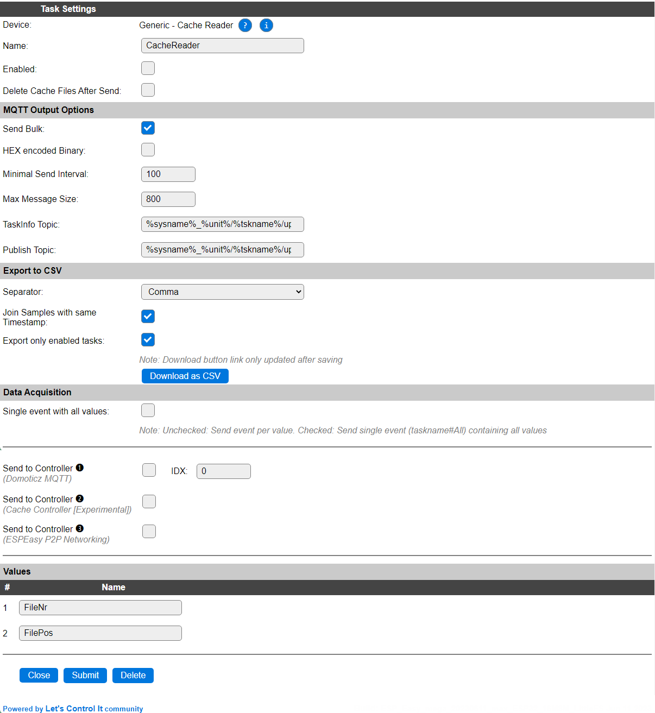

.. include:: ../Plugin/_plugin_substitutions_p14x.repl
.. _P146_page:

|P146_typename|
==================================================

|P146_shortinfo|

Plugin details
--------------

Type: |P146_type|

Name: |P146_name|

Status: |P146_status|

GitHub: |P146_github|_

Maintainer: |P146_maintainer|

Used libraries: |P146_usedlibraries|

.. Supported hardware
.. ------------------

|P146_usedby|

Description
------------

This plugin aids in (re)sending data, accumulated by the Cache Controller on the local file system, to a controller.

It will re-send the data using the original plugin via the original controller it was supposed to be sent out, but no network connection was available, like when collecting data in a car, and sending it out once the home location, with WiFi is available again.

Data will be sent out to the configured Controller, while the task(s) collecting data should be sending their data to the Cache Controller, that will have to be configured (and enabled!) separately on the Controllers tab.

Device Configuration
--------------------

* **Name**: Required by ESPEasy, must be unique among the list of available devices/tasks.

* **Enabled**: The device can be disabled or enabled. When not enabled the device should not use any resources.

* **Delete Cache Files After Send**: After successfully sending out the data, the cache files will be removed when this setting is enable. When leaving this option disabled, might cause data to be sent multiple time, depending on the receiving controller to deduplicate the received data.

MQTT Output Options
^^^^^^^^^^^^^^^^^^^

* **Send buld**: When enabled will send the data in a bulk message when possible, when disabled separate messages will be sent.

* **HEX Encoded Binary**: Determines if any binary data will be hex encoded when sent. Depends on the receiving (MQTT) controller is this option is needed.

* **Minimal Send Interval**: The minimal required send interval, defaults to 100 msec, but when using an external MQTT server, this might need to be increased to accommodate the TOS (Terms of service).

* **Max message size**: This is the max size for the content sent in a single message.

* **TaskInfo topic**: The MQTT topic the taskinfo data will be sent to.

* **Publish Topic**: The MWTT topic to publish the data to.

Export to CSV
^^^^^^^^^^^^^

* **Separator**: The separator that will be used when writing CSV data.

Available options:

.. image:: P146_SeparatorOptions.png

* *Tab*

* *Comma* (Default)

* *Semicolon*

..

* **Join Samples with same Timestamp**: When enabled will join/combine data with the same timestamp.

* **Export only set tasks**:

Data Acquisition
^^^^^^^^^^^^^^^^

This group of settings, **Single event with all values** and **Send to Controller** settings are standard available configuration items. Send to Controller is only visible when one or more Controllers are configured.

Values
^^^^^^

The plugin provides the ``FileNr`` and ``FilePos`` values, reporting the last used file and filepos values.

Commands available
^^^^^^^^^^^^^^^^^^

.. include:: P146_commands.repl

.. Events
.. ~~~~~~

.. .. include:: P146_events.repl

Change log
----------

.. versionchanged:: 2.0
  ...

  |added| 2023-01-18
  Initial release version.

