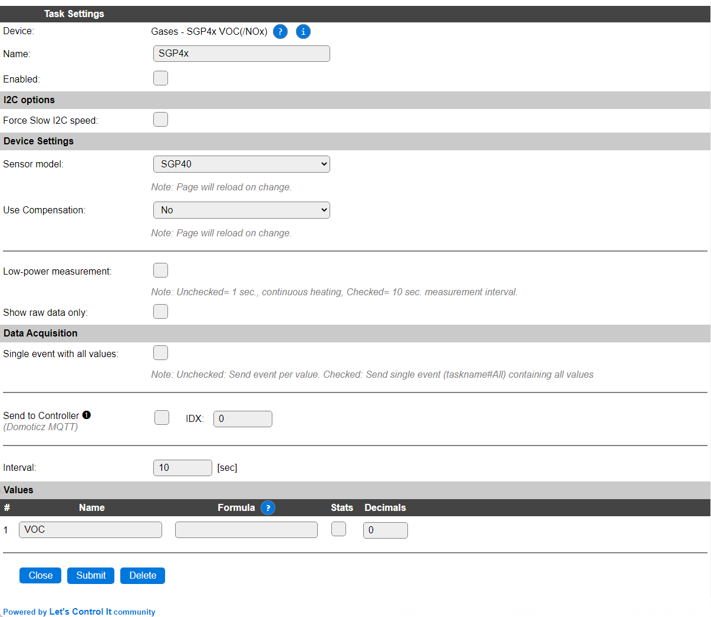
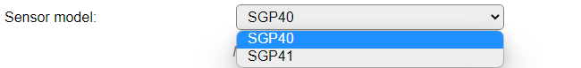
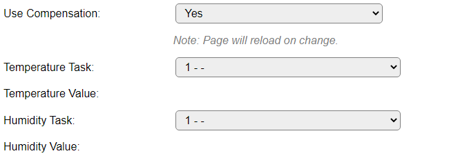
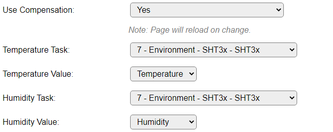
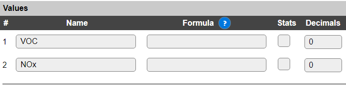

.. include:: ../Plugin/_plugin_substitutions_p14x.repl
.. _P147_page:

|P147_typename|
==================================================

|P147_shortinfo|

Plugin details
--------------

Type: |P147_type|

Name: |P147_name|

Status: |P147_status|

GitHub: |P147_github|_

Maintainer: |P147_maintainer|

Used libraries: |P147_usedlibraries|

Description
-----------

The SGP40 is a VOC sensor, and SGP41 is a VOC/NOx sensor, and both have a temperature and humidity compensation feature. By using the low-power operation option the measurements will be available slower, but average power usage will be much lower.

Configuration
-------------

* **Name**: Required by ESPEasy, must be unique among the list of available devices/tasks.

* **Enabled**: The device can be disabled or enabled. When not enabled the device should not use any resources.

I2C options
^^^^^^^^^^^

The available settings here depend on the build used. At least the **Force Slow I2C speed** option is available, but selections for the I2C Multiplexer can also be shown. For details see the :ref:`Hardware_page`

The sensor has a fixed I2C address of 0x59, so to connect multiple sensors to a single ESP, an I2C multiplexer should be used.

Device Settings
^^^^^^^^^^^^^^^

* **Sensor model**: Select the sensor model used, available options:

* *SGP40* The default, 'basic', sensor model, that can measure VOC only.

* *SGP41* The 'advanced' model that supports measuring both VOC and NOx.

When this setting is changed, the page is saved and reloaded to show/hide the extra Values entry for NOx.

* **Use Compensation**: Select if Temperature/Humidity compensation should be used.

When this setting is changed, the page is saved and reloaded to show/hide the Temperature & Humidity Task/Value selections.

* **Temperature Task**: Select the Task of a sensor that provides a Temperature value, preferrably positioned close to the SGP4x sensor.

* **Temperature Value**: Select the Value of the selected Temperature task that will represent a Temperature value.

* **Humidity Task**: Select the Task of a sensor that provides a Humidity value, preferrably positioned close to the SGP4x sensor.

* **Humidity Value**: Select the Value of the selected Humidity task that will represent a Humidity value.

After selecting a Temperature task/value and Humidity task/value it could look like this:

.. note:: If either the Temperature task/value or the Humidity task/value is invalid, the default compensation value will be used (Temperature: 25°C, Humidity: 50%), similar to when compensation is disabled.

* **Low-power measurement**: In normal use mode, the internal heater of the sensor will be powered continuously. To reduce power usage, a low-power mode can be selected, that will supply 1 measurement every 10 seconds.

* **Show raw data only**: In normal use, the measured raw data is provided to the Sensirion VOCGasIndexAlgorithm, and also NOxGasIndexAlgorithm for SGP41, to get an index for the measured values in the range 1..500. If you want to use the raw value(s) from the sensor to apply another, or no, algorithm on it, this checkbox can be enabled. The indexed values won't be available when enabled.

Data Acquisition
^^^^^^^^^^^^^^^^

This group of settings, **Single event with all values**, **Send to Controller** and **Interval** settings are standard available configuration items. Send to Controller is only visible when one or more Controllers are configured.

* **Interval** By default, Interval will be set to 60 sec. The data will be collected and optionally sent to any configured controllers using this interval.

Values
^^^^^^

The plugin provides measurements for ``VOC`` either in an Indexed value, or raw, and ``NOx`` also Indexed or raw, when a SGP41 is used. By default the Decimals are set to 0, as both the Index and Raw results are integer values.

Is selected builds, per Value is a **Stats** checkbox available, that when checked, gathers the data and presents recent data in a graph, as described here: :ref:`Task Value Statistics:  <Task Value Statistics>`

.. note:: After enabling the sensor it can take some time before sensible values are returned by the sensor and the index Algorithm, so these, usually invalid, values are discarded.

.. note:: The Indexed values are calculated using the `Sensirion Gas Index Algorithm Arduino Library <https://github.com/Sensirion/arduino-gas-index-algorithm>`_, available on Github.

When the SGP41 sensor is selected, the Values sections also includes the ``NOx`` value.

.. Commands available
.. ^^^^^^^^^^^^^^^^^^

.. .. include:: P147_commands.repl

Get Config Values
^^^^^^^^^^^^^^^^^

Get Config Values retrieves values or settings from the sensor or plugin, and can be used in Rules, Display plugins, Formula's etc. The square brackets **are** part of the variable. Replace ``<taskname>`` by the **Name** of the task.

.. include:: P147_config_values.repl

Change log
----------

.. versionchanged:: 2.0
  ...

  |added|
  2023-05-07 Initial release version.

