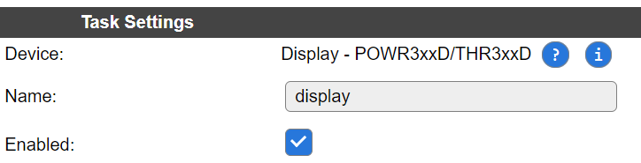
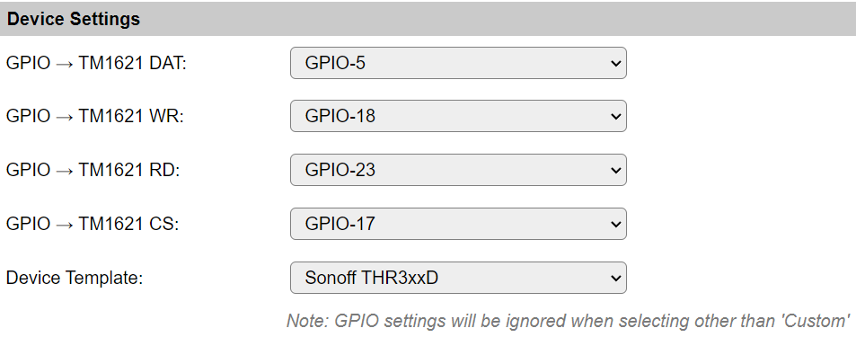
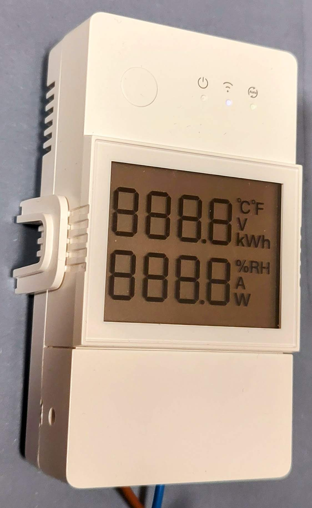
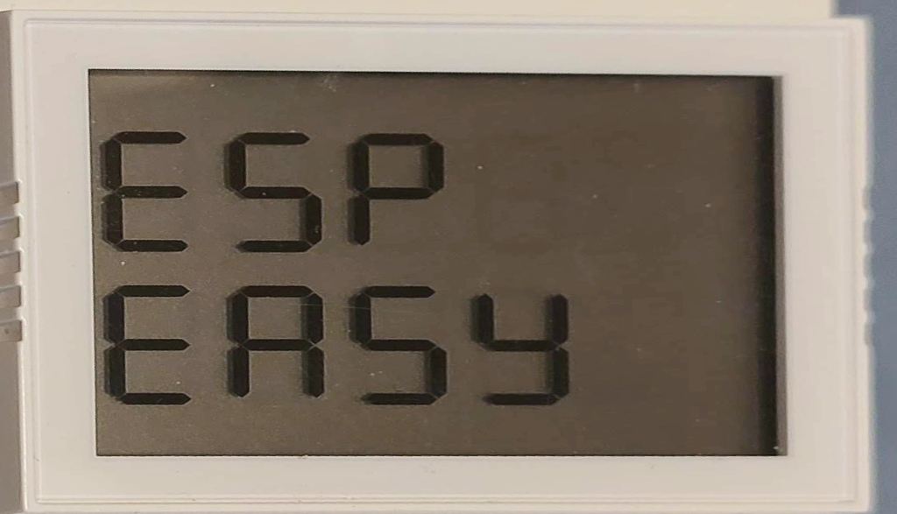
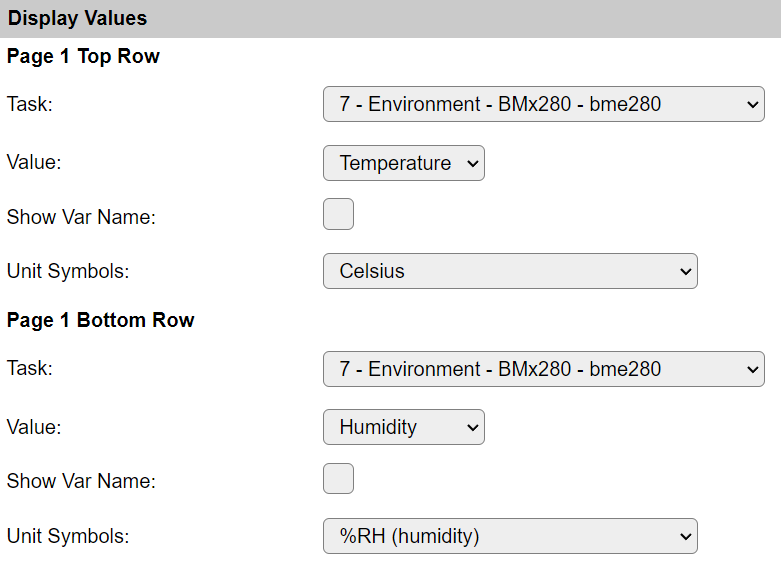
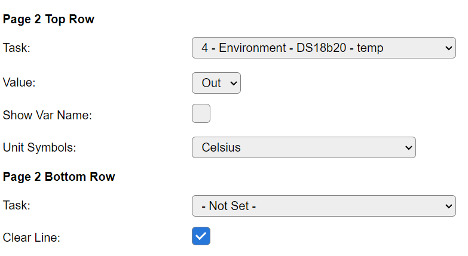
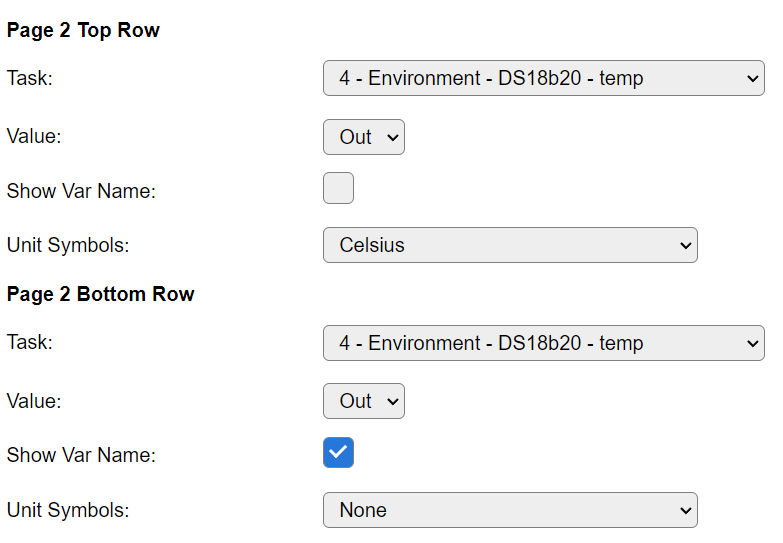
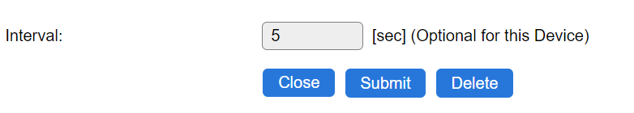

.. include:: ../Plugin/_plugin_substitutions_p14x.repl
.. _P148_page:

|P148_typename|
==================================================

|P148_shortinfo|

Plugin details
--------------

Type: |P148_type|

Name: |P148_name|

Status: |P148_status|

GitHub: |P148_github|_

Maintainer: |P148_maintainer|

Used libraries: |P148_usedlibraries|

Description
-----------

The latest revision of the Sonoff POW and TH modules are now available in an "Elite" version.

These are equipped with a LCD with 2 rows of 4x 7-segment display.


Hardware
--------

A short summary of the improvements compared to the previous models:

* Looks a lot better.
* ESP32 with 4MB flash (Older ESP8266 version of the POW and POW2 also had 4M flash, but the TH series did not)
* Greatly improved WiFi antenna, connected via IPEX connector.
* Improved power terminals.
* DIN rail mount clamp included.
* LCD
* 2 individually addressable LEDs (3 on the THR3xxD).

Specific to the THR3xxD Elite:

* 2x relais
* 1 relais with "dry" contacts, thus not connected to anything else.
* RJ9 connector for external sensors, like Dallas DS18b20.


See for more information about the new design and hardware features the Sonoff site:

* `Sonoff TH Elite series <https://sonoff.tech/product/diy-smart-switches/th-elite/>`_
* `Sonoff POW Elite series <https://sonoff.tech/product/diy-smart-switches/pow-elite/>`_

List of GPIO pinout:

* `templates.blakadder.com/sonoff_THR316D <https://templates.blakadder.com/sonoff_THR316D.html>`_
* `templates.blakadder.com/sonoff_POWR316D <https://templates.blakadder.com/sonoff_POWR316D.html>`_


Configuration
-------------



* **Name**: Required by ESPEasy, must be unique among the list of available devices/tasks.

* **Enabled**: The device can be disabled or enabled. When not enabled the device should not use any resources.


Device Settings
^^^^^^^^^^^^^^^



The TM1621 LCD controller chip needs 4 pins to allow communication:

* ``DAT`` Data line, used to read and write data and send commands to the TM1621.
* ``WR`` Pulled low to start a write sequence. On the rising edge of the /WR signal, the data on the DATA line is written to the TM1621.
* ``RD`` Usually pulled low, but only after a read or read/write command it should be pulled up to indicate the need to read a bit.
* ``CS`` Chip-Select. Must be pulled low to address a chip. While this pin is high, all other signals will be ignored by the TM1621.

Since this chip and this display is only used in 2 devices made by Sonoff, the used pins of both devices is made available via the "Device Template" selection.
When this is set to any value other than "Custom", the set GPIO selection will be ignored and overwritten by the GPIOs used on those Sonoff devices.

Default pins on Sonoff devices
``````````````````````````````

.. code-block:: none

  Sonoff      THR3xxD  POWR3xxD
  TM1621 DAT  GPIO05   GPIO14
  TM1621 WR   GPIO18   GPIO27
  TM1621 RD   GPIO23   GPIO26
  TM1621 CS   GPIO17   GPIO25

Sources:

* `templates.blakadder.com/sonoff_THR316D <https://templates.blakadder.com/sonoff_THR316D.html>`_
* `templates.blakadder.com/sonoff_POWR316D <https://templates.blakadder.com/sonoff_POWR316D.html>`_

Display Layout
^^^^^^^^^^^^^^

Most LCDs used in devices, not using a dot-matrix layout, only have a limited number of segments which can be switched between black and transparent.

The LCD used on these Sonoff Elite devices does only have 64 "pixels" or "segments".
There are 2 rows with each 4x 7-segment digits and only between the 3rd and 4th digit is a decimal dot.

The symbols on the right are:

* Degree Celsius
* Degree Fahrenheit
* ``V`` and ``A`` combined
* ``kWh`` and ``W`` combined
* ``%RH``

The 'combined' symbols can not be addressed separately.
This limits the flexibility of the display as it will be confusing to show 2 rows with readings of a voltage.
Also showing current (Ampere) and power (Watt) at the same time is confusing since both symbols are on the same row.




Display Values
^^^^^^^^^^^^^^

There are 2 options to display some values on the LCD:

* The plugin can 'loop' over upto 3 sets of taskvalues periodically.
* Using commands via for example the rules.

Due to the limited number of digits on the display, the range of numerical values is rather limited:

* -999 ... 9999 without decimal point.
* -99.9 ... 999.9 with decimal point.
* Numericals will be right aligned due to the fixed position of the decimal point.

Most letters of the alphabet are also present and can be used.

* Some letters are not included, like the ``K``, ``M``, ``W``, ``X`` and ``Z``.
* Upper and lower case letters are somewhat mixed. For example ``D`` and ``O`` would be indistinguishable from the number ``0`` on a 7-segment display. Therefore those look more like their lower case parts.
* As special characters, the ``-`` and ``?`` are also included. All not included characters will look like a space.

At least the most important letters can be clearly shown on a 7-segment display:



Display Page Temp/Hum
`````````````````````

An example showing the configuration displaying temperature and humidity from a BME280 sensor.



Display Page Clear Line
```````````````````````

An example showing the configuration displaying temperature on the first row and clearing the second row.



When switching pages and a row is not defined, then the content of the previous page may still be visible.
By selecting "Clear Line", the row will be cleared.


Display Page With Text Label
````````````````````````````

An example showing the configuration displaying temperature on the first row and some text label on the second row.



One can give task values a descriptive name, which can be displayed on the 'other' row.
As long as the used characters are available in the limited font.

For example, one can write "Co2" or "in" or "out".
These labels are taken from the selected task value names.


Switching Pages
^^^^^^^^^^^^^^^

A "task run", which happens every set ``Interval`` period, will try to draw the "next page" which causes an update to the display.



If this interval is set to "0", there will be no automatic page updates.
A user may trigger a "page update" by calling a ``taskrun`` for this task.
Each taskrun, the next page will be displayed.
When only a single "page" is defined, the same page will be refreshed.

When updates to the display are only sent via commands, the ``Interval`` should be set to ``0``.


Commands available
^^^^^^^^^^^^^^^^^^

.. include:: P148_commands.repl


Change log
----------

.. versionchanged:: 2.0
  ...

  |added|
  2023-01-10 Initial release version.


