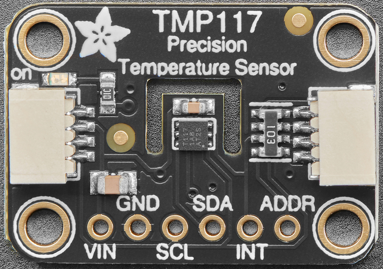
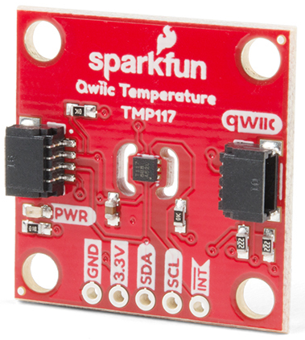
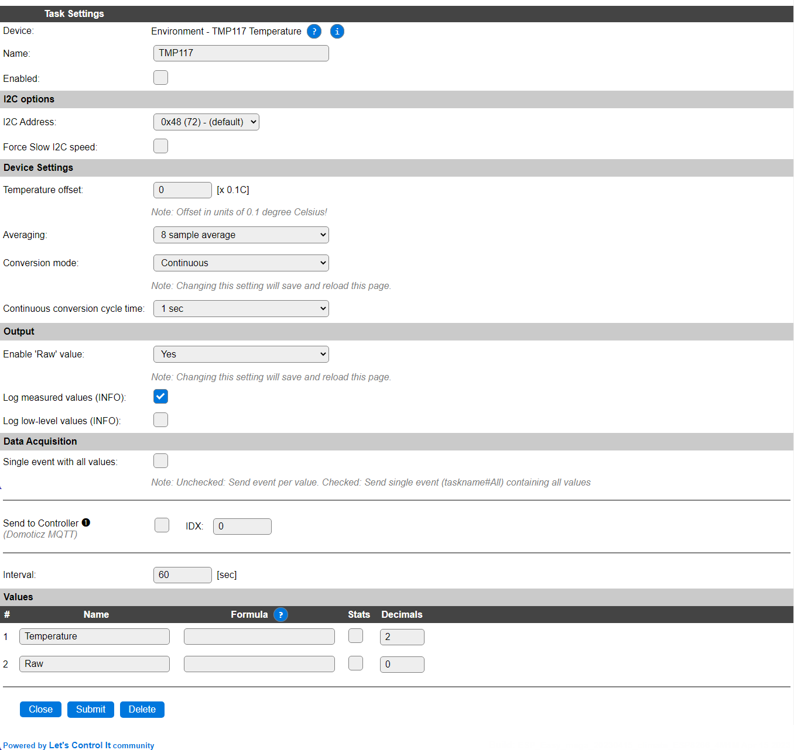
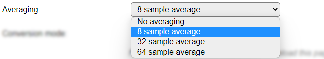
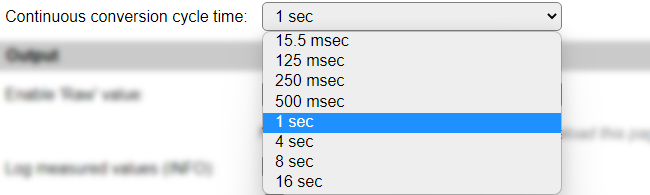

.. include:: ../Plugin/_plugin_substitutions_p15x.repl
.. _P150_page:

|P150_typename|
==================================================

|P150_shortinfo|

Plugin details
--------------

Type: |P150_type|

Name: |P150_name|

Status: |P150_status|

GitHub: |P150_github|_

Maintainer: |P150_maintainer|

Used libraries: |P150_usedlibraries|

Description
-----------

The Texas Instruments TMP117 High-accuracy temperature sensor offers an accuracy of 0.1°C in the range of -20°C to 50°C, and requires very low power when in shutdown mode.

The low/high alarm options and accompanying ``INT`` pin, as provided by the sensor, are *not* implemented in this plugin.

The datasheet offers the most up to date information: `Texas Instruments TMP117 Datasheet (online) <https://www.ti.com/document-viewer/tmp117/datasheet>`_

Hardware
--------

Adafruit TMP117 board.

SparkFun TMP117 board.

Configuration
-------------

* **Name**: Required by ESPEasy, must be unique among the list of available devices/tasks.

* **Enabled**: The device can be disabled or enabled. When not enabled the device should not use any resources.

I2C options
^^^^^^^^^^^

* **I2C Address**: The device supports up to 4 addresses, that can be configured using the ``ADDR`` pin: (not all boards have the ADDR pin directly available, but use soldering-pads to configure the address)

.. csv-table::
    :header: "Address", "ADDR pin to:", "Remark"
    :widths: 10, 10, 40

    "0x48", "GND", "Default, also when not connected."
    "0x49", "VCC / VIN", ""
    "0x4A", "SDA", ""
    "0x4B", "SCL", ""

The available I2C settings here depend on the build used. At least the **Force Slow I2C speed** option is available, but selections for the I2C Multiplexer can also be shown. For details see the :ref:`Hardware_page`

Device Settings
^^^^^^^^^^^^^^^

* **Temperature offset**: An offset from the current temperature can be applied in 0.1°C steps. The number of steps can be set here.

* **Averaging**: The sensor supports several averaging options, to stabilize the measurement. By default the average of 8 measurements is used.

*No averaging*: This turns off averaging.

*8 sample averaging*: Average the last 8 measured samples (default).

*32 sample averaging*: Average the last 32 measured samples.

*64 sample averaging*: Average the last 64 measured samples.

.. .. separator

* **Conversion mode**: The default measuring conversion mode is to continuously perform measurements.

*Continuous*: Continuously perform measurements, with a configurable cycle-time (see below).

*One-shot*: Perform a single measurement, then go into shutdown mode to conserve power. When the values are retrieved by the Interval event cycle, the One-shot mode is started, and read as soon as available (once per second). This value is returned on the next Interval, and a new One-shot measurement is started.

.. warning:: When changing this setting, the current settings are saved, and the page is reloaded, to show or hide the **Continuous conversion cycle time** setting, as that is only available/applicable for Continuous mode.

* **Continuous conversion cycle time**: The delay between actual measurements in Continuous conversion mode. When this is set to a value longer than the **Interval** time, some of the Interval readings will return the previous values, as no new value has been read yet. It is advised to set the **Interval** higher than the configured cycle time.

*15.5 msec*: A new measurement is performed every 15.5 milliseconds.

*125 msec*: A new measurement is performed every 125 milliseconds.

*250 msec*: A new measurement is performed every 250 milliseconds.

*500 msec*: A new measurement is performed every 500 milliseconds.

*1 sec*: A new measurement is performed every second.

*4 sec*: A new measurement is performed every 4 seconds.

*8 sec*: A new measurement is performed every 8 seconds.

*16 sec*: A new measurement is performed every 16 seconds.

This option is only available if **Conversion mode** is set to **Continuous**.

Output
^^^^^^

* **Enable 'Raw' value**: Select Yes if you want to include the **Raw** value on the Devices overview page, and when sent to controllers. This contains the raw digital value read from the sensor.

.. warning:: When changing this setting, the current settings are saved, and the page is reloaded, to show or hide the **Raw** Value (bottom of the page).

* **Log measured values (INFO)**: When checked, the values will be included in the serial log, when that is enabled, on INFO level.

* **Log low-level values (INFO)**: When checked, the values during the actual read (max. 1 per second) will be output to the serial log, on INFO level. This can be used for debugging purposes. May not be available in all builds to save space in the bin file.

Data Acquisition
^^^^^^^^^^^^^^^^

This group of settings, **Single event with all values** and **Send to Controller** settings are standard available configuration items. Send to Controller is only visible when one or more Controllers are configured.

* **Interval** By default, Interval will be set to 60 sec. The data will be collected and optionally sent to any configured controllers using this interval. If the Interval is set lower than the **Continuous conversion cycle time**, the interval will return the previously measured value until an actual measurement has been retrieved from the sensor.

Values
^^^^^^

The plugin provides the ``Temperature`` and ``Raw`` values. Raw can be disabled, see above. A formula can be set to recalculate. The number of decimals can be set as desired, and defaults to 2 for Temperature, and 0 for Raw.

Per Value is a **Stats** checkbox available, that when checked, gathers the data and presents recent data in a graph, as described here: :ref:`Task Value Statistics:  <Task Value Statistics>`

Change log
----------

.. versionchanged:: 2.0
  ...

  |added|
  2023-04-15 Initial release version.

