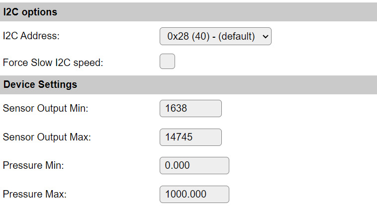

.. include:: ../Plugin/_plugin_substitutions_p15x.repl
.. _P151_page:

|P151_typename|
==================================================

|P151_shortinfo|

Plugin details
--------------

Type: |P151_type|

Name: |P151_name|

Status: |P151_status|

GitHub: |P151_github|_

Maintainer: |P151_maintainer|

Used libraries: |P151_usedlibraries|

Description
-----------

The Honeywell TruStability™ HSC Series are calibrated pressure sensors with internal temperature compensation.
This series has a lot of versions of pressure sensors ranging in form factor, pressure range, etc.

Hardware
--------

See the `datasheet <https://prod-edam.honeywell.com/content/dam/honeywell-edam/sps/siot/en-us/products/sensors/pressure-sensors/board-mount-pressure-sensors/trustability-hsc-series/documents/sps-siot-trustability-hsc-series-high-accuracy-board-mount-pressure-sensors-50099148-a-en-ciid-151133.pdf?download=false>`_ for all versions.

* Page 13 is a must to help decode the nomenclature of the model numbers.
* Pages 17 - 29 are about the various form factors of these sensors.

The digital versions of these sensors typically output a 14 bit value ranging from ``0`` ... ``16383``.

The usable (and compensated) range is typically 10% - 90% of the full range.
These 10% and 90% points are also the specified range of the sensor.

For example, a differential sensor ranging -1 ... 1 bar, will output:

* ``1638`` = -1 bar 
* ``14746`` = 1 bar

In practice, the sensor can measure from 2.5% upto 97.5% of the full range before it will start clipping.

Configuration
-------------

* **Name**: Required by ESPEasy, must be unique among the list of available devices/tasks.

* **Enabled**: The device can be disabled or enabled. When not enabled the device should not use any resources.

Device Settings
^^^^^^^^^^^^^^^

Sensor Output Min and Max must be set to resp. 10% and 90% of the digital count range.

* ``Sensor Output Min`` Default to 1638 (10% of 2^14)
* ``Sensor Output Max`` Default to 14745 (90% of 2^14)
* ``Pressure Min`` Minimal stated pressure for the given sensor.
* ``Pressure Max`` Maximal stated pressure for the given sensor.

For example, given the ``HCSMANV001BA2A3`` sensor:

* ``M`` SMT
* ``AN`` Single Axial barbed port
* ``V`` Liquid Media port 1, diagnostics on
* ``001BA`` 0 bar to 1 bar
* ``2`` I2C address 0x28
* ``A`` 10% to 90% 2^14 digital
* ``3`` 3V3

The measurement range for this sensor is 0 ... 1 bar.
This means the ``Pressure Min`` and ``Pressure Max`` should be set to resp. 0 and 1.
However, if the pressure in some container needs to be compared to some outside pressure, measured by for example a Bosch BMP280, it might be useful to directly output to mbar.
Thus for this purpose the ``Pressure Max`` should be set to ``1000``.

Change log
----------

.. versionchanged:: 2.0
  ...

  |added|
  2023-04-12 Initial release version.

