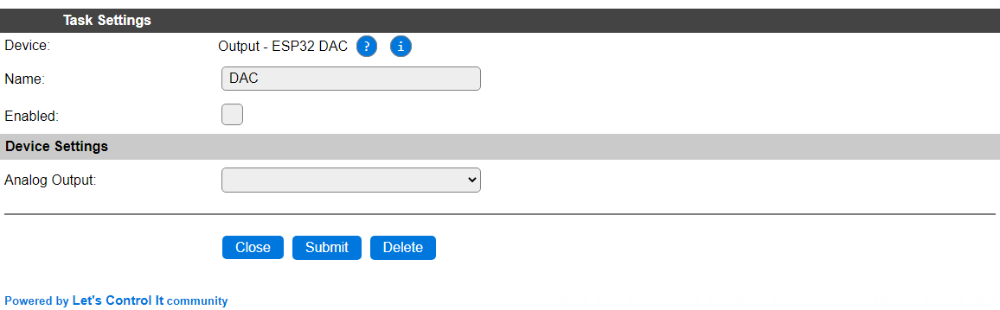
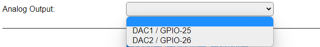
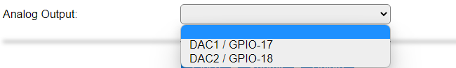

.. include:: ../Plugin/_plugin_substitutions_p15x.repl
.. _P152_page:

|P152_typename|
==================================================

|P152_shortinfo|

Plugin details
--------------

Type: |P152_type|

Name: |P152_name|

Status: |P152_status|

GitHub: |P152_github|_

Maintainer: |P152_maintainer|

Used libraries: |P152_usedlibraries|

Description
-----------

Plugin for using the built-in DAC (Digital Analog Converter) as available on ESP32 and ESP32-S2 chips. This implies that the plugin is **only** available on ESP32 and ESP32-S2 builds!

Configuration
--------------

* **Name** A unique name should be entered here.

* **Enabled** The device can be disabled or enabled. When not enabled the device should not use any resources.

Device Settings
^^^^^^^^^^^^^^^^

* **Analog Output**: Select 1 of 2 available GPIO pins that support the DAC feature.

**ESP32**:

* **DAC1 / GPIO-25**: First available DAC output pin.

* **DAC2 / GPIO-26**: Second available DAC output pin.

**ESP32-S2**:

* **DAC1 / GPIO-17**: First available DAC output pin.

* **DAC2 / GPIO-18**: Second available DAC output pin.

Commands
~~~~~~~~

.. include:: P152_commands.repl

Extra events
~~~~~~~~~~~~

Despite that the plugin doesn't allow configuring explicit Values, there is a single value available: ``<taskname>#Output``, and this is also generated as an event, using the default Interval. This variable and event show the last set value of the ``dac`` command, above.

Change log
----------

.. versionchanged:: 2.0

  |added| 2023-04-10 Initially added.
