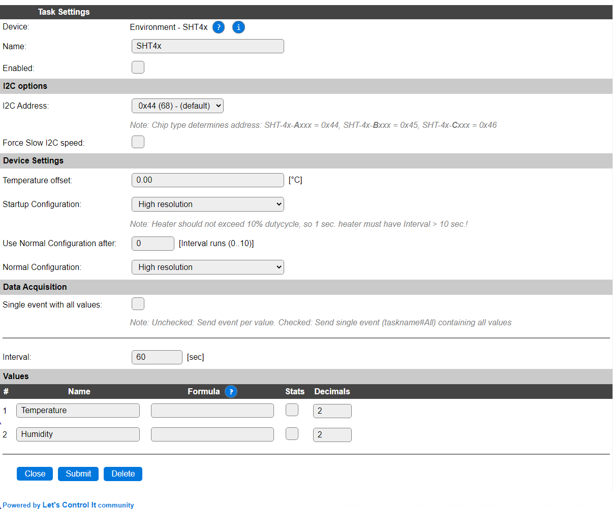
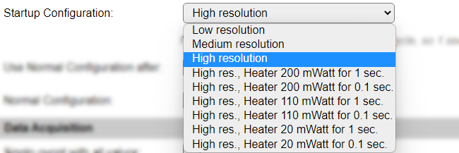
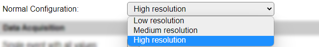

.. include:: ../Plugin/_plugin_substitutions_p15x.repl
.. _P153_page:

|P153_typename|
==================================================

|P153_shortinfo|

Plugin details
--------------

Type: |P153_type|

Name: |P153_name|

Status: |P153_status|

GitHub: |P153_github|_

Maintainer: |P153_maintainer|

Used libraries: |P153_usedlibraries|

Description
-----------

The Sensirion SHT4x range (SHT40, SHT41, SHT43 and SHT45) Temperature and Humidity sensors offer accuracy depending on the model used. The SHT43 is an industrial grade high accuracy sensor, the other models have increasing accuracy from low to high type number.

Configuration
-------------

* **Name**: Required by ESPEasy, must be unique among the list of available devices/tasks.

* **Enabled**: The device can be disabled or enabled. When not enabled the device should not use any resources.

I2C options
^^^^^^^^^^^

* **I2C Address**: The sensor supports a single address, but that address depends on the actual type suffix, printed on the sensor chip (and usually included in the documentation for the device/board).

.. csv-table::
    :header: "Address", "Type", "Remark"
    :widths: 10, 10, 40

    "0x44", "SHT4x-Axxx", "Default, most used."
    "0x45", "SHT4x-Bxxx", ""
    "0x46", "SHT4x-Cxxx", ""

The available I2C settings here depend on the build used. At least the **Force Slow I2C speed** option is available, but selections for the I2C Multiplexer can also be shown. For details see the :ref:`Hardware_page`

Device Settings
^^^^^^^^^^^^^^^

* **Temperature offset**: An offset from the current temperature can be applied in 0.01°C steps. The offset can be set here.

* **Startup Configuration**: To enable conditioning of the sensor, a Startup Configuration can be selected that enables an internal heater for a limited amount of measurements. Here that statup setting can be selected. The sensors don't allow the heater to be used combined with Low or Medium resolution measurements.

*Low resolution*: Execute only low resolution measurements.

*Medium resolution*: Execute only medium resolution measurements.

*High resolution*: Execute only high resolution measurements. (Default)

*High res., Heater 200 mWatt for 1 sec.*: Heat the sensor for 1 second with 200 milliwatt power, then execute a high resolution measurement.

*High res., Heater 200 mWatt for 0.1 sec.*: Heat the sensor for 100 milliseconds with 200 milliwatt power, then execute a high resolution measurement.

*High res., Heater 110 mWatt for 1 sec.*: Heat the sensor for 1 second with 110 milliwatt power, then execute a high resolution measurement.

*High res., Heater 110 mWatt for 0.1 sec.*: Heat the sensor for 100 milliseconds with 110 milliwatt power, then execute a high resolution measurement.

*High res., Heater 20 mWatt for 1 sec.*: Heat the sensor for 1 second with 20 milliwatt power, then execute a high resolution measurement.

*High res., Heater 20 mWatt for 0.1 sec.*: Heat the sensor for 100 milliseconds with 20 milliwatt power, then execute a high resolution measurement.

.. warning:: The maximum duty-cycle using the heater is 10%, so when using a 1 second heating period, an **Interval** setting > 10 seconds **must** be used, to protect the sensor.

Activating the heater helps to remove possible condensation from the sensor.

.. .. separator

* **Use Normal Configuration after**: After using the Startup configuration for some time, the Normal Configuration will be used. This is configured in **Interval** cycles, in range 1..10.

* **Normal Configuration**: After the Startup Configuration has been applied for some time, or if the Startup Configuration is the same as the Normal Configuration, the Normal Configuration measurement mode will be applied.

*Low resolution*: Execute only low resolution measurements.

*Medium resolution*: Execute only medium resolution measurements.

*High resolution*: Execute only high resolution measurements. (Default)

Data Acquisition
^^^^^^^^^^^^^^^^

This group of settings, **Single event with all values** and **Send to Controller** settings are standard available configuration items. Send to Controller is only visible when one or more Controllers are configured.

* **Interval** By default, Interval will be set to 60 sec. The data will be collected and optionally sent to any configured controllers using this interval. If the Interval is set lower or equal than the required 10 * Heater time, the plugin will not start!

Values
^^^^^^

The plugin provides the ``Temperature`` and ``Humidity`` values. A formula can be set to recalculate. The number of decimals can be set as desired, and defaults to 2.

In selected builds, per Value is a **Stats** checkbox available, that when checked, gathers the data and presents recent data in a graph, as described here: :ref:`Task Value Statistics:  <Task Value Statistics>`

Commands available
^^^^^^^^^^^^^^^^^^

.. include:: P153_commands.repl

Get Config Values
^^^^^^^^^^^^^^^^^

Get Config Values retrieves values or settings from the sensor or plugin, and can be used in Rules, Display plugins, Formula's etc. The square brackets **are** part of the variable. Replace ``<taskname>`` by the **Name** of the task.

.. include:: P153_config_values.repl

Change log
----------

.. versionchanged:: 2.0
  ...

  |added|
  2023-05-06 Initial release version.

