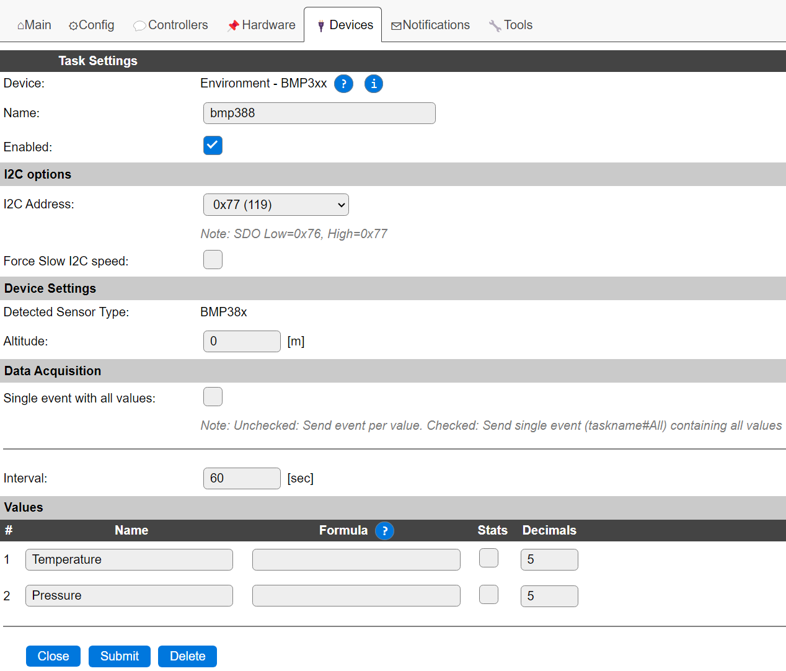
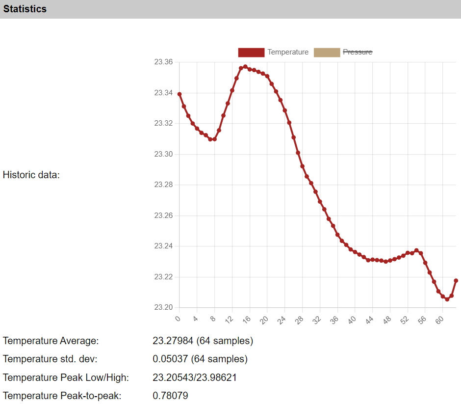

.. include:: ../Plugin/_plugin_substitutions_p15x.repl
.. _P154_page:

|P154_typename|
==================================================

|P154_shortinfo|

Plugin details
--------------

Type: |P154_type|

Name: |P154_name|

Status: |P154_status|

GitHub: |P154_github|_

Maintainer: |P154_maintainer|

Used libraries: |P154_usedlibraries|

Description
-----------

As a successor to their BMP280, Bosch made the BMP388 and the even higher resolution BMP390 temperature and air pressure sensors.

The main improvements compared to the BMP280 are:

* Lower power consumption
* Higher possible sample rate
* Option to store a number of samples in the 512 byte buffer to burst read
* Higher resolution
* Less noise

Configuration
-------------

* **Name**: Required by ESPEasy, must be unique among the list of available devices/tasks.

* **Enabled**: The device can be disabled or enabled. When not enabled the device should not use any resources.

I2C options
^^^^^^^^^^^

* **I2C Address**: The sensor supports a single address, but that address depends on the actual type suffix, printed on the sensor chip (and usually included in the documentation for the device/board).

.. csv-table::
    :header: "Address", "Remark"
    :widths: 10, 50

    "0x76",  "Connect SDO to GND"
    "0x77",  "Connect SDO to V_DDIO (default on most boards)"

The available I2C settings here depend on the build used. At least the **Force Slow I2C speed** option is available, but selections for the I2C Multiplexer can also be shown. For details see the :ref:`Hardware_page`

Since this chip supports both SPI and I2C, the pin naming may be slightly confusing:

* SCK: Serial Clock (SCL)
* SDI: Data (SDA)
* SDO: Slave Address LSB (GND = '0', V_DDIO = '1')
* CSB is not used and left open.
* SDI must be externally connected to V_DDIO via pull-up resistor.

On most boards sold online, SDO and SDI are already pulled-up, setting the default I2C address to 0x77.

Device Settings
^^^^^^^^^^^^^^^

* **Detected Sensor Type**: Shows either ``BMP38x`` or ``BMP390`` or a number if no sensor or an unknown sensor ID is detected.
* **Altitude**: Optionally set the offset (in meters) of the sensor to convert pressure measurements to sea level pressure.

Data Acquisition
^^^^^^^^^^^^^^^^

This group of settings, **Single event with all values** and **Send to Controller** settings are standard available configuration items. Send to Controller is only visible when one or more Controllers are configured.

* **Interval** By default, Interval will be set to 60 sec. The data will be collected and optionally sent to any configured controllers using this interval. If the Interval is set lower or equal than the required 10 * Heater time, the plugin will not start!

Values
^^^^^^

The plugin provides the ``Temperature`` and ``Pressure`` values. A formula can be set to recalculate. The number of decimals can be set as desired, and defaults to 2.

In selected builds, per Value is a **Stats** checkbox available, that when checked, gathers the data and presents recent data in a graph, as described here: :ref:`Task Value Statistics:  <Task Value Statistics>`

Currently the extra features offered by the sensore are not configurable in this plugin.
These may be added later.

The internal filtering in the sensor is fixed to these settings:

* Temperature: 8x oversampling
* Pressure: 4x oversampling
* IIR Filter Coefficient: 3
* Sample rate: 50 Hz

  Example of the high temperature resolution of a BMP388

Change log
----------

.. versionchanged:: 2.0
  ...

  |added|
  2023-09-07 Initial release version.

