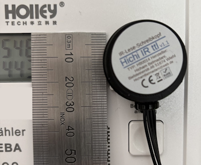
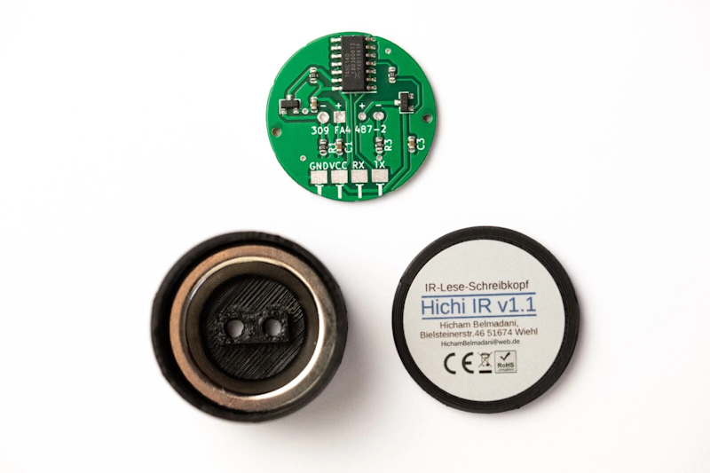

.. include:: ../Plugin/_plugin_substitutions_p15x.repl
.. _P155_page:

|P155_typename|
==================================================

|P155_shortinfo|

Plugin details
--------------

Type: |P155_type|

Port Type: |P155_porttype|

Name: |P155_name|

Status ESP32: |P155_status|

Status ESP8266: |P155_status_lb|

GitHub: |P155_github|_

Maintainer: |P155_maintainer|

Used libraries: |P155_usedlibraries|

Hardware
--------
This plugin uses an infrared reader to read data via the optical infrared interface of an electricity meter.

Devices
~~~~~~~~~~~~

Supports all smart meters using the SML protocol (Smart Message Language)
and older meters using the D0 protocol (IEC 62056-21).

Tested devices:

* ebZ DD3 (use model: SML)
* Holley DTZ541 (use model: SML)
* Any SML-compliant meter (use model: SML)
* Older meters with optical interface (use model: D0)

Reading Head
~~~~~~~~~~~~

To connect a smart meter to the ESP, an IR reading head is required.
Example for a compatible TTL/UART reading head :

* Hichi TTL, IR Reader
* bitShake SmartMeterReader - UART | IR Reader

The reading head includes a fully assembled PCB with IR diode and phototransistor,
a ring magnet to attach to the meter, and a housing with cover.
The plugin uses Hardware Serial which can be configured in ESPEasy UI.
The meter's serial interface operates at 9600 baud with 3.3V logic levels.
No level converter is required for 3.3V meters.

Wiring
~~~~~~~~~~~~
Example how to connect the Reader to the ESP32 as follows:

.. code-block:: none

  IR-Reader    ESP32
  TXD        --> GPIO 16 (RX2)
  RXD        --> GPIO 17 (TX2)
  VCC        --> 3.3V
  GND        --> GND

Configuration
-------------

**Name** A unique name for the task (example: **SmartMeter**).

**Enabled** The device can be enabled or disabled.

**Model Type** Select the protocol matching your meter:

.. csv-table::
  :header: "Model", "Meter", "Notes"
  :widths: 8, 15, 20

  "D0", "Older meters with optical interface",""
  "SML", "All SML-compliant meters", "Dynamic TL parsing, recommended"

.. note::

   Changing the model reloads the page and resets the value selectors.

**Value 1-4** Select the desired measurement values from the available OBIS registers.

.. include:: DataAcquisition.repl

* **Interval**: Recommended 1s for power values, 10s for energy values.

Output
~~~~~~

The available measurement values depend on the selected model.

D0:

.. csv-table::
  :header: "#", "Value Name", "OBIS", "Unit", "Description"
  :widths: 2, 12, 12, 4, 15

  "1", "Consumption_kWh", "1-0:1.8.0\*255", "kWh", "Total import energy"
  "2", "L1_W", "1-0:21.7.0\*255", "W", "Active power L1"
  "3", "L2_W", "1-0:41.7.0\*255", "W", "Active power L2"
  "4", "L3_W", "1-0:61.7.0\*255", "W", "Active power L3"
  "5", "L123_W", "1-0:1.7.0\*255", "W", "Total active power"

SML has the following OBIS codes but not any model sends every code:
You have to find out with testing. See, for example, the section on DTZ541 below, which has just 3 values to send.

.. csv-table::
  :header: "#", "Value Name", "OBIS", "Unit", "Description"
  :widths: 2, 12, 10, 4, 20

  "1", "Energy_Consumption_kWh", "1-0:1.8.0", "kWh \*", "Total import energy"
  "2", "L1_W", "1-0:21.7.0", "W", "Active power L1"
  "3", "L2_W", "1-0:41.7.0", "W", "Active power L2"
  "4", "L3_W", "1-0:61.7.0", "W", "Active power L3"
  "5", "L123_W", "1-0:16.7.0", "W", "Total active power"
  "6", "Energy_FeedIn_kWh", "1-0:2.8.0", "kWh \*", "Total export energy"
  "7", "L1_V", "1-0:32.7.0", "V", "Voltage L1"
  "8", "L2_V", "1-0:52.7.0", "V", "Voltage L2"
  "9", "L3_V", "1-0:72.7.0", "V", "Voltage L3"
  "10", "L1_A", "1-0:31.7.0", "A", "Current L1"
  "11", "L2_A", "1-0:51.7.0", "A", "Current L2"
  "12", "L3_A", "1-0:71.7.0", "A", "Current L3"

\* SML delivers energy values in Wh. Enter ``%VALUE%/1000`` in the formula field to get kWh.

DTZ541:

.. csv-table::
  :header: "#", "Value Name", "OBIS", "Unit", "Description"
  :widths: 2, 12, 10, 4, 15

  "1", "Energy_Consumption_kWh", "1-0:1.8.0", "kWh", "Total import energy"
  "2", "L123_W", "1-0:16.7.0", "W", "Total active power"
  "3", "Energy_FeedIn_kWh", "1-0:2.8.0", "kWh", "Total export energy"

Indicators (recommended settings)
~~~~~~~~~~~~~~~~~~~~~~~~~~~~~~~~~

.. csv-table::
  :header: "Indicator", "Value Name", "Interval", "Formula", "Extra information"
  :widths: 12, 10, 5, 8, 20

  "Energy_Consumption_kWh", "Import_kWh", "10", "%VALUE%/1000", "SML only: Wh to kWh"
  "Energy_FeedIn_kWh", "Export_kWh", "10", "%VALUE%/1000", "SML only: Wh to kWh"
  "L123_W", "Power_W", "1", "", "No formula needed"
  "L1_V / L2_V / L3_V", "Voltage_V", "10", "", ""

.. note::

   With **SML**, energy registers deliver the raw value in Wh (scaler is read
   automatically from the telegram). Enter ``%VALUE%/1000`` in the ESPEasy formula
   field to get kWh. Power values (W) require no formula.

Change log
----------

.. versionadded:: 1.0
  ...

  |added|
  Initial release version.
