.. include:: ../Plugin/_plugin_substitutions_p15x.repl
.. _P157_page:

|P157_typename|
==================================================

|P157_shortinfo|

Plugin details
--------------

Type: |P157_type|

Name: |P157_name|

Status ESP32: |P157_status|

Status ESP8266: |P157_status_lb|

GitHub: |P157_github|_

Maintainer: |P157_maintainer|

Used libraries: |P157_usedlibraries|

Description
-----------

The 14-/7-segment display plugin allows to display date, time, temperatures, numbers, text and self-created shapes on 14 segment LED displays, also supporting 7-segment displays, using a HT16K33 I2C driver.

Up to 8 displays can be combined, and as these displays are available with 4 and 8 digits, up to 64 characters can be shown from a single plugin instance.

For 14-segment displays a single font is available, and for 7-segment displays the 3 fonts available in P073 (when also included in the build) can be selected for presenting text on the display, where the character shapes are somewhat different.

When text to be displayed can't fit on the width of the display, scrolling text can be used so longer messages are shown like a ticker-tape display. Scrolling is always from right to left, and optionally starts with an empty display, so text can be read as it scrolls in.

Periods, comma's, colons and semicolons in text are always shown on the dots of the display, when available (all 14-segment, and most 7-segment, HT16K33 displays have a dot per digit).

For temperature display commands, ``7dt,<temp>`` and ``7ddt,<temp1>,<temp2>``, the degree symbol after the temperature can be turned off so there's room for 1 more digit of temperature on the display.

Hardware
^^^^^^^^

Most available 14-segment display units have 4 digits:

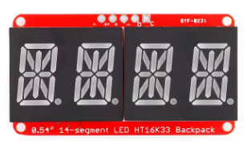

When multiple modules are combined to form a single display, the adjacent modules must get consecutive addresses, and placed from left to right with low to high addresses. The address for each unit (0x70 .. 0x77) is adjusted by adding a connection on the A0/A1/A2 solder bridges at the backside of the module. All 3 bridges open is address 0x70:

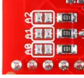

To make the A0/A1/A2 addressing of the modules explicit:

+---------+-------------------+
| address | A0/A1/A2          |
+=========+===================+
| 0x70    | all open          |
+---------+-------------------+
| 0x71    | A0 closed         |
+---------+-------------------+
| 0x72    | A1 closed         |
+---------+-------------------+
| 0x73    | A0, A1 closed     |
+---------+-------------------+
| 0x74    | A2 closed         |
+---------+-------------------+
| 0x75    | A0, A2 closed     |
+---------+-------------------+
| 0x76    | A1, A2 closed     |
+---------+-------------------+
| 0x77    | A0, A1, A2 closed |
+---------+-------------------+

Wiring
~~~~~~

Wiring multiple modules is as simple as connecting the ``Vi2c``, ``VCC``, ``GND``, ``SDA`` and ``SCL`` of all modules in parallel, and connect ``Vi2c`` to ``3V3``, ``VCC`` to ``5V``, ``GND`` to ``GND`` at the ESP, and ``SDA`` and ``SCL`` to the configured I2C pins of the ESP. The modules using red LEDs will usually work at a VCC of 3V3, but connecting more than 1 module to the 3V3 of the ESP will overload the 3V3 regulator, installed on the ESP board. This split power pinout design makes it very easy to connect these modules, as no level-converter is needed to protect the GPIO pins of the ESP.

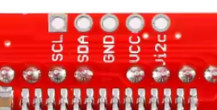

When connecting more than 4 modules to the same ESP, it's best to **not** connect ``Vi2c`` to more than 4 modules, as each module comes with its own pair of 10k pull-up resistors, and having too many of these in parallel will result in a too low value, causing possible display errors.

Configuration
^^^^^^^^^^^^^^

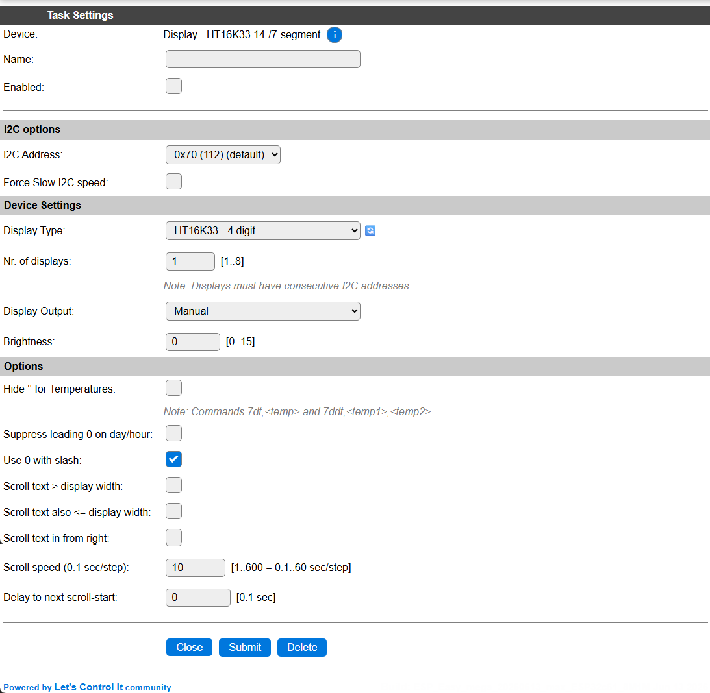

* **Name**: In the Name field a unique name should be entered.

* **Enabled**: When unchecked the plugin is not enabled.

I2C options
^^^^^^^^^^^

* **I2C Address**: Select the address the chip is set for, available options:

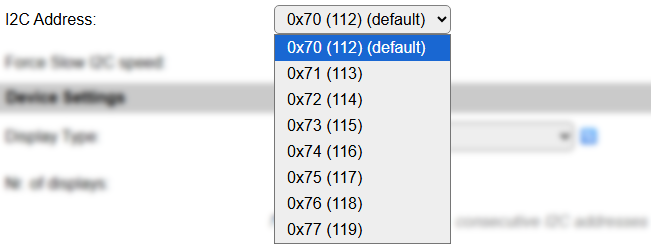

The available settings here depend on the build and hardware configuration used. At least the **Force Slow I2C speed** option is available, but selections for the I2C Multiplexer can also be shown. For details see the :ref:`i2c-bus` page

Device Settings
~~~~~~~~~~~~~~~

* **Display Type**: Select the type of display that's connected:

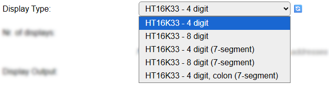

* **Nr. of digits**: Up to 8 displays can be connected on the same I2C bus, or when using a multiplexer on the multiplexer channel.

If a longer than the default size display is needed, multiple displays of the same type can be combined. They must have incremental I2C addresses.

When multiple displays are connected, but the content must be set independent, multiple tasks can be configured, using the I2C address of the display for the next task.

* **Display Output**: Here the type of output can be selected:

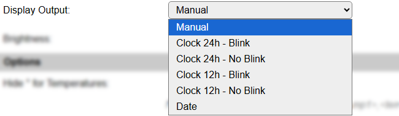

*Manual*: The content can be set from rules by using the commands available (see below)

*Clock 24h - Blink*: Displays the current time in 24h format, with a blinking colon or dot.

*Clock 24h - No Blink*: Displays the current time in 24h format.

*Clock 12h - Blink*: Displays the current time in 12h format, with a blinking colon or dot.

*Clock 12h - No Blink*: Displays the current time in 12h format.

*Date*: Displays the current date.

*NB: Clock and Date outputs assume a time-source is available, f.e. the via NTP or External Time Source settings in Tools/Advanced, by connecting a GPS module, or via the ESPEasy P2P network.*

The Clock and Date outputs are updated every second, and the blinking selections are 1 second on then 1 second off.

Clock formats are shown in HH.MM format on 4 digit displays, and in HH.MM.SS format on displays with 8 or more available digits. Date is shown in DD MM format on 4 digit displays, and DD MM YYYY format on 8 digit and wider displays.

* **Brightness**: The brightness level of the display can be set here. 0 is 'Default' brightness, 1..15 from low to high brightness.

* **Font set**: Select the font set from this list: (Only available for 7-segment displays, and when plugin :ref:`P073_page` is also included in the build)

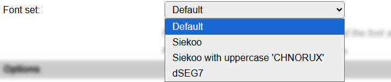

*Default*: The standard font. Includes digits 0..9, special characters: space, dash, degree (when using a ``^``), equal sign, slash, underscore and letters A..Z. Uppercase and lowercase characters are shown exactly the same, but as the possible shapes are quite limited, some can be somewhat hard to recognize at first.

*Siekoo*: The character set as documented here `Fakoo.de: Siekoo alphabet <https://fakoo.de/siekoo.html>`_ (See below for the extra special characters supported)

*Siekoo with uppercase 'CHNORUX'*: This font is the same as the normal Siekoo character set, but supports uppercase versions for characters 'CHNORUX', even though they duplicate other characters in the set, they are somewhat better recognizable.

*dSEG7*: the character set as documented here `Keshikan.net: dSEG7 <https://www.keshikan.net/fonts-e.html>`_ special characters: space, dash, degree (when using a ``^``), equal sign, slash, underscore and letters A..Z. (Again single-case, like the default font)

**Siekoo**:

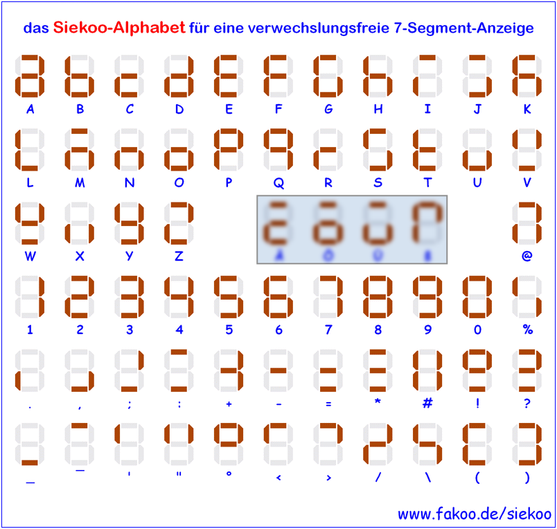

The four marked characters, Ä, Ö, Ü and ß, are *not* included, as they can not reliably be sent to the unit because of conversion issues from ASCII/UTF-8/ISO charactersets. And they are possibly not often used, except in German, and some closely related, languages.

**dSEG7**:

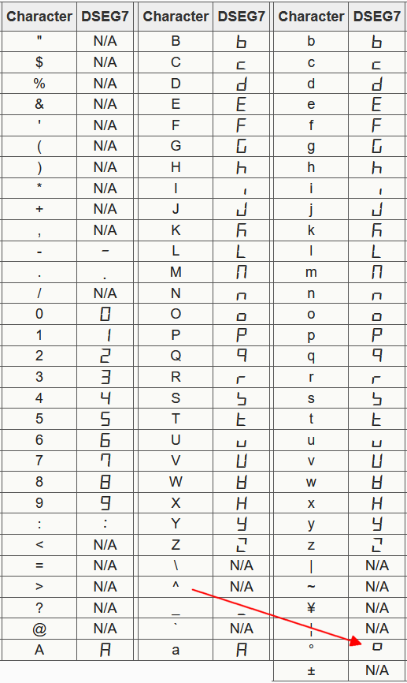

The ``^`` character is used to display the degree symbol, and the degree symbol is not recognized!

Options
^^^^^^^

* **Hide ° for Temperatures**: Will leave out the degree symbol from the display for temperature commands ``7dt,<temp>`` (and ``7ddt,<temp1>,<temp2>`` when available), allowing 1 more digit for actual temperature display.

* **Suppress leading 0 on day/hour**: When enabled, will show the hours of the time and days of the date without a leading 0 when < 10. (Not available in all builds for size reasons)

* **Use 0 with slash**: The default font has an open ``0`` symbol, like the uppercase ``O``. To have a zero with a slash through it on the display, this setting can be enabled, or disable if the user preferes an open ``0``. Only available for 14-segment displays.

* **Scroll text > display width**: Normally the ``7dtext,<text>`` and ``7dbin,...`` commands only show the left n characters the display can hold. This option enables the Scroll Text feature, that will scroll text sent using the ``7dtext`` command (or ``7dbin`` command when available) from right to left when the content is longer than the display can show at once.

* **Scroll text also <= display width**: The default setting is to only use scrolling for text (``7dtext,...``) or binary (``7dbin,...``) content if that doesn't fit on the display. This option allows to scroll *any* content, also when it *does* fit on the display.

* **Scroll text in from right**: Normally the Scroll Text feature starts with the display filled with the left part of the text to scroll, with this option enabled, the display starts empty and the text is scrolled in from the right side of the display to the left, until all text is scrolled off. Then the scrolling restarts.

* **Scroll speed (0.1 sec/step)**: Determines the speed of scrolling the text. Default value is 10, so 1 character per second.

* **Delay to next scroll-start**: Set a (non-blocking) delay after a scroll is completed (display is empty), before the next scroll is started. Range 0 to 10 minutes, in 0.1 second steps.

(The Scroll options and feature are not included in some builds for size reasons)

Commands available
^^^^^^^^^^^^^^^^^^

.. include:: P157_commands.repl

Bit to segment mapping for 7dbin command
^^^^^^^^^^^^^^^^^^^^^^^^^^^^^^^^^^^^^^^^

The ``7dbin`` command allows to show any combination of segments on the display according to a (sequence of) bit pattern(s).

14-segment
~~~~~~~~~~

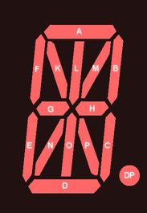

The mapping from bits to segments is ``0B(dp)ponmlkhgfedcba`` where the decimal point only takes 1 bit, of course.

7-segment
~~~~~~~~~

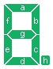

The mapping from bits to segments is: ``0Bhgfedcba``

ESPEasy allows decimal, hexadecimal and binary notation for numbers. This makes creating the desired display pattern easy when using the binary notation (starting with ``0B`` or ``0b``).

Switching on all horizontal segments for a 14-segment digit can be done by the command ``7dbin,0b11001001`` or ``7dbin,0b01001001`` for a 7-segment digit. This can also be entered in hexadecimal notation: ``7dbin,0xC9`` (14 segment) or ``7dbin,0x49`` (7-segment).

Change log
----------

.. versionchanged:: 2.0
  ...

  |added| 2026-05-24: Initial release version.

