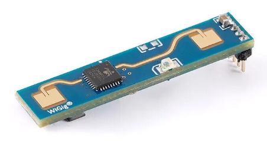
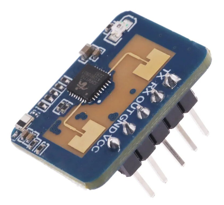
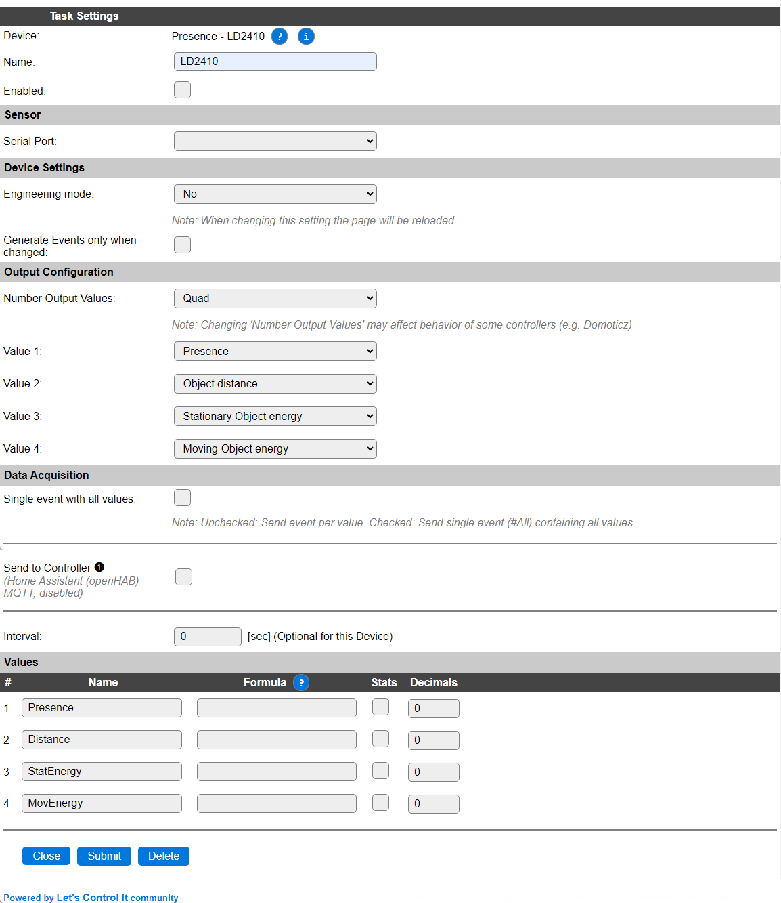
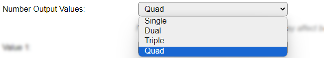
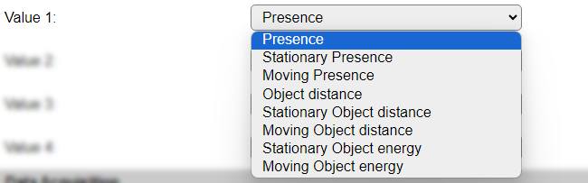
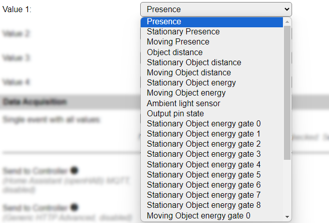
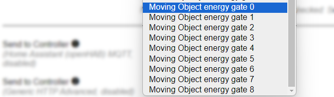
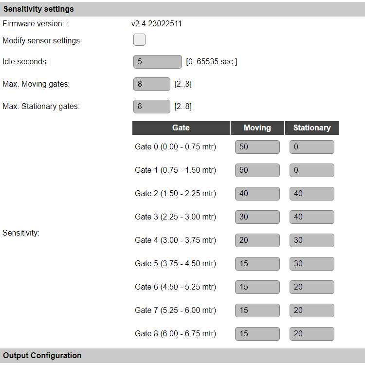
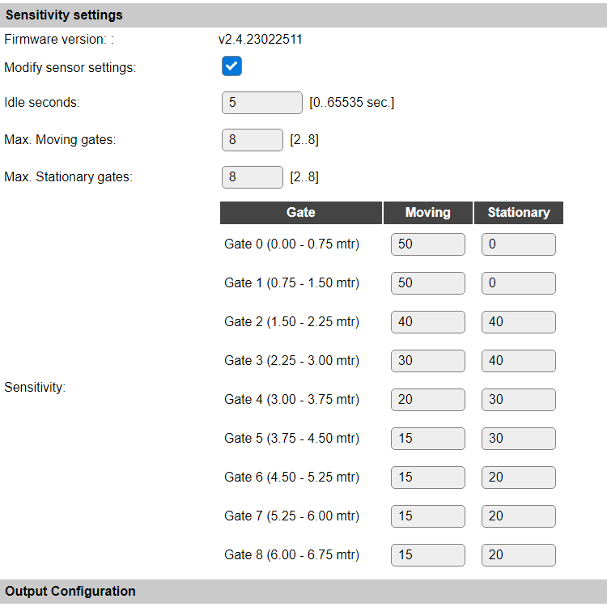

.. include:: ../Plugin/_plugin_substitutions_p15x.repl
.. _P159_page:

|P159_typename|
==================================================

|P159_shortinfo|

Plugin details
--------------

Type: |P159_type|

Name: |P159_name|

Status: |P159_status|

GitHub: |P159_github|_

Maintainer: |P159_maintainer|

Used libraries: |P159_usedlibraries|

Description
-----------

Detecting (human) presence can be achieved in several ways, like via IR detection sensors, or a light-beam that's interrupted by someone passing. But these sensors have quite some limitations, like limited sensitivity, no information about the distance, or weather a person is there but not moving.

The limitations of these existing sensors are not applicable when using radar-based presence detection, and since some time, rather affordable radar human-presence detectors are available. These are available with 5 GHz, 10 GHz, 24 GHz and 60 GHz radar frequency transmitter/receiver chips. Because of the accuracy and range, achievable with 24 GHz sensors, these are quite popular, so support has been added to ESPEasy.

Some examples of these sensors:

LD2410b with bluetooth support, 35 x 7 mm in size

LD2410c, 22 x 15 mm in size

(Images are sourced from AliExpress vendors)

Configuration
-------------

* **Name**: Required by ESPEasy, must be unique among the list of available devices/tasks.

* **Enabled**: The device can be disabled or enabled. When not enabled the device should not use any resources.

Sensor
^^^^^^

See: :ref:`SerialHelper_page`

For this sensor, only the **Serial port**, and for ESP32 or Software Serial, the GPIO selection options are available.

.. warning:: The ``SWSerial`` option should better not be used, because of the high speed (256000 baud) that is used for the serial connection!

Device Settings
^^^^^^^^^^^^^^^

* **Engineering mode**: With this option set ``Yes``, when changed the settings will be saved and the page reloaded, several extra Values are made available for selection. When not using the extra values available, **Engineering mode** should best be set to ``No`` to lower the system-load.

.. image:: P159_EngineeringMode.png

* *Available options*: **Yes** or **No** (the default).

* **Generate Events only when changed**: Checking this option prevents sending an event if none of the values has changed on the next **Interval**.

Output Configuration
^^^^^^^^^^^^^^^^^^^^

* **Number Output Values**: Select the number of values that should be available. Default set to ``Quad`` (4).

* Select from **Single** (1) to **Quad** (4).

After submitting the page, the number of Values will be changed to the selected number.

* **Value 1** .. **Value 4**: For each Value the desired data can be configured, depending on the setting for **Engineering mode**, the available options are adjusted.

* Engineering mode = **No**:

* Engineering mode = **Yes**:

Available options:

* *Presence*: 0 = No presence, 1 = Presence detected
* *Stationairy presence*: 0 = No stationary presence, 1 = Stationary presence detected (Stationairy = non-moving person)
* *Moving presence*: 0 = No moving presence, 1 = Moving presence detected
* *Object distance*: Distance of the detected presence, in cm.
* *Stationary Object distance*: Distance of the detected stationary presence, in cm.
* *Moving Object distance*: Distance of the detected moving presence, in cm.
* *Stationary Object energy*: Energy level of the detected stationary presence, undefined unit, range 0..100.
* *Moving Object energy*: Energy level of the detected moving presence, undefined unit, range 0..100.

Engineering mode enabled:

* *Ambient light sensor*: If the unit includes an ambient light sensor, and many do, then this will hold the light level, undefined unit, range 0..255. This is an undocumented setting from the device, only usable on boards that have this sensor installed.
* *Output pin state*: This reflects the **Out** pin, available on most boards. This is an undocumented setting from the device.
* *Stationary Object energy gate 0..8*: 9 selections of the Stationary Object energy level for each 'gate' (the concept of gates is explained below)
* *Moving Object energy gate 0..8*: 9 selections of the Moving Object energy level for each 'gate'

.. * *Stationary sensitivity gate 0..8*: 9 selections of the configured Stationary sensitivity level for each 'gate'
.. * *Moving sensitivity gate 0..8*: 9 selections of the configured Moving sensitivity level for each 'gate'

Sensitivity settings
^^^^^^^^^^^^^^^^^^^^

Once the task is enabled, and a sensor is connected, extra configuration settings are available, that are disabled by default, and show the current configuration, as read from the sensor. To change any of these settings, the **Modify sensor settings** checkbox must be enabled, and the input fields will be enabled. The settings available are for configuring the idle time, number of active gates and sensitivity per gate.

A **gate** is an area in view of the sensor. Each gate is aproximately 75 cm distance (sequentially) from the sensor, and the highest active gate-number, default set to the max. value, is 8 (number starts at 0, so there are 9 gates). These active gates can be configured separately for detecting Moving and Stationary objects/persons. The lowest gate-number that can be selected is 2.

By default, the **Modify sensor settings** checkbox is unchecked.

After checking the checkbox to enabled state, the settings will be available immediately:

* **Firmware version**: The version of the firmware installed on the sensor. The version shown in the screenshots is only shown as informational, and not a required value. For the Bluetooth enabled LD2410b sensor, updates for the firmware, when available, can be installed by using the LD2410 Mobile phone app. This firmware update feature is not available from ESPEasy.
* **Modify sensor settings**: Enable the checkbox to change the sensitivity settings, and store these in the sensor when the page is Submitted.
* **Idle seconds**: The number of seconds the *Presence* stays active after presence is removed, can be set here. Default value 5 sec. max. value is 65535 sec.
* **Max. Moving gates**: The number of active gates for detecting Moving presence. Range 2 .. 8.
* **Max. Stationary gates**: The number of active gates for detecting Stationary presence. Range 2 .. 8.
* **Sensitivity, Gate 0 .. 8**: For each type of detection, the sensitivity treshold can be set, range 0 .. 100, where 0 is the most sensitive, and 100 means it won't trigger, as that's the max. value that will be reported.

For each gate the distance range in meters is also shown. When the highest enabled Gate is less that the default 8, then only up to that gate-number is shown and configurable.

If the **Modify sensor settings** checkbox is checked when submitting the page, the settings are sent to the sensor, and the sensor will be restarted to activate them. The configured values are persistently stored in the LD2410 sensor.

Might the configuration not be set correctly, and changing them again doesn't seem to work, then resetting the sensor, by issuing the ``ld2410,factoryreset`` command while the task is enabled and the sensor connected, the factory defaults will be restored. (See the list of supported commands, below.)

Data Acquisition
^^^^^^^^^^^^^^^^

This group of settings, **Single event with all values** and **Send to Controller** settings are standard available configuration items. Send to Controller is only visible when one or more Controllers are configured.

* **Interval** By default, Interval will be set to 0 sec. as this is optional for this device. The data will be collected and optionally sent to any configured controllers using this interval. For sending the values to the enabled controller(s), the command ``TaskRun,<taskName|taskNr>`` can be used.

Values
^^^^^^

The plugin provides user configurable values, where the names will be changed according to the selected sensor value. A formula can be set to recalculate. The number of decimals can be set as desired, and defaults to 0.

In selected builds, per Value is a **Stats** checkbox available, that when checked, gathers the data and presents recent data in a graph, as described here: :ref:`Task Value Statistics:  <Task Value Statistics>`

Commands available
^^^^^^^^^^^^^^^^^^

.. include:: P159_commands.repl

Get Config Values
^^^^^^^^^^^^^^^^^

Get Config Values retrieves values or settings from the sensor or plugin, and can be used in Rules, Display plugins, Formula's etc. The square brackets **are** part of the variable. Replace ``<taskname>`` by the **Name** of the task.

.. include:: P159_config_values.repl

Change log
----------

.. versionchanged:: 2.0
  ...

  |added|
  2023-11-13 Initial release version.

