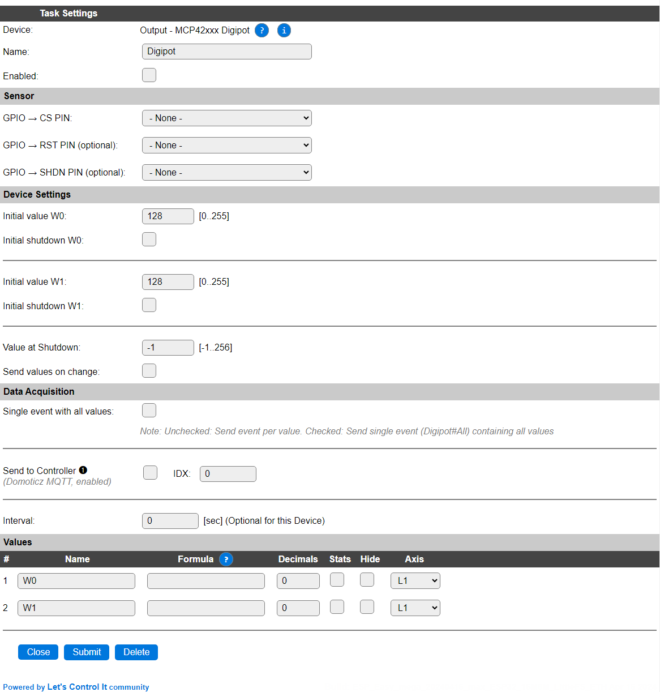

.. include:: ../Plugin/_plugin_substitutions_p16x.repl
.. _P162_page:

|P162_typename|
==================================================

|P162_shortinfo|

Plugin details
--------------

Type: |P162_type|

Name: |P162_name|

Status: |P162_status|

GitHub: |P162_github|_

Maintainer: |P162_maintainer|

Used libraries: |P162_usedlibraries|

Description
-----------

The MCP42xxx/MCP41xxx (the xxx specifies the max resistance value) are dual/single digital potentiometers (digipot), that can be controlled via SPI, and offer a 256 step resolution.

NB: The daisy-chain feature, available in the MCP42xxx chips, is not implemented in this plugin.

Hardware 
--------

This plugin is built and tested using a DFRobot `DFR0520 Dual Digipot board <https://wiki.dfrobot.com/Dual_Digital_Pot__100K__SKU__DFR0520>`_ where also a suggestion for wiring up the board is shown.

The board will tolerate 5V power and signals, but when powering the board at 5V and connecting to an ESP, the signal levels **must** be adjusted to 3.3V by using a level converter, to avoid damaging the ESP!

Configuration
-------------

* **Name**: Required by ESPEasy, must be unique among the list of available devices/tasks.

* **Enabled**: The device can be disabled or enabled. When not enabled the device should not use any resources.

Sensor
^^^^^^

* **GPIO -> CS PIN**: Configuring the ``CS`` (Chip select) pin is required to correctly address the board, and start the plugin. Also, the standard SPI interface pins ``MOSI`` and ``CLK`` have to be configured and connected.

* **GPIO -> RST PIN (optional)**: Not all boards have the ``RST`` (Reset) pin of the chip available. When not available or not used, it should be set to *- None -*. This pin is not available on the MCP41xxx chips.

* **GPIO -> SHDN PIN (optional)**: Not all boards have the ``SHDN`` (Shutdown) pin of the chip available. When not available or not used, it should be set to *- None -* (Shutdown is explained below). This pin is not available on the MCP41xxx chips.

Device Settings
^^^^^^^^^^^^^^^

* **Initial value Wx**: Range: 0..255. Set the value of the wiper (W) after initialization. By default it is set at the center of the range, 128, corresponding to the value after power-on or reset. Lower values bring the wiper closer to PBx, and higher values closer to PAx level.

* **Initial shutdown Wx**: The wiper can be initially set to Shutdown mode, where the PAx connection is disconnected, and Wx is connected to PBx. When both outputs are initially set to Shutdown, and the SHDN pin is configured, that pin will be used to shutdown the chip. Shutdown mode is undone by setting a value to one of the outputs, using the command described below.

These settings are available for both W0 and W1.  NB: The W1 settings can't be applied on the MCP41xxx chips, as that has only 1 digipot.

* **Value at Shutdown**: Range -1..256. Value for the output variables when Shutdown mode for that output is set.

* **Send values on change**: When checked, and Interval set to 0, events will only be generated, and sent to any configured Controllers, when a Value is changed. On startup, the initial values will be sent out, but that's the default behavior for ESPEasy.

Data Acquisition
^^^^^^^^^^^^^^^^

This group of settings, **Single event with all values** and **Send to Controller** settings are standard available configuration items. Send to Controller is only visible when one or more Controllers are configured.

* **Interval** By default, Interval will not be set. The values will be optionally sent to any configured controllers using the interval, when set.

Values
^^^^^^

The plugin provides the ``W0`` and ``W1`` values. A formula can be set to recalculate. The number of decimals can be set as desired, and defaults to 0, as these can only be set to integer values, but a formula could result in decimal values.

In selected builds, per Value is a **Stats** checkbox available, that when checked, gathers the data and presents recent data in a graph, as described here: :ref:`Task Value Statistics:  <Task Value Statistics>`

Commands available
^^^^^^^^^^^^^^^^^^

.. include:: P162_commands.repl

Change log
----------

.. versionchanged:: 2.0
  ...

  |added| 2024-04-15 Initial release version.

